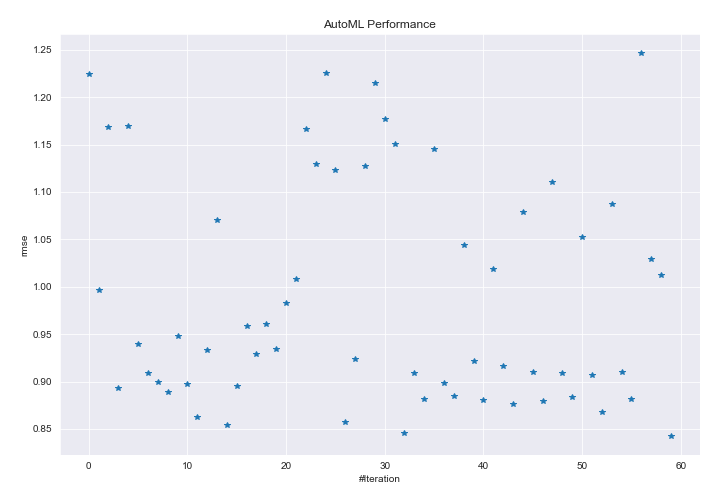
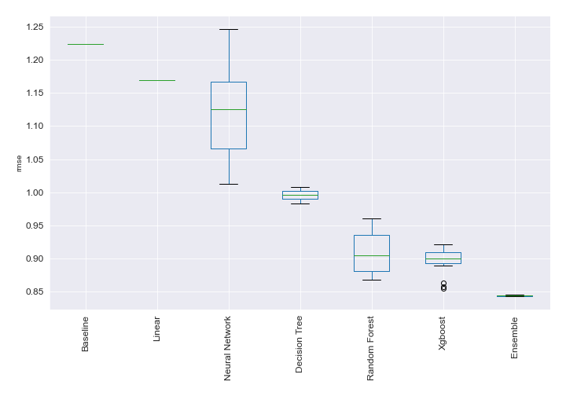
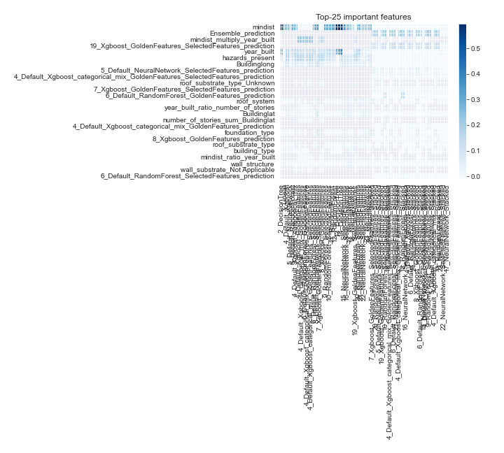
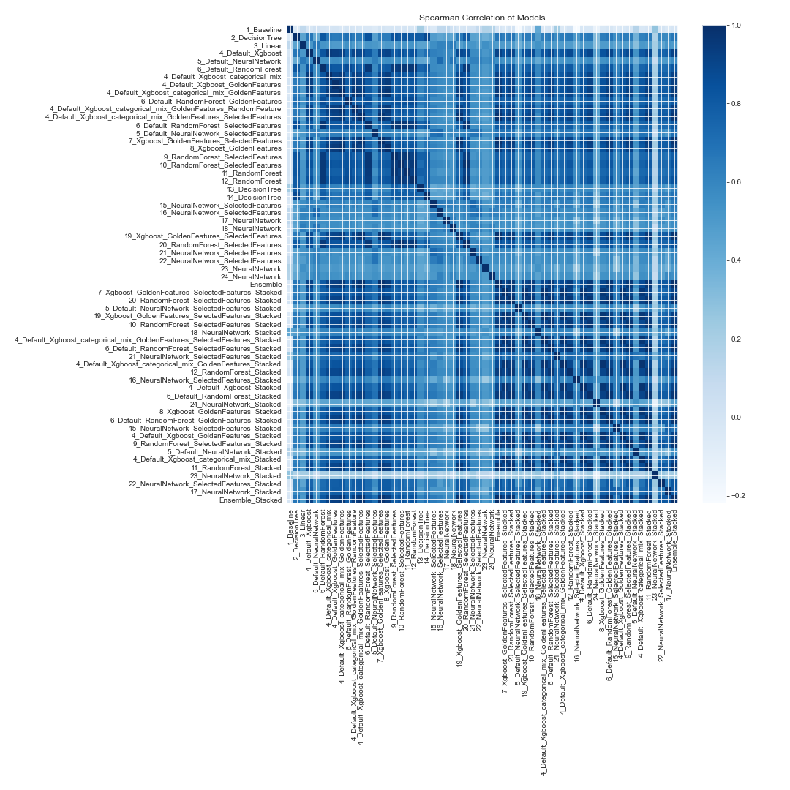

# AutoML Leaderboard

| Best model   | name                                                                                                                                                             | model_type     | metric_type   |   metric_value |   train_time |
|:-------------|:-----------------------------------------------------------------------------------------------------------------------------------------------------------------|:---------------|:--------------|---------------:|-------------:|
|              | [1_Baseline](1_Baseline/README.md)                                                                                                                               | Baseline       | rmse          |       1.22393  |         8.98 |
|              | [2_DecisionTree](2_DecisionTree/README.md)                                                                                                                       | Decision Tree  | rmse          |       0.996499 |        24.97 |
|              | [3_Linear](3_Linear/README.md)                                                                                                                                   | Linear         | rmse          |       1.16897  |        12.7  |
|              | [4_Default_Xgboost](4_Default_Xgboost/README.md)                                                                                                                 | Xgboost        | rmse          |       0.893028 |        15.63 |
|              | [5_Default_NeuralNetwork](5_Default_NeuralNetwork/README.md)                                                                                                     | Neural Network | rmse          |       1.16951  |         9.59 |
|              | [6_Default_RandomForest](6_Default_RandomForest/README.md)                                                                                                       | Random Forest  | rmse          |       0.939101 |        16.79 |
|              | [4_Default_Xgboost_categorical_mix](4_Default_Xgboost_categorical_mix/README.md)                                                                                 | Xgboost        | rmse          |       0.909468 |        17.41 |
|              | [4_Default_Xgboost_GoldenFeatures](4_Default_Xgboost_GoldenFeatures/README.md)                                                                                   | Xgboost        | rmse          |       0.899562 |        20.98 |
|              | [4_Default_Xgboost_categorical_mix_GoldenFeatures](4_Default_Xgboost_categorical_mix_GoldenFeatures/README.md)                                                   | Xgboost        | rmse          |       0.889398 |        18.42 |
|              | [6_Default_RandomForest_GoldenFeatures](6_Default_RandomForest_GoldenFeatures/README.md)                                                                         | Random Forest  | rmse          |       0.947986 |        22.15 |
|              | [4_Default_Xgboost_categorical_mix_GoldenFeatures_RandomFeature](4_Default_Xgboost_categorical_mix_GoldenFeatures_RandomFeature/README.md)                       | Xgboost        | rmse          |       0.896998 |        19.22 |
|              | [4_Default_Xgboost_categorical_mix_GoldenFeatures_SelectedFeatures](4_Default_Xgboost_categorical_mix_GoldenFeatures_SelectedFeatures/README.md)                 | Xgboost        | rmse          |       0.86261  |        17.08 |
|              | [6_Default_RandomForest_SelectedFeatures](6_Default_RandomForest_SelectedFeatures/README.md)                                                                     | Random Forest  | rmse          |       0.933495 |        18.2  |
|              | [5_Default_NeuralNetwork_SelectedFeatures](5_Default_NeuralNetwork_SelectedFeatures/README.md)                                                                   | Neural Network | rmse          |       1.07032  |        10.65 |
|              | [7_Xgboost_GoldenFeatures_SelectedFeatures](7_Xgboost_GoldenFeatures_SelectedFeatures/README.md)                                                                 | Xgboost        | rmse          |       0.854434 |        19.28 |
|              | [8_Xgboost_GoldenFeatures](8_Xgboost_GoldenFeatures/README.md)                                                                                                   | Xgboost        | rmse          |       0.895039 |        22.89 |
|              | [9_RandomForest_SelectedFeatures](9_RandomForest_SelectedFeatures/README.md)                                                                                     | Random Forest  | rmse          |       0.958517 |        17.42 |
|              | [10_RandomForest_SelectedFeatures](10_RandomForest_SelectedFeatures/README.md)                                                                                   | Random Forest  | rmse          |       0.928525 |        21.38 |
|              | [11_RandomForest](11_RandomForest/README.md)                                                                                                                     | Random Forest  | rmse          |       0.960211 |        20.58 |
|              | [12_RandomForest](12_RandomForest/README.md)                                                                                                                     | Random Forest  | rmse          |       0.934218 |        23.49 |
|              | [13_DecisionTree](13_DecisionTree/README.md)                                                                                                                     | Decision Tree  | rmse          |       0.982956 |        24.59 |
|              | [14_DecisionTree](14_DecisionTree/README.md)                                                                                                                     | Decision Tree  | rmse          |       1.00764  |        27.9  |
|              | [15_NeuralNetwork_SelectedFeatures](15_NeuralNetwork_SelectedFeatures/README.md)                                                                                 | Neural Network | rmse          |       1.16631  |        16.6  |
|              | [16_NeuralNetwork_SelectedFeatures](16_NeuralNetwork_SelectedFeatures/README.md)                                                                                 | Neural Network | rmse          |       1.12944  |        17.26 |
|              | [17_NeuralNetwork](17_NeuralNetwork/README.md)                                                                                                                   | Neural Network | rmse          |       1.22522  |        21.81 |
|              | [18_NeuralNetwork](18_NeuralNetwork/README.md)                                                                                                                   | Neural Network | rmse          |       1.12335  |        18.04 |
|              | [19_Xgboost_GoldenFeatures_SelectedFeatures](19_Xgboost_GoldenFeatures_SelectedFeatures/README.md)                                                               | Xgboost        | rmse          |       0.857616 |        25.18 |
|              | [20_RandomForest_SelectedFeatures](20_RandomForest_SelectedFeatures/README.md)                                                                                   | Random Forest  | rmse          |       0.923597 |        27.7  |
|              | [21_NeuralNetwork_SelectedFeatures](21_NeuralNetwork_SelectedFeatures/README.md)                                                                                 | Neural Network | rmse          |       1.1269   |        18.91 |
|              | [22_NeuralNetwork_SelectedFeatures](22_NeuralNetwork_SelectedFeatures/README.md)                                                                                 | Neural Network | rmse          |       1.21466  |        17.54 |
|              | [23_NeuralNetwork](23_NeuralNetwork/README.md)                                                                                                                   | Neural Network | rmse          |       1.17695  |        18.54 |
|              | [24_NeuralNetwork](24_NeuralNetwork/README.md)                                                                                                                   | Neural Network | rmse          |       1.15004  |       360.79 |
|              | [Ensemble](Ensemble/README.md)                                                                                                                                   | Ensemble       | rmse          |       0.84531  |         1.04 |
|              | [7_Xgboost_GoldenFeatures_SelectedFeatures_Stacked](7_Xgboost_GoldenFeatures_SelectedFeatures_Stacked/README.md)                                                 | Xgboost        | rmse          |       0.909394 |       683.68 |
|              | [20_RandomForest_SelectedFeatures_Stacked](20_RandomForest_SelectedFeatures_Stacked/README.md)                                                                   | Random Forest  | rmse          |       0.881999 |        43.35 |
|              | [5_Default_NeuralNetwork_SelectedFeatures_Stacked](5_Default_NeuralNetwork_SelectedFeatures_Stacked/README.md)                                                   | Neural Network | rmse          |       1.14509  |        25    |
|              | [19_Xgboost_GoldenFeatures_SelectedFeatures_Stacked](19_Xgboost_GoldenFeatures_SelectedFeatures_Stacked/README.md)                                               | Xgboost        | rmse          |       0.898595 |        32.09 |
|              | [10_RandomForest_SelectedFeatures_Stacked](10_RandomForest_SelectedFeatures_Stacked/README.md)                                                                   | Random Forest  | rmse          |       0.884725 |        33.64 |
|              | [18_NeuralNetwork_Stacked](18_NeuralNetwork_Stacked/README.md)                                                                                                   | Neural Network | rmse          |       1.04407  |        24.14 |
|              | [4_Default_Xgboost_categorical_mix_GoldenFeatures_SelectedFeatures_Stacked](4_Default_Xgboost_categorical_mix_GoldenFeatures_SelectedFeatures_Stacked/README.md) | Xgboost        | rmse          |       0.921497 |        30.57 |
|              | [6_Default_RandomForest_SelectedFeatures_Stacked](6_Default_RandomForest_SelectedFeatures_Stacked/README.md)                                                     | Random Forest  | rmse          |       0.880949 |        35.62 |
|              | [21_NeuralNetwork_SelectedFeatures_Stacked](21_NeuralNetwork_SelectedFeatures_Stacked/README.md)                                                                 | Neural Network | rmse          |       1.01922  |        24.48 |
|              | [4_Default_Xgboost_categorical_mix_GoldenFeatures_Stacked](4_Default_Xgboost_categorical_mix_GoldenFeatures_Stacked/README.md)                                   | Xgboost        | rmse          |       0.915991 |        36.49 |
|              | [12_RandomForest_Stacked](12_RandomForest_Stacked/README.md)                                                                                                     | Random Forest  | rmse          |       0.875873 |        38.17 |
|              | [16_NeuralNetwork_SelectedFeatures_Stacked](16_NeuralNetwork_SelectedFeatures_Stacked/README.md)                                                                 | Neural Network | rmse          |       1.07903  |        31.35 |
|              | [4_Default_Xgboost_Stacked](4_Default_Xgboost_Stacked/README.md)                                                                                                 | Xgboost        | rmse          |       0.910361 |        44.16 |
|              | [6_Default_RandomForest_Stacked](6_Default_RandomForest_Stacked/README.md)                                                                                       | Random Forest  | rmse          |       0.878988 |        51.6  |
|              | [24_NeuralNetwork_Stacked](24_NeuralNetwork_Stacked/README.md)                                                                                                   | Neural Network | rmse          |       1.1101   |        38.04 |
|              | [8_Xgboost_GoldenFeatures_Stacked](8_Xgboost_GoldenFeatures_Stacked/README.md)                                                                                   | Xgboost        | rmse          |       0.908965 |        48.79 |
|              | [6_Default_RandomForest_GoldenFeatures_Stacked](6_Default_RandomForest_GoldenFeatures_Stacked/README.md)                                                         | Random Forest  | rmse          |       0.883711 |        53.05 |
|              | [15_NeuralNetwork_SelectedFeatures_Stacked](15_NeuralNetwork_SelectedFeatures_Stacked/README.md)                                                                 | Neural Network | rmse          |       1.05243  |        53.12 |
|              | [4_Default_Xgboost_GoldenFeatures_Stacked](4_Default_Xgboost_GoldenFeatures_Stacked/README.md)                                                                   | Xgboost        | rmse          |       0.906527 |        57.37 |
|              | [9_RandomForest_SelectedFeatures_Stacked](9_RandomForest_SelectedFeatures_Stacked/README.md)                                                                     | Random Forest  | rmse          |       0.868091 |        66.29 |
|              | [5_Default_NeuralNetwork_Stacked](5_Default_NeuralNetwork_Stacked/README.md)                                                                                     | Neural Network | rmse          |       1.08726  |        57.93 |
|              | [4_Default_Xgboost_categorical_mix_Stacked](4_Default_Xgboost_categorical_mix_Stacked/README.md)                                                                 | Xgboost        | rmse          |       0.909585 |        79.01 |
|              | [11_RandomForest_Stacked](11_RandomForest_Stacked/README.md)                                                                                                     | Random Forest  | rmse          |       0.88155  |        67.34 |
|              | [23_NeuralNetwork_Stacked](23_NeuralNetwork_Stacked/README.md)                                                                                                   | Neural Network | rmse          |       1.24643  |        45.9  |
|              | [22_NeuralNetwork_SelectedFeatures_Stacked](22_NeuralNetwork_SelectedFeatures_Stacked/README.md)                                                                 | Neural Network | rmse          |       1.02938  |        49.48 |
|              | [17_NeuralNetwork_Stacked](17_NeuralNetwork_Stacked/README.md)                                                                                                   | Neural Network | rmse          |       1.01278  |        51.2  |
| **the best** | [Ensemble_Stacked](Ensemble_Stacked/README.md)                                                                                                                   | Ensemble       | rmse          |       0.842651 |         3.3  |

### AutoML Performance

### AutoML Performance Boxplot

### Features Importance

### Spearman Correlation of Models

