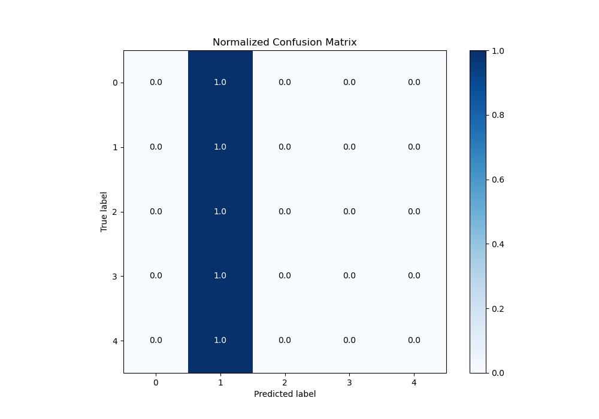

# Summary of 1_Baseline

[<< Go back](../README.md)

## Baseline Classifier (Baseline)
- **n_jobs**: -1
- **num_class**: 5
- **explain_level**: 2

## Validation
 - **validation_type**: split
 - **train_ratio**: 0.9
 - **shuffle**: True
 - **stratify**: True

## Optimized metric
logloss

## Training time

0.5 seconds

### Metric details
|           |   0 |         1 |   2 |   3 |   4 |   accuracy |   macro avg |   weighted avg |   logloss |
|:----------|----:|----------:|----:|----:|----:|-----------:|------------:|---------------:|----------:|
| precision |   0 |  0.288136 |   0 |   0 |   0 |   0.288136 |   0.0576271 |      0.0830221 |   1.51076 |
| recall    |   0 |  1        |   0 |   0 |   0 |   0.288136 |   0.2       |      0.288136  |   1.51076 |
| f1-score  |   0 |  0.447368 |   0 |   0 |   0 |   0.288136 |   0.0894737 |      0.128903  |   1.51076 |
| support   |   4 | 17        |  17 |   9 |  12 |   0.288136 |  59         |     59         |   1.51076 |

## Confusion matrix
|              |   Predicted as 0 |   Predicted as 1 |   Predicted as 2 |   Predicted as 3 |   Predicted as 4 |
|:-------------|-----------------:|-----------------:|-----------------:|-----------------:|-----------------:|
| Labeled as 0 |                0 |                4 |                0 |                0 |                0 |
| Labeled as 1 |                0 |               17 |                0 |                0 |                0 |
| Labeled as 2 |                0 |               17 |                0 |                0 |                0 |
| Labeled as 3 |                0 |                9 |                0 |                0 |                0 |
| Labeled as 4 |                0 |               12 |                0 |                0 |                0 |

## Learning curves

## Confusion Matrix

## Normalized Confusion Matrix

## ROC Curve

## Precision Recall Curve

[<< Go back](../README.md)
