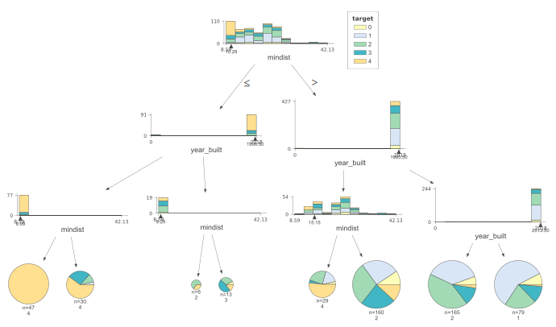
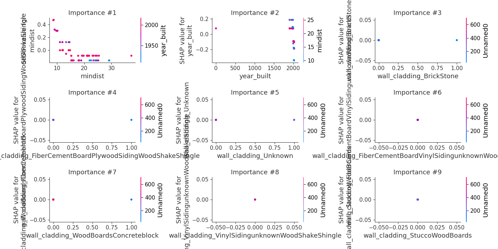

# Summary of 2_DecisionTree

[<< Go back](../README.md)

## Decision Tree
- **n_jobs**: -1
- **criterion**: gini
- **max_depth**: 3
- **num_class**: 5
- **explain_level**: 2

## Validation
 - **validation_type**: split
 - **train_ratio**: 0.9
 - **shuffle**: True
 - **stratify**: True

## Optimized metric
logloss

## Training time

14.6 seconds

### Metric details
|           |   0 |         1 |         2 |   3 |         4 |   accuracy |   macro avg |   weighted avg |   logloss |
|:----------|----:|----------:|----------:|----:|----------:|-----------:|------------:|---------------:|----------:|
| precision |   0 |  0.5      |  0.4      |   0 |  0.727273 |   0.474576 |    0.325455 |       0.407242 |   1.23026 |
| recall    |   0 |  0.235294 |  0.941176 |   0 |  0.666667 |   0.474576 |    0.368627 |       0.474576 |   1.23026 |
| f1-score  |   0 |  0.32     |  0.561404 |   0 |  0.695652 |   0.474576 |    0.315411 |       0.395452 |   1.23026 |
| support   |   4 | 17        | 17        |   9 | 12        |   0.474576 |   59        |      59        |   1.23026 |

## Confusion matrix
|              |   Predicted as 0 |   Predicted as 1 |   Predicted as 2 |   Predicted as 3 |   Predicted as 4 |
|:-------------|-----------------:|-----------------:|-----------------:|-----------------:|-----------------:|
| Labeled as 0 |                0 |                2 |                2 |                0 |                0 |
| Labeled as 1 |                0 |                4 |               11 |                0 |                2 |
| Labeled as 2 |                0 |                1 |               16 |                0 |                0 |
| Labeled as 3 |                0 |                1 |                7 |                0 |                1 |
| Labeled as 4 |                0 |                0 |                4 |                0 |                8 |

## Learning curves

## Decision Tree 

### Tree #1

### Rules

if (mindist > 10.287) and (year_built > 1995.5) and (year_built <= 2013.5) then class: 2 (proba: 42.42%) | based on 165 samples

if (mindist > 10.287) and (year_built <= 1995.5) and (mindist > 15.151) then class: 2 (proba: 29.38%) | based on 160 samples

if (mindist > 10.287) and (year_built > 1995.5) and (year_built > 2013.5) then class: 1 (proba: 58.23%) | based on 79 samples

if (mindist <= 10.287) and (year_built <= 1996.5) and (mindist <= 8.992) then class: 4 (proba: 100.0%) | based on 47 samples

if (mindist <= 10.287) and (year_built <= 1996.5) and (mindist > 8.992) then class: 4 (proba: 60.0%) | based on 30 samples

if (mindist > 10.287) and (year_built <= 1995.5) and (mindist <= 15.151) then class: 4 (proba: 51.72%) | based on 29 samples

if (mindist <= 10.287) and (year_built > 1996.5) and (mindist > 9.285) then class: 3 (proba: 46.15%) | based on 13 samples

if (mindist <= 10.287) and (year_built > 1996.5) and (mindist <= 9.285) then class: 2 (proba: 66.67%) | based on 6 samples

## Permutation-based Importance

## Confusion Matrix

## Normalized Confusion Matrix

## ROC Curve

## Precision Recall Curve

## SHAP Importance

## SHAP Dependence plots

### Dependence 0 (Fold 1)

### Dependence 1 (Fold 1)

### Dependence 2 (Fold 1)

### Dependence 3 (Fold 1)

### Dependence 4 (Fold 1)

## SHAP Decision plots

### Worst decisions for selected sample 1 (Fold 1)

### Worst decisions for selected sample 2 (Fold 1)

### Worst decisions for selected sample 3 (Fold 1)

### Worst decisions for selected sample 4 (Fold 1)

### Best decisions for selected sample 1 (Fold 1)

### Best decisions for selected sample 2 (Fold 1)

### Best decisions for selected sample 3 (Fold 1)

### Best decisions for selected sample 4 (Fold 1)

[<< Go back](../README.md)
