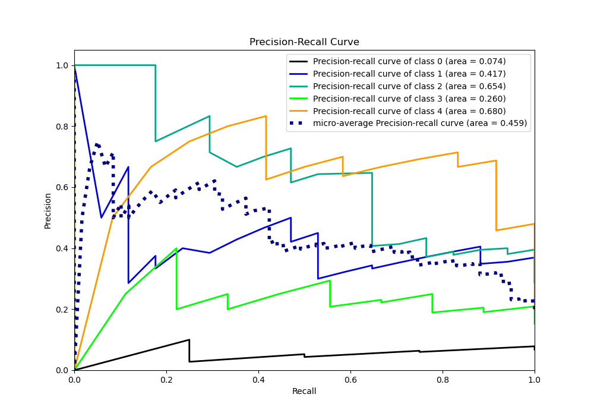
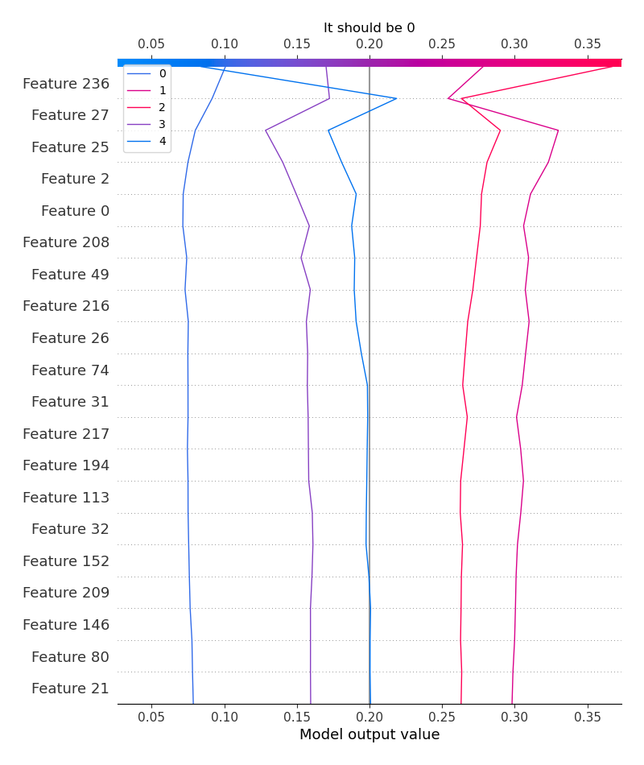

# Summary of 5_Default_RandomForest

[<< Go back](../README.md)

## Random Forest
- **n_jobs**: -1
- **criterion**: gini
- **max_features**: 0.9
- **min_samples_split**: 30
- **max_depth**: 4
- **eval_metric_name**: logloss
- **num_class**: 5
- **explain_level**: 2

## Validation
 - **validation_type**: split
 - **train_ratio**: 0.9
 - **shuffle**: True
 - **stratify**: True

## Optimized metric
logloss

## Training time

9.3 seconds

### Metric details
|           |   0 |         1 |         2 |        3 |         4 |   accuracy |   macro avg |   weighted avg |   logloss |
|:----------|----:|----------:|----------:|---------:|----------:|-----------:|------------:|---------------:|----------:|
| precision |   0 |  0.407407 |  0.428571 | 0.333333 |  0.875    |   0.474576 |    0.408862 |       0.469689 |   1.27455 |
| recall    |   0 |  0.647059 |  0.529412 | 0.111111 |  0.583333 |   0.474576 |    0.374183 |       0.474576 |   1.27455 |
| f1-score  |   0 |  0.5      |  0.473684 | 0.166667 |  0.7      |   0.474576 |    0.36807  |       0.44835  |   1.27455 |
| support   |   4 | 17        | 17        | 9        | 12        |   0.474576 |   59        |      59        |   1.27455 |

## Confusion matrix
|              |   Predicted as 0 |   Predicted as 1 |   Predicted as 2 |   Predicted as 3 |   Predicted as 4 |
|:-------------|-----------------:|-----------------:|-----------------:|-----------------:|-----------------:|
| Labeled as 0 |                0 |                2 |                2 |                0 |                0 |
| Labeled as 1 |                0 |               11 |                5 |                1 |                0 |
| Labeled as 2 |                0 |                8 |                9 |                0 |                0 |
| Labeled as 3 |                0 |                5 |                2 |                1 |                1 |
| Labeled as 4 |                0 |                1 |                3 |                1 |                7 |

## Learning curves

## Permutation-based Importance

## Confusion Matrix

## Normalized Confusion Matrix

## ROC Curve

## Precision Recall Curve

## SHAP Importance

## SHAP Dependence plots

### Dependence 0 (Fold 1)

### Dependence 1 (Fold 1)

### Dependence 2 (Fold 1)

### Dependence 3 (Fold 1)

### Dependence 4 (Fold 1)

## SHAP Decision plots

### Worst decisions for selected sample 1 (Fold 1)

### Worst decisions for selected sample 2 (Fold 1)

### Worst decisions for selected sample 3 (Fold 1)

### Worst decisions for selected sample 4 (Fold 1)

### Best decisions for selected sample 1 (Fold 1)

### Best decisions for selected sample 2 (Fold 1)

### Best decisions for selected sample 3 (Fold 1)

### Best decisions for selected sample 4 (Fold 1)

[<< Go back](../README.md)
