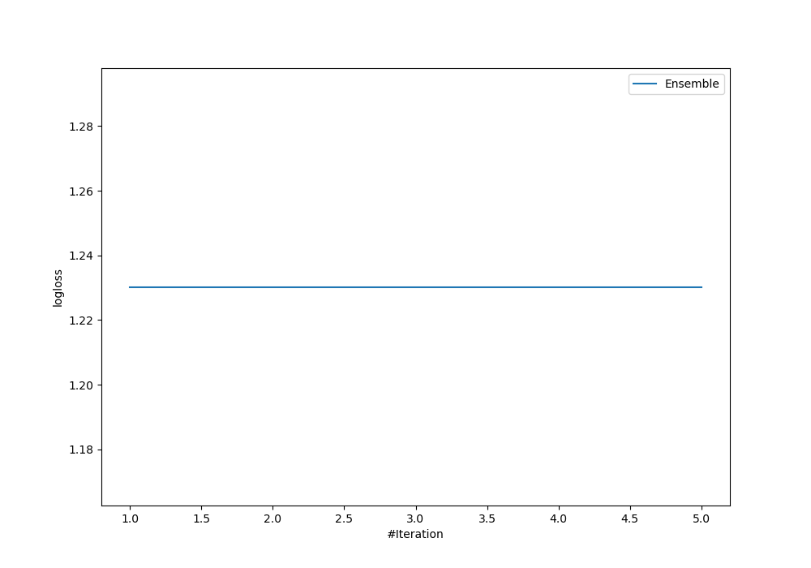
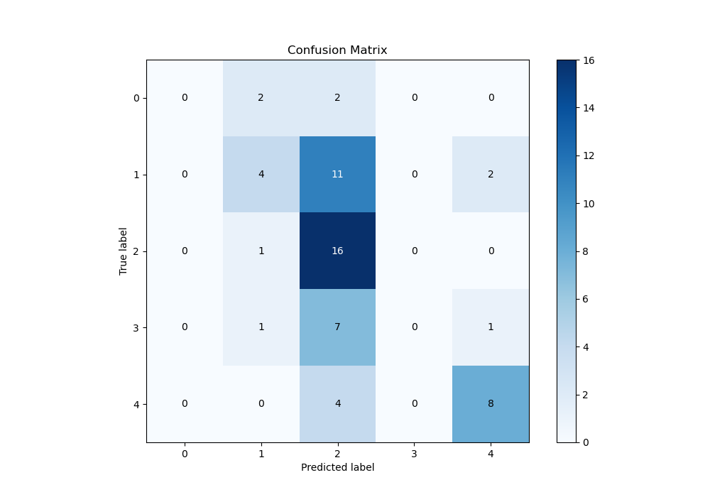
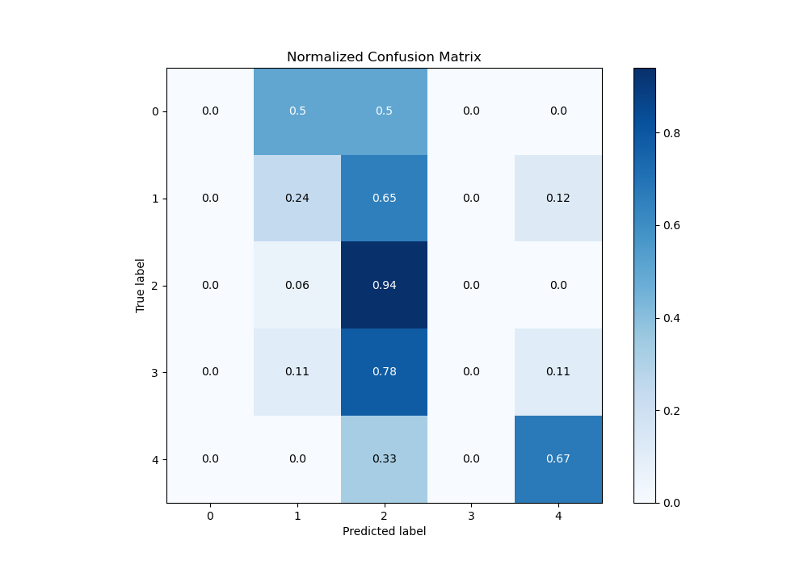
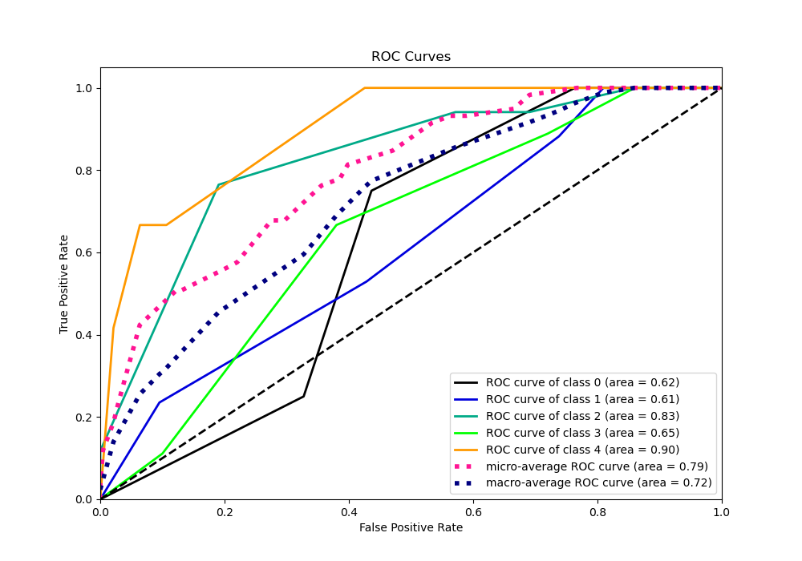
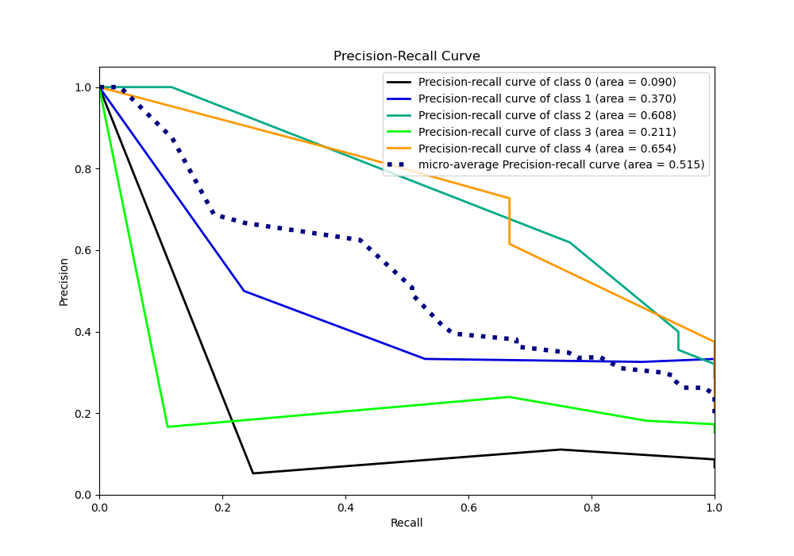

# Summary of Ensemble

[<< Go back](../README.md)

## Ensemble structure
| Model          |   Weight |
|:---------------|---------:|
| 2_DecisionTree |        1 |

### Metric details
|           |   0 |         1 |         2 |   3 |         4 |   accuracy |   macro avg |   weighted avg |   logloss |
|:----------|----:|----------:|----------:|----:|----------:|-----------:|------------:|---------------:|----------:|
| precision |   0 |  0.5      |  0.4      |   0 |  0.727273 |   0.474576 |    0.325455 |       0.407242 |   1.23026 |
| recall    |   0 |  0.235294 |  0.941176 |   0 |  0.666667 |   0.474576 |    0.368627 |       0.474576 |   1.23026 |
| f1-score  |   0 |  0.32     |  0.561404 |   0 |  0.695652 |   0.474576 |    0.315411 |       0.395452 |   1.23026 |
| support   |   4 | 17        | 17        |   9 | 12        |   0.474576 |   59        |      59        |   1.23026 |

## Confusion matrix
|              |   Predicted as 0 |   Predicted as 1 |   Predicted as 2 |   Predicted as 3 |   Predicted as 4 |
|:-------------|-----------------:|-----------------:|-----------------:|-----------------:|-----------------:|
| Labeled as 0 |                0 |                2 |                2 |                0 |                0 |
| Labeled as 1 |                0 |                4 |               11 |                0 |                2 |
| Labeled as 2 |                0 |                1 |               16 |                0 |                0 |
| Labeled as 3 |                0 |                1 |                7 |                0 |                1 |
| Labeled as 4 |                0 |                0 |                4 |                0 |                8 |

## Learning curves

## Confusion Matrix

## Normalized Confusion Matrix

## ROC Curve

## Precision Recall Curve

[<< Go back](../README.md)
