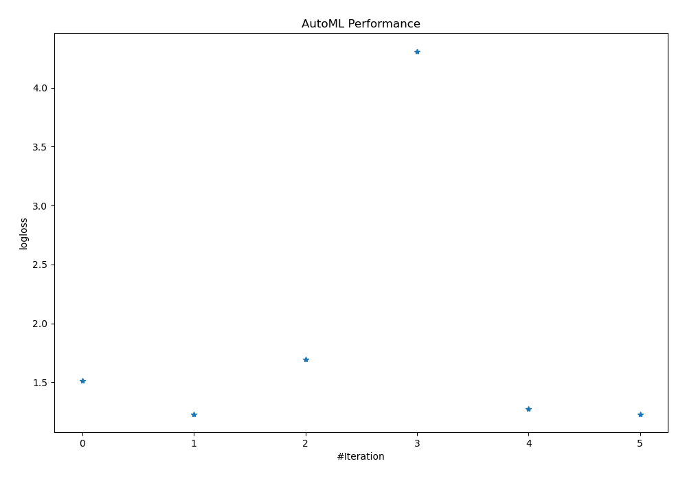
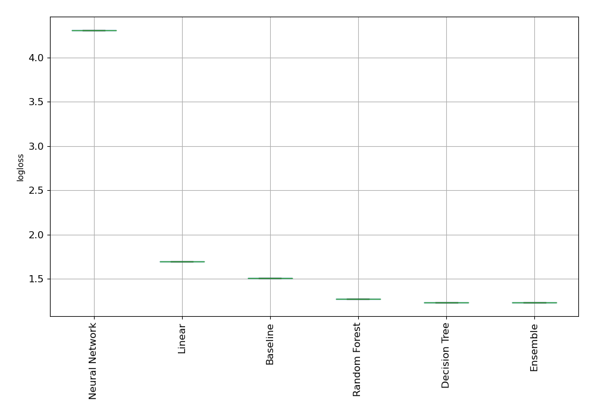
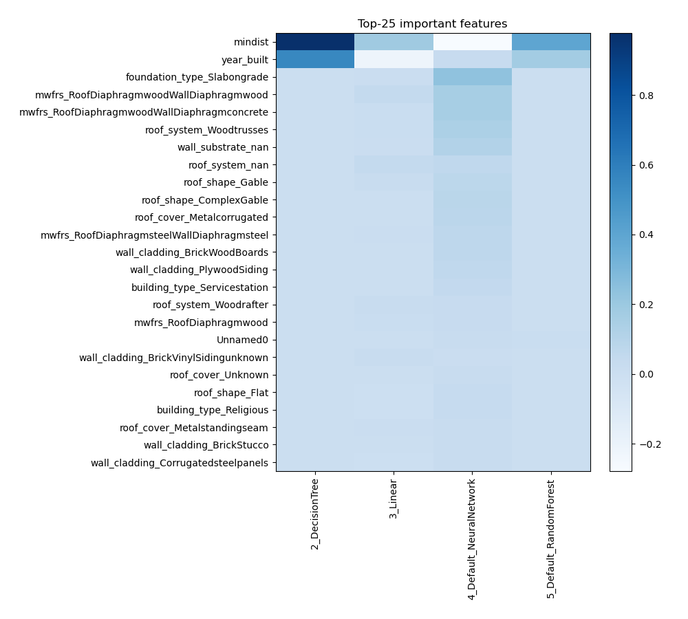
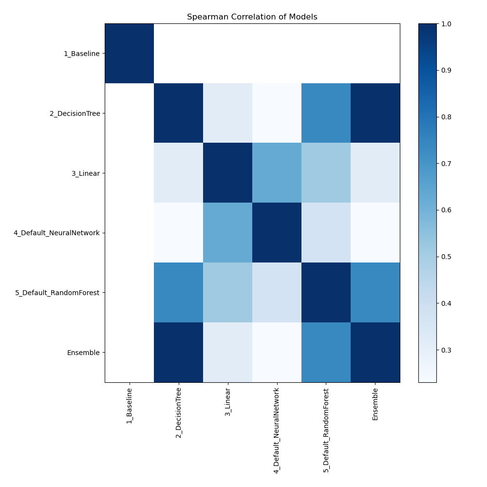

# AutoML Leaderboard

| Best model   | name                                                         | model_type     | metric_type   |   metric_value |   train_time |
|:-------------|:-------------------------------------------------------------|:---------------|:--------------|---------------:|-------------:|
|              | [1_Baseline](1_Baseline/README.md)                           | Baseline       | logloss       |        1.51076 |         0.89 |
| **the best** | [2_DecisionTree](2_DecisionTree/README.md)                   | Decision Tree  | logloss       |        1.23026 |        15.18 |
|              | [3_Linear](3_Linear/README.md)                               | Linear         | logloss       |        1.69297 |         7.56 |
|              | [4_Default_NeuralNetwork](4_Default_NeuralNetwork/README.md) | Neural Network | logloss       |        4.30916 |         1.94 |
|              | [5_Default_RandomForest](5_Default_RandomForest/README.md)   | Random Forest  | logloss       |        1.27455 |         9.87 |
|              | [Ensemble](Ensemble/README.md)                               | Ensemble       | logloss       |        1.23026 |         0.16 |

### AutoML Performance

### AutoML Performance Boxplot

### Features Importance

### Spearman Correlation of Models

