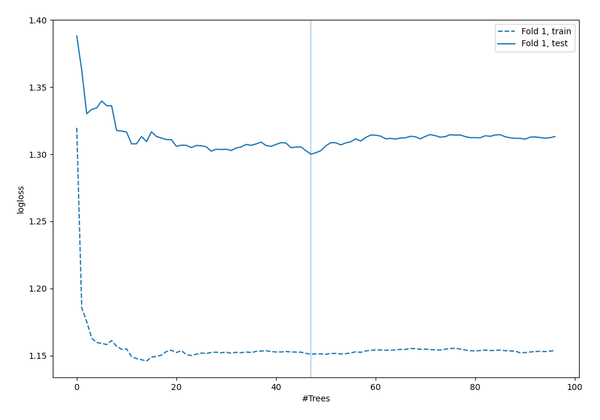

# Summary of 11_RandomForest

[<< Go back](../README.md)

## Random Forest
- **n_jobs**: -1
- **criterion**: gini
- **max_features**: 0.8
- **min_samples_split**: 40
- **max_depth**: 3
- **eval_metric_name**: logloss
- **num_class**: 5
- **explain_level**: 1

## Validation
 - **validation_type**: split
 - **train_ratio**: 0.9
 - **shuffle**: True
 - **stratify**: True

## Optimized metric
logloss

## Training time

3.8 seconds

### Metric details
|           |   0 |         1 |         2 |   3 |         4 |   accuracy |   macro avg |   weighted avg |   logloss |
|:----------|----:|----------:|----------:|----:|----------:|-----------:|------------:|---------------:|----------:|
| precision |   0 |  0.347826 |  0.230769 |   0 |  0.6      |   0.338983 |    0.235719 |       0.288748 |       1.3 |
| recall    |   0 |  0.470588 |  0.352941 |   0 |  0.5      |   0.338983 |    0.264706 |       0.338983 |       1.3 |
| f1-score  |   0 |  0.4      |  0.27907  |   0 |  0.545455 |   0.338983 |    0.244905 |       0.306604 |       1.3 |
| support   |   4 | 17        | 17        |   9 | 12        |   0.338983 |   59        |      59        |       1.3 |

## Confusion matrix
|              |   Predicted as 0 |   Predicted as 1 |   Predicted as 2 |   Predicted as 3 |   Predicted as 4 |
|:-------------|-----------------:|-----------------:|-----------------:|-----------------:|-----------------:|
| Labeled as 0 |                0 |                2 |                2 |                0 |                0 |
| Labeled as 1 |                0 |                8 |                8 |                0 |                1 |
| Labeled as 2 |                0 |                9 |                6 |                0 |                2 |
| Labeled as 3 |                0 |                3 |                5 |                0 |                1 |
| Labeled as 4 |                0 |                1 |                5 |                0 |                6 |

## Learning curves

## Permutation-based Importance

## Confusion Matrix

## Normalized Confusion Matrix

## ROC Curve

## Precision Recall Curve

[<< Go back](../README.md)
