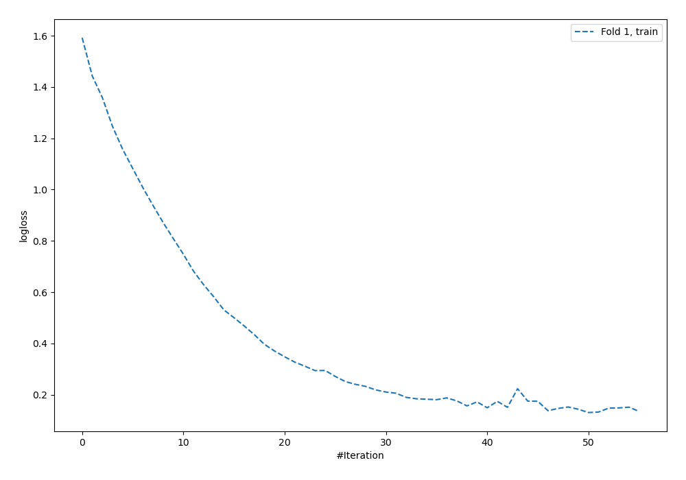
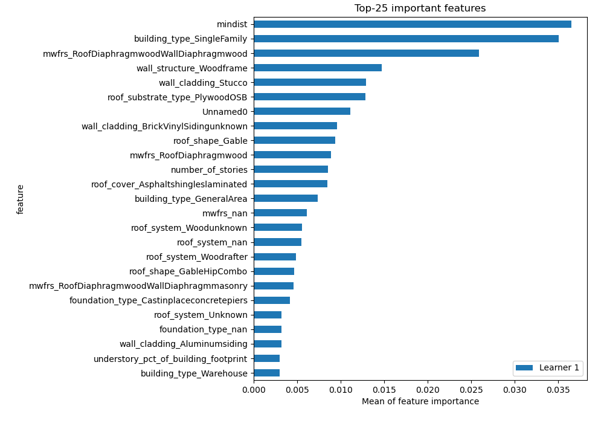
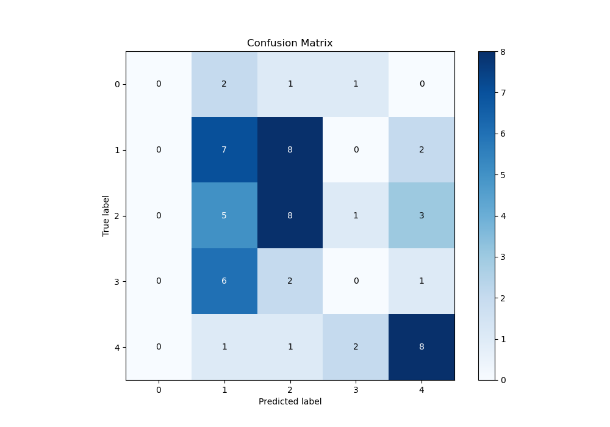
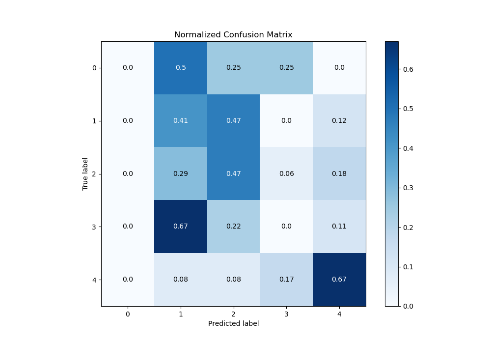
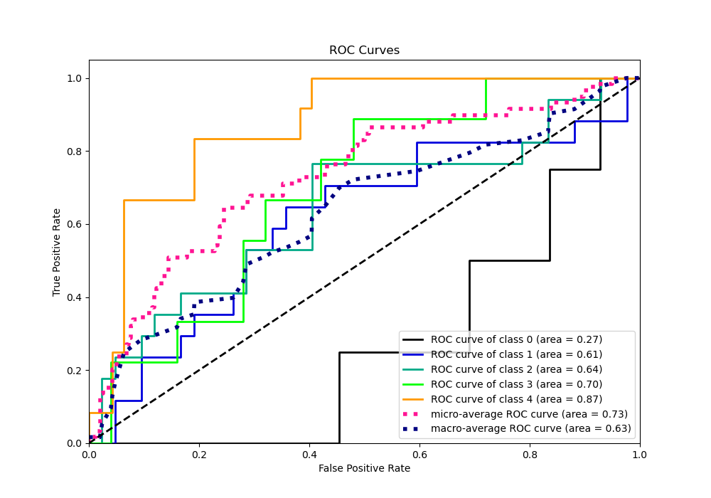
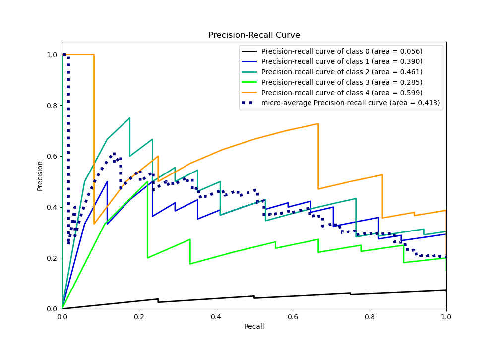

# Summary of 14_NeuralNetwork

[<< Go back](../README.md)

## Neural Network
- **n_jobs**: -1
- **dense_1_size**: 64
- **dense_2_size**: 16
- **learning_rate**: 0.01
- **num_class**: 5
- **explain_level**: 1

## Validation
 - **validation_type**: split
 - **train_ratio**: 0.9
 - **shuffle**: True
 - **stratify**: True

## Optimized metric
logloss

## Training time

1.3 seconds

### Metric details
|           |   0 |         1 |         2 |   3 |         4 |   accuracy |   macro avg |   weighted avg |   logloss |
|:----------|----:|----------:|----------:|----:|----------:|-----------:|------------:|---------------:|----------:|
| precision |   0 |  0.333333 |  0.4      |   0 |  0.571429 |   0.389831 |    0.260952 |       0.327522 |   1.45058 |
| recall    |   0 |  0.411765 |  0.470588 |   0 |  0.666667 |   0.389831 |    0.309804 |       0.389831 |   1.45058 |
| f1-score  |   0 |  0.368421 |  0.432432 |   0 |  0.615385 |   0.389831 |    0.283248 |       0.355917 |   1.45058 |
| support   |   4 | 17        | 17        |   9 | 12        |   0.389831 |   59        |      59        |   1.45058 |

## Confusion matrix
|              |   Predicted as 0 |   Predicted as 1 |   Predicted as 2 |   Predicted as 3 |   Predicted as 4 |
|:-------------|-----------------:|-----------------:|-----------------:|-----------------:|-----------------:|
| Labeled as 0 |                0 |                2 |                1 |                1 |                0 |
| Labeled as 1 |                0 |                7 |                8 |                0 |                2 |
| Labeled as 2 |                0 |                5 |                8 |                1 |                3 |
| Labeled as 3 |                0 |                6 |                2 |                0 |                1 |
| Labeled as 4 |                0 |                1 |                1 |                2 |                8 |

## Learning curves

## Permutation-based Importance

## Confusion Matrix

## Normalized Confusion Matrix

## ROC Curve

## Precision Recall Curve

[<< Go back](../README.md)
