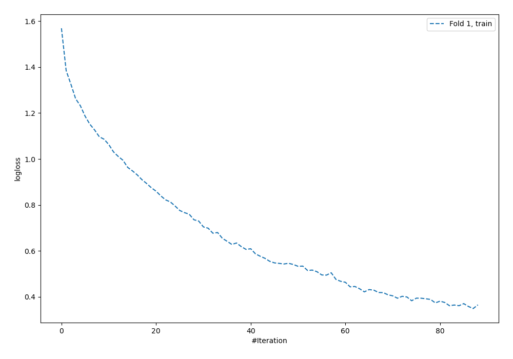

# Summary of 14_NeuralNetwork_SelectedFeatures

[<< Go back](../README.md)

## Neural Network
- **n_jobs**: -1
- **dense_1_size**: 64
- **dense_2_size**: 16
- **learning_rate**: 0.01
- **num_class**: 5
- **explain_level**: 1

## Validation
 - **validation_type**: split
 - **train_ratio**: 0.9
 - **shuffle**: True
 - **stratify**: True

## Optimized metric
logloss

## Training time

0.6 seconds

### Metric details
|           |        0 |         1 |         2 |        3 |         4 |   accuracy |   macro avg |   weighted avg |   logloss |
|:----------|---------:|----------:|----------:|---------:|----------:|-----------:|------------:|---------------:|----------:|
| precision | 0.5      |  0.35     |  0.363636 | 0.285714 |  0.625    |   0.389831 |    0.42487  |       0.410225 |   1.84584 |
| recall    | 0.25     |  0.411765 |  0.470588 | 0.222222 |  0.416667 |   0.389831 |    0.354248 |       0.389831 |   1.84584 |
| f1-score  | 0.333333 |  0.378378 |  0.410256 | 0.25     |  0.5      |   0.389831 |    0.374394 |       0.389663 |   1.84584 |
| support   | 4        | 17        | 17        | 9        | 12        |   0.389831 |   59        |      59        |   1.84584 |

## Confusion matrix
|              |   Predicted as 0 |   Predicted as 1 |   Predicted as 2 |   Predicted as 3 |   Predicted as 4 |
|:-------------|-----------------:|-----------------:|-----------------:|-----------------:|-----------------:|
| Labeled as 0 |                1 |                0 |                3 |                0 |                0 |
| Labeled as 1 |                1 |                7 |                6 |                2 |                1 |
| Labeled as 2 |                0 |                7 |                8 |                1 |                1 |
| Labeled as 3 |                0 |                3 |                3 |                2 |                1 |
| Labeled as 4 |                0 |                3 |                2 |                2 |                5 |

## Learning curves

## Permutation-based Importance

## Confusion Matrix

## Normalized Confusion Matrix

## ROC Curve

## Precision Recall Curve

[<< Go back](../README.md)
