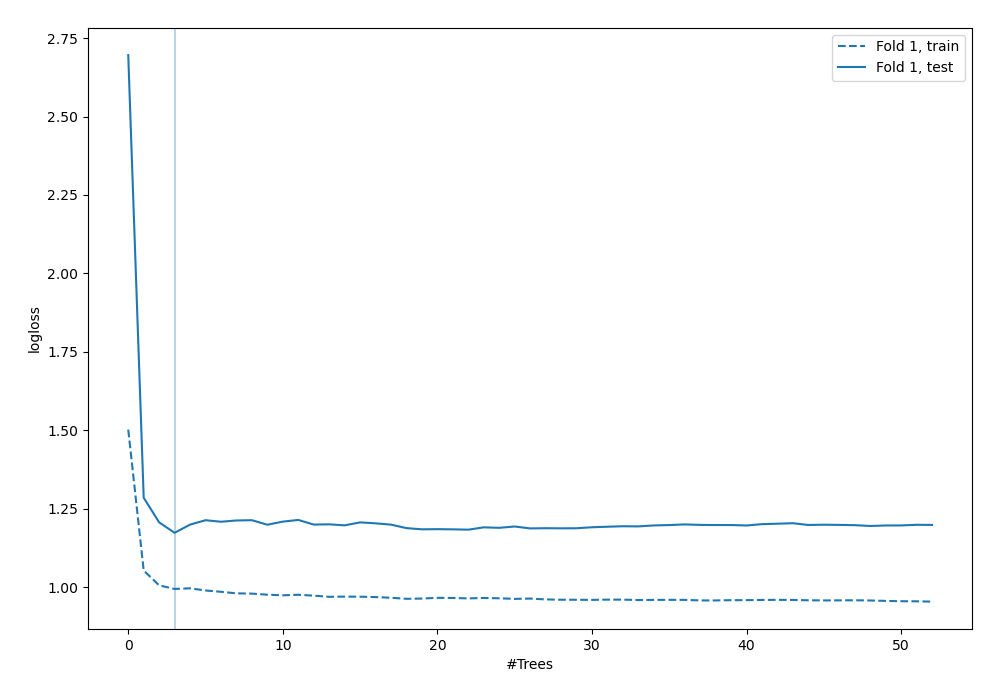
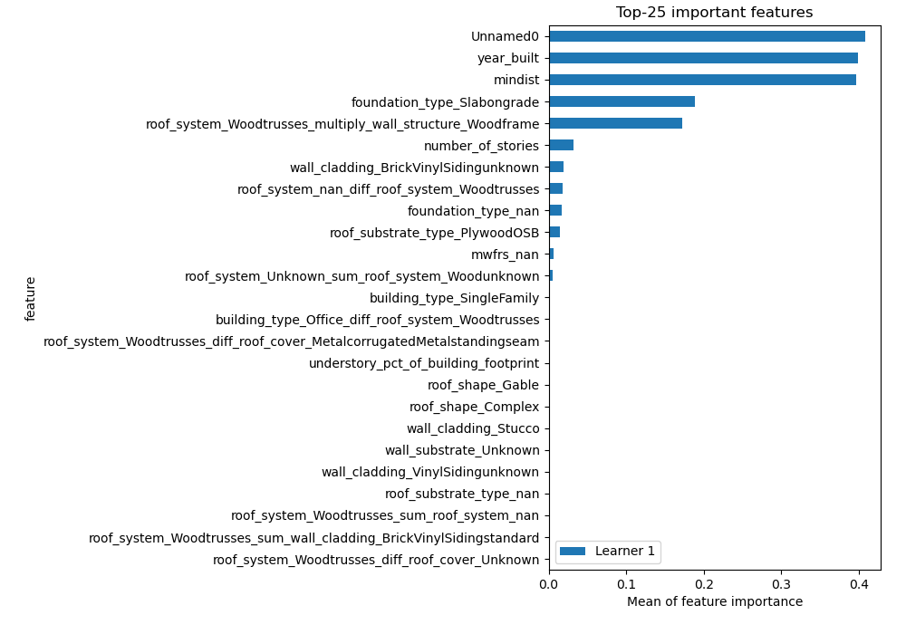
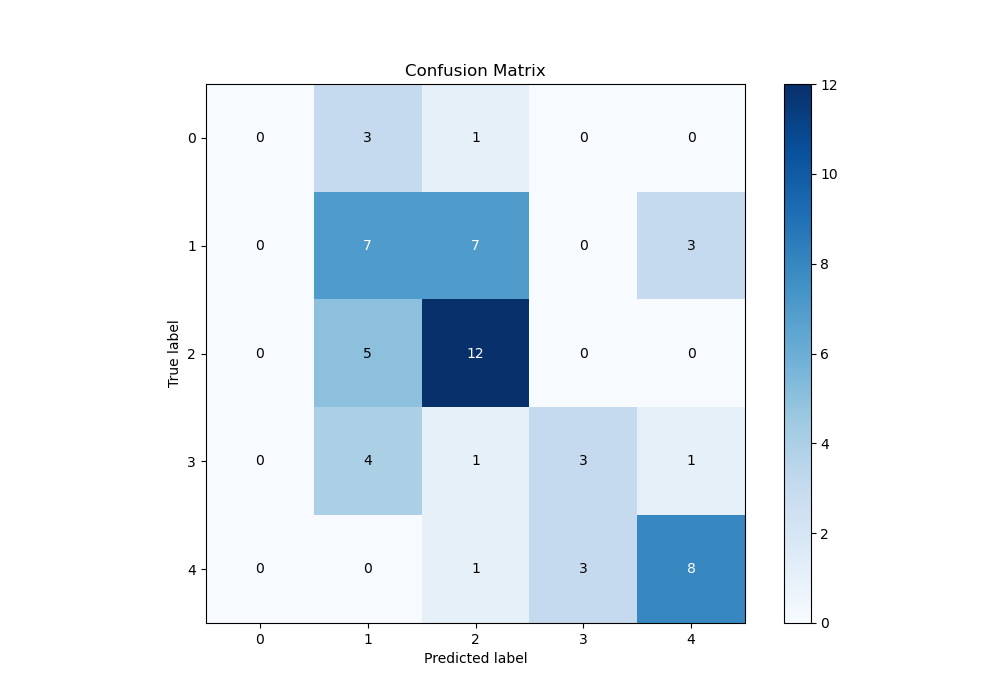
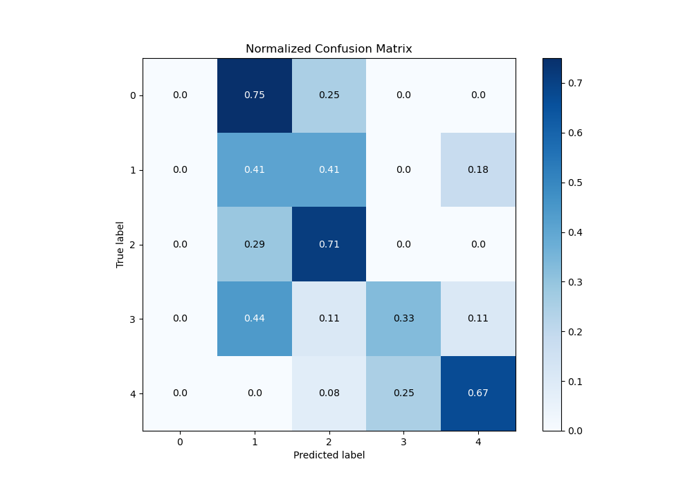
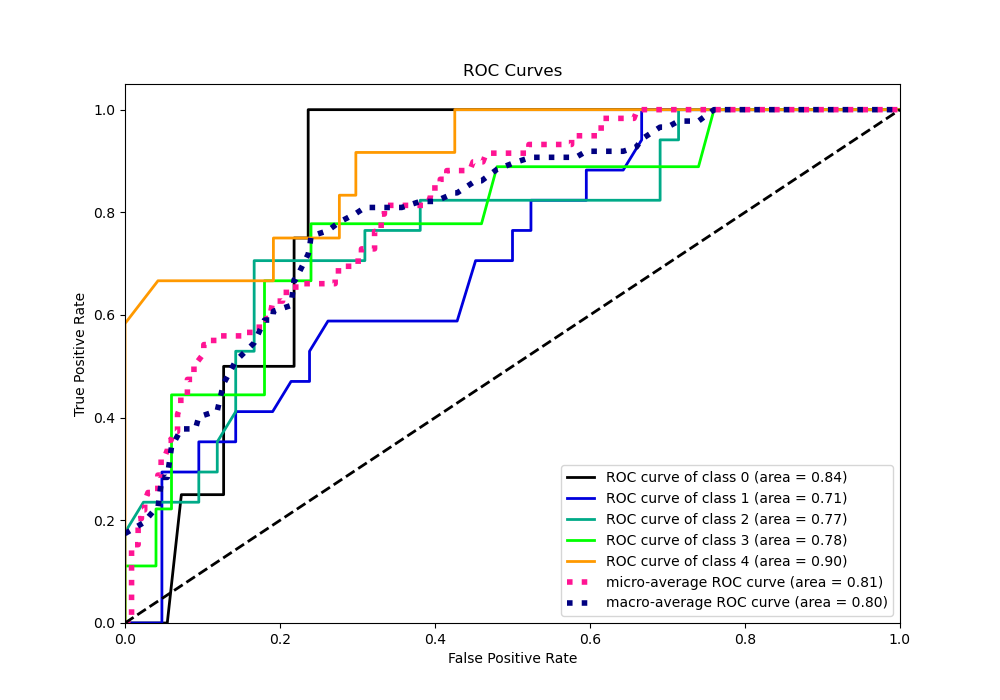
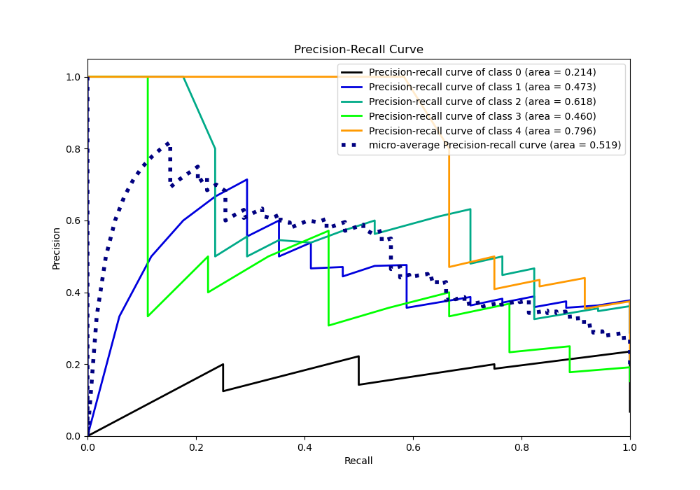

# Summary of 19_RandomForest_GoldenFeatures_SelectedFeatures

[<< Go back](../README.md)

## Random Forest
- **n_jobs**: -1
- **criterion**: entropy
- **max_features**: 0.7
- **min_samples_split**: 30
- **max_depth**: 7
- **eval_metric_name**: logloss
- **num_class**: 5
- **explain_level**: 1

## Validation
 - **validation_type**: split
 - **train_ratio**: 0.9
 - **shuffle**: True
 - **stratify**: True

## Optimized metric
logloss

## Training time

1.0 seconds

### Metric details
|           |   0 |         1 |         2 |        3 |         4 |   accuracy |   macro avg |   weighted avg |   logloss |
|:----------|----:|----------:|----------:|---------:|----------:|-----------:|------------:|---------------:|----------:|
| precision |   0 |  0.368421 |  0.545455 | 0.5      |  0.666667 |   0.508475 |    0.416108 |       0.475184 |    1.1731 |
| recall    |   0 |  0.411765 |  0.705882 | 0.333333 |  0.666667 |   0.508475 |    0.423529 |       0.508475 |    1.1731 |
| f1-score  |   0 |  0.388889 |  0.615385 | 0.4      |  0.666667 |   0.508475 |    0.414188 |       0.485977 |    1.1731 |
| support   |   4 | 17        | 17        | 9        | 12        |   0.508475 |   59        |      59        |    1.1731 |

## Confusion matrix
|              |   Predicted as 0 |   Predicted as 1 |   Predicted as 2 |   Predicted as 3 |   Predicted as 4 |
|:-------------|-----------------:|-----------------:|-----------------:|-----------------:|-----------------:|
| Labeled as 0 |                0 |                3 |                1 |                0 |                0 |
| Labeled as 1 |                0 |                7 |                7 |                0 |                3 |
| Labeled as 2 |                0 |                5 |               12 |                0 |                0 |
| Labeled as 3 |                0 |                4 |                1 |                3 |                1 |
| Labeled as 4 |                0 |                0 |                1 |                3 |                8 |

## Learning curves

## Permutation-based Importance

## Confusion Matrix

## Normalized Confusion Matrix

## ROC Curve

## Precision Recall Curve

[<< Go back](../README.md)
