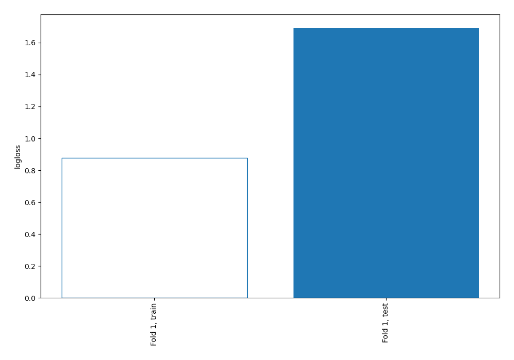
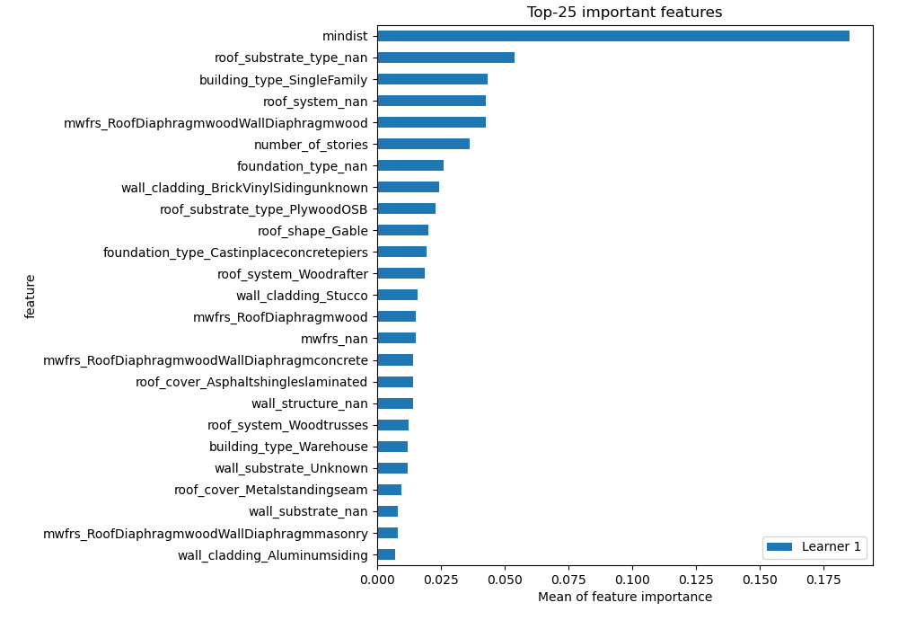
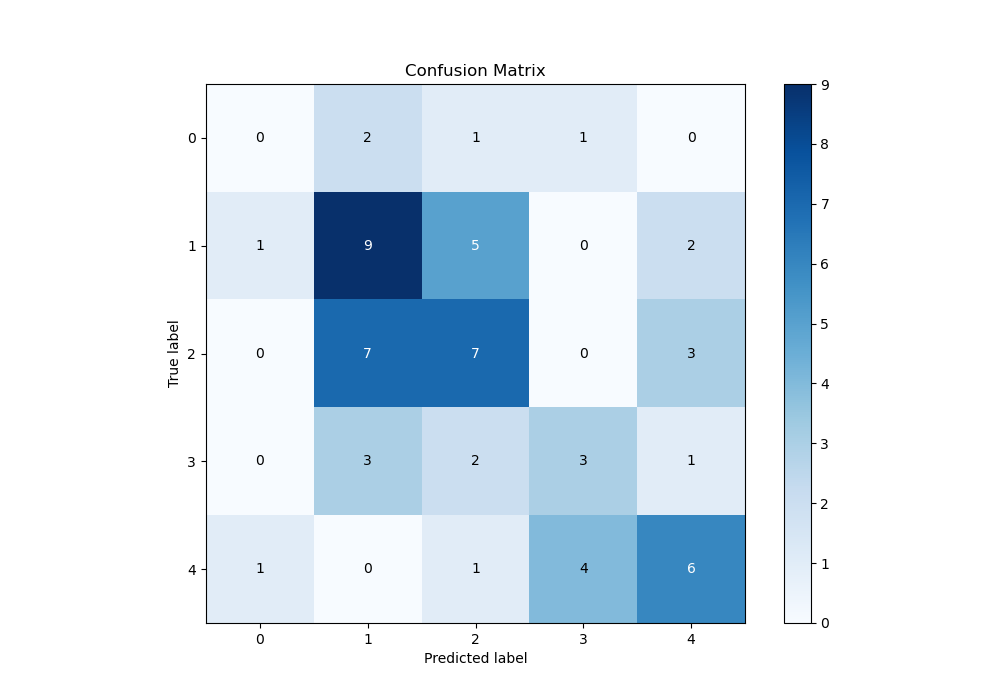
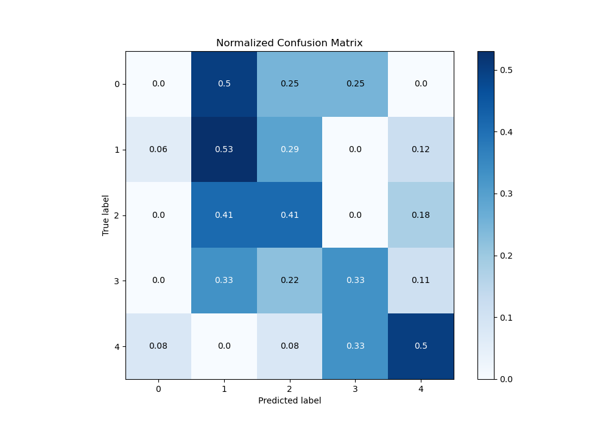
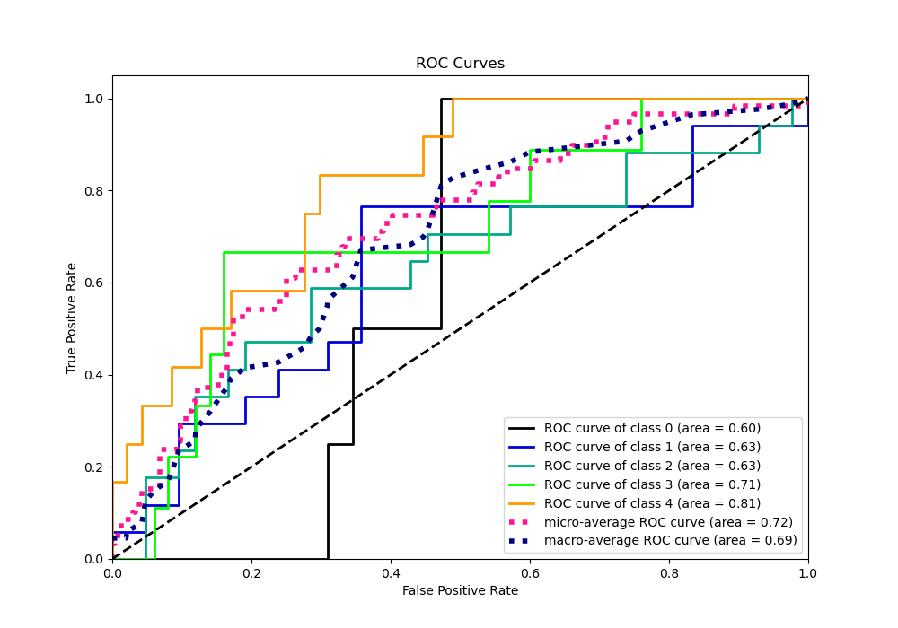
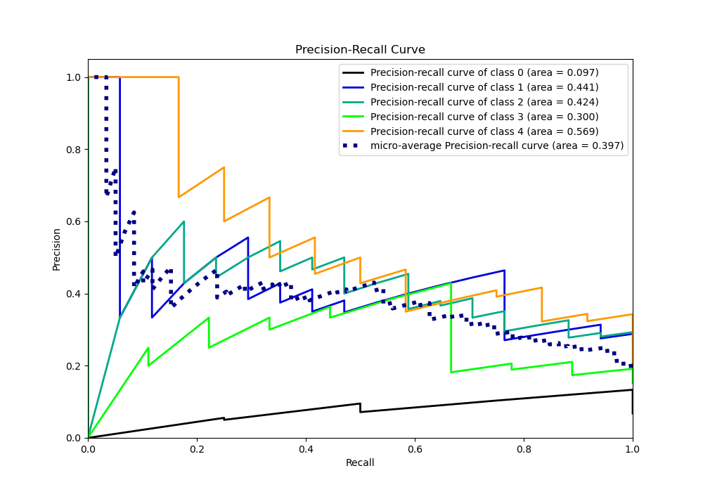

# Summary of 1_Linear

[<< Go back](../README.md)

## Logistic Regression (Linear)
- **n_jobs**: -1
- **num_class**: 5
- **explain_level**: 1

## Validation
 - **validation_type**: split
 - **train_ratio**: 0.9
 - **shuffle**: True
 - **stratify**: True

## Optimized metric
logloss

## Training time

8.1 seconds

### Metric details
|           |   0 |         1 |         2 |        3 |    4 |   accuracy |   macro avg |   weighted avg |   logloss |
|:----------|----:|----------:|----------:|---------:|-----:|-----------:|------------:|---------------:|----------:|
| precision |   0 |  0.428571 |  0.4375   | 0.375    |  0.5 |   0.423729 |    0.348214 |       0.408444 |   1.69297 |
| recall    |   0 |  0.529412 |  0.411765 | 0.333333 |  0.5 |   0.423729 |    0.354902 |       0.423729 |   1.69297 |
| f1-score  |   0 |  0.473684 |  0.424242 | 0.352941 |  0.5 |   0.423729 |    0.350174 |       0.414258 |   1.69297 |
| support   |   4 | 17        | 17        | 9        | 12   |   0.423729 |   59        |      59        |   1.69297 |

## Confusion matrix
|              |   Predicted as 0 |   Predicted as 1 |   Predicted as 2 |   Predicted as 3 |   Predicted as 4 |
|:-------------|-----------------:|-----------------:|-----------------:|-----------------:|-----------------:|
| Labeled as 0 |                0 |                2 |                1 |                1 |                0 |
| Labeled as 1 |                1 |                9 |                5 |                0 |                2 |
| Labeled as 2 |                0 |                7 |                7 |                0 |                3 |
| Labeled as 3 |                0 |                3 |                2 |                3 |                1 |
| Labeled as 4 |                1 |                0 |                1 |                4 |                6 |

## Learning curves

## Permutation-based Importance

## Confusion Matrix

## Normalized Confusion Matrix

## ROC Curve

## Precision Recall Curve

[<< Go back](../README.md)
