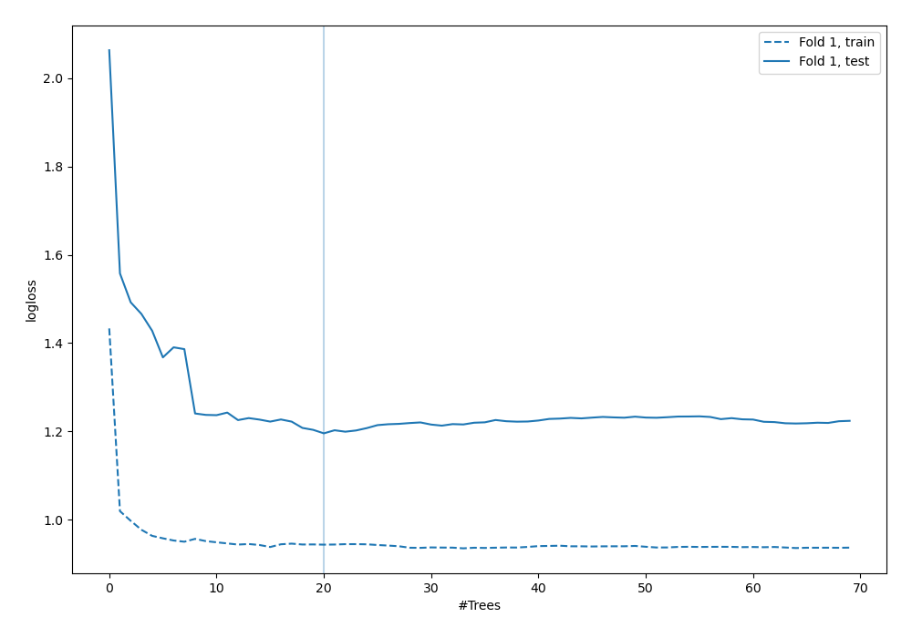
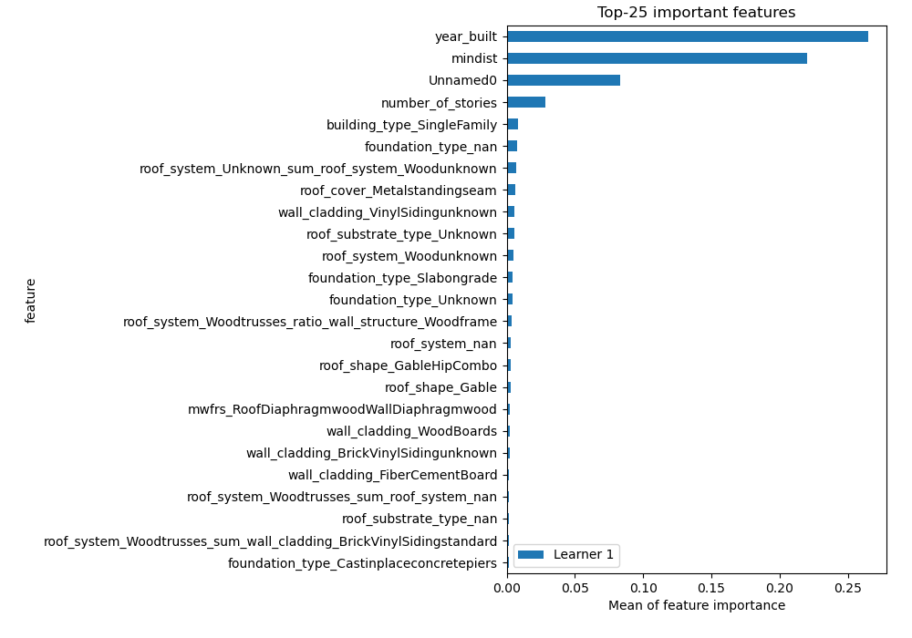
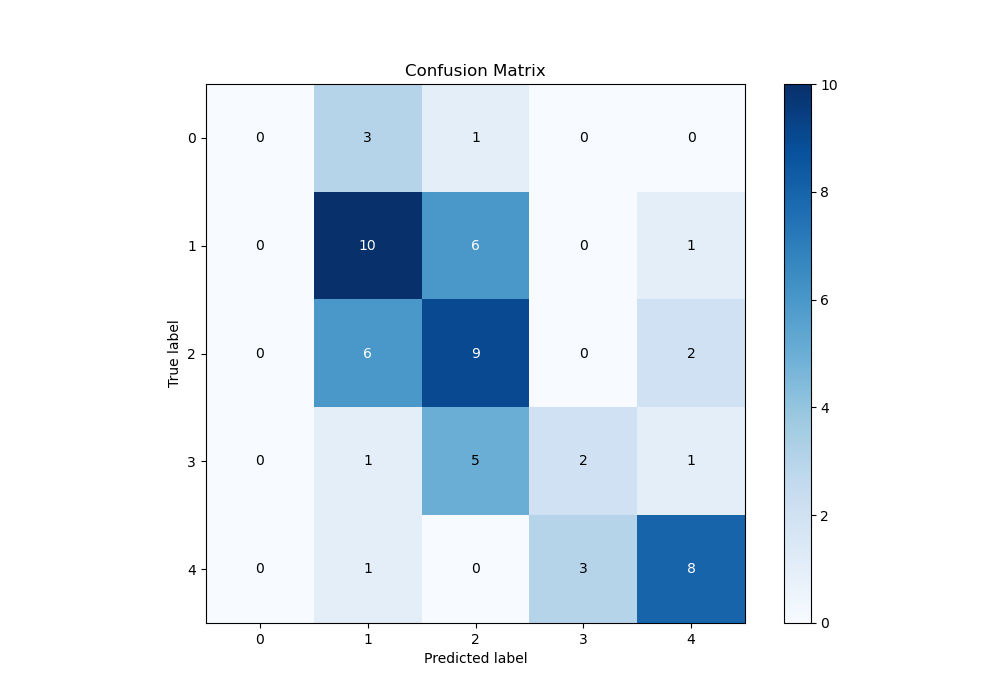
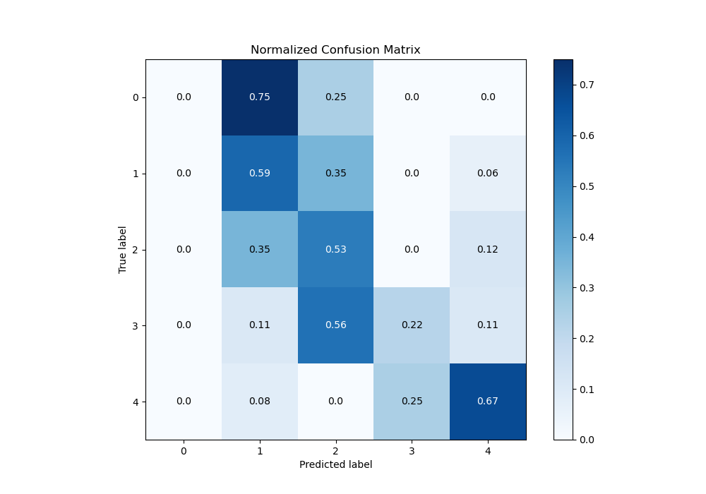
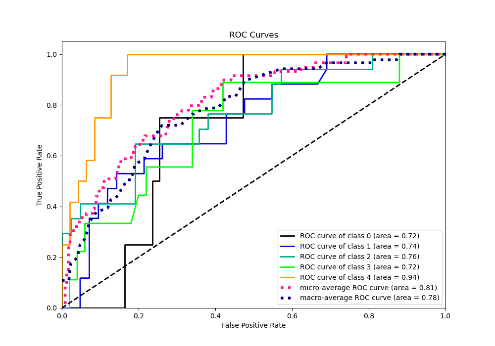
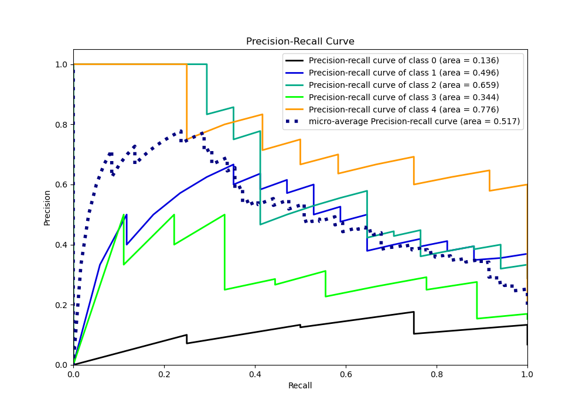

# Summary of 20_RandomForest_GoldenFeatures

[<< Go back](../README.md)

## Random Forest
- **n_jobs**: -1
- **criterion**: entropy
- **max_features**: 0.7
- **min_samples_split**: 30
- **max_depth**: 7
- **eval_metric_name**: logloss
- **num_class**: 5
- **explain_level**: 1

## Validation
 - **validation_type**: split
 - **train_ratio**: 0.9
 - **shuffle**: True
 - **stratify**: True

## Optimized metric
logloss

## Training time

4.4 seconds

### Metric details
|           |   0 |         1 |         2 |        3 |         4 |   accuracy |   macro avg |   weighted avg |   logloss |
|:----------|----:|----------:|----------:|---------:|----------:|-----------:|------------:|---------------:|----------:|
| precision |   0 |  0.47619  |  0.428571 | 0.4      |  0.666667 |   0.491525 |    0.394286 |       0.457304 |   1.19554 |
| recall    |   0 |  0.588235 |  0.529412 | 0.222222 |  0.666667 |   0.491525 |    0.401307 |       0.491525 |   1.19554 |
| f1-score  |   0 |  0.526316 |  0.473684 | 0.285714 |  0.666667 |   0.491525 |    0.390476 |       0.467312 |   1.19554 |
| support   |   4 | 17        | 17        | 9        | 12        |   0.491525 |   59        |      59        |   1.19554 |

## Confusion matrix
|              |   Predicted as 0 |   Predicted as 1 |   Predicted as 2 |   Predicted as 3 |   Predicted as 4 |
|:-------------|-----------------:|-----------------:|-----------------:|-----------------:|-----------------:|
| Labeled as 0 |                0 |                3 |                1 |                0 |                0 |
| Labeled as 1 |                0 |               10 |                6 |                0 |                1 |
| Labeled as 2 |                0 |                6 |                9 |                0 |                2 |
| Labeled as 3 |                0 |                1 |                5 |                2 |                1 |
| Labeled as 4 |                0 |                1 |                0 |                3 |                8 |

## Learning curves

## Permutation-based Importance

## Confusion Matrix

## Normalized Confusion Matrix

## ROC Curve

## Precision Recall Curve

[<< Go back](../README.md)
