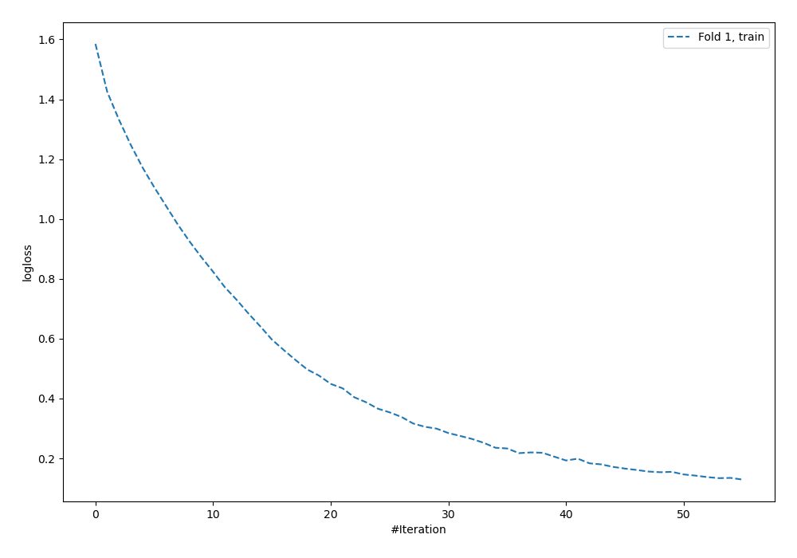
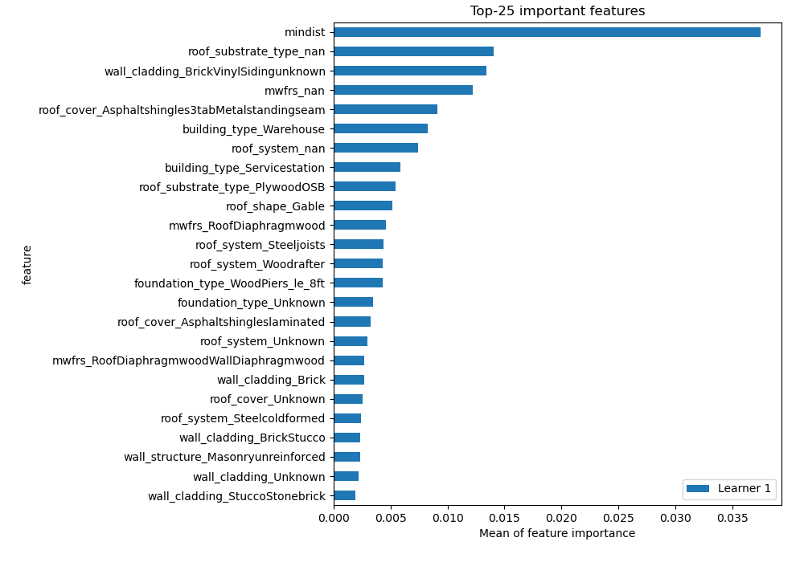
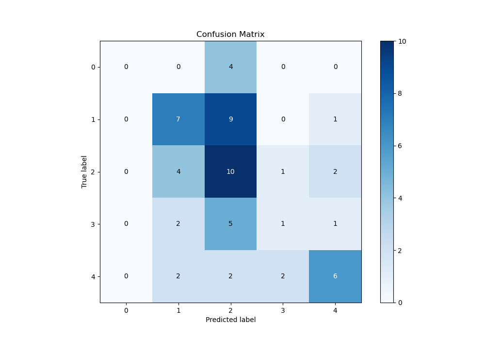
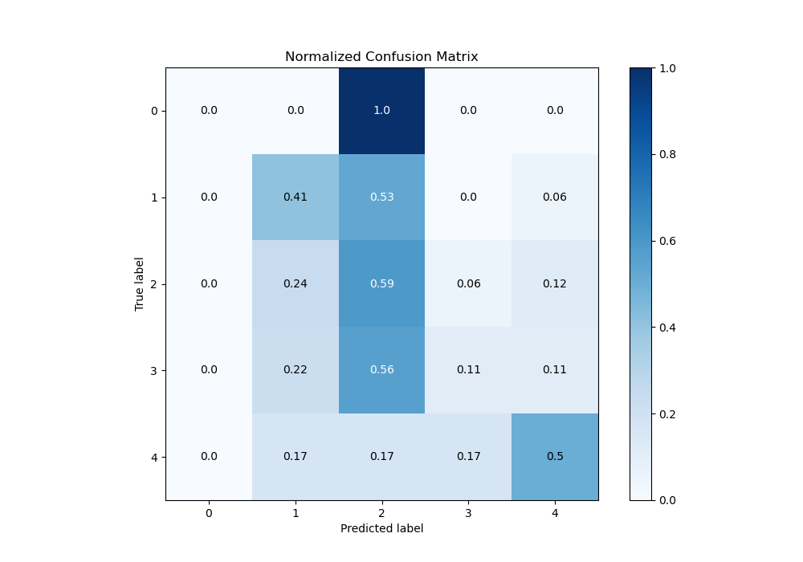
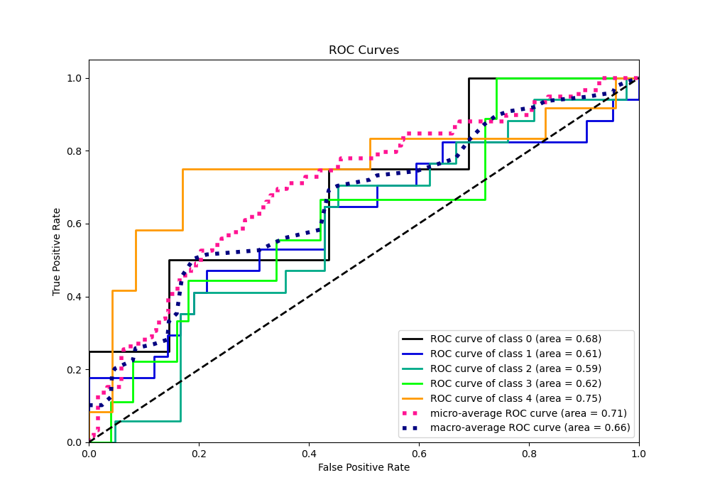
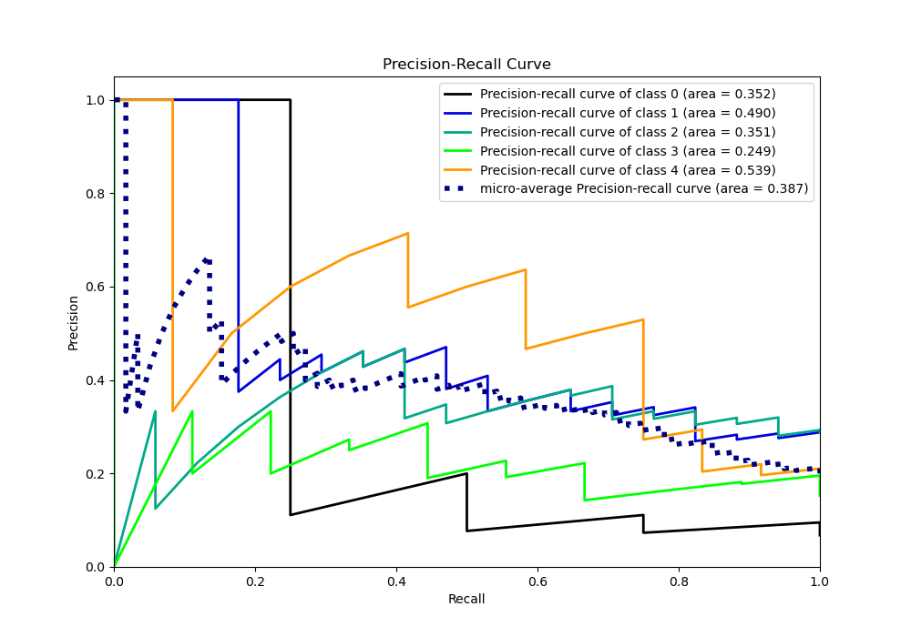

# Summary of 22_NeuralNetwork

[<< Go back](../README.md)

## Neural Network
- **n_jobs**: -1
- **dense_1_size**: 32
- **dense_2_size**: 16
- **learning_rate**: 0.01
- **num_class**: 5
- **explain_level**: 1

## Validation
 - **validation_type**: split
 - **train_ratio**: 0.9
 - **shuffle**: True
 - **stratify**: True

## Optimized metric
logloss

## Training time

1.7 seconds

### Metric details
|           |   0 |         1 |         2 |        3 |         4 |   accuracy |   macro avg |   weighted avg |   logloss |
|:----------|----:|----------:|----------:|---------:|----------:|-----------:|------------:|---------------:|----------:|
| precision |   0 |  0.466667 |  0.333333 | 0.25     |  0.6      |    0.40678 |    0.33     |       0.390678 |   1.47707 |
| recall    |   0 |  0.411765 |  0.588235 | 0.111111 |  0.5      |    0.40678 |    0.322222 |       0.40678  |   1.47707 |
| f1-score  |   0 |  0.4375   |  0.425532 | 0.153846 |  0.545455 |    0.40678 |    0.312467 |       0.383078 |   1.47707 |
| support   |   4 | 17        | 17        | 9        | 12        |    0.40678 |   59        |      59        |   1.47707 |

## Confusion matrix
|              |   Predicted as 0 |   Predicted as 1 |   Predicted as 2 |   Predicted as 3 |   Predicted as 4 |
|:-------------|-----------------:|-----------------:|-----------------:|-----------------:|-----------------:|
| Labeled as 0 |                0 |                0 |                4 |                0 |                0 |
| Labeled as 1 |                0 |                7 |                9 |                0 |                1 |
| Labeled as 2 |                0 |                4 |               10 |                1 |                2 |
| Labeled as 3 |                0 |                2 |                5 |                1 |                1 |
| Labeled as 4 |                0 |                2 |                2 |                2 |                6 |

## Learning curves

## Permutation-based Importance

## Confusion Matrix

## Normalized Confusion Matrix

## ROC Curve

## Precision Recall Curve

[<< Go back](../README.md)
