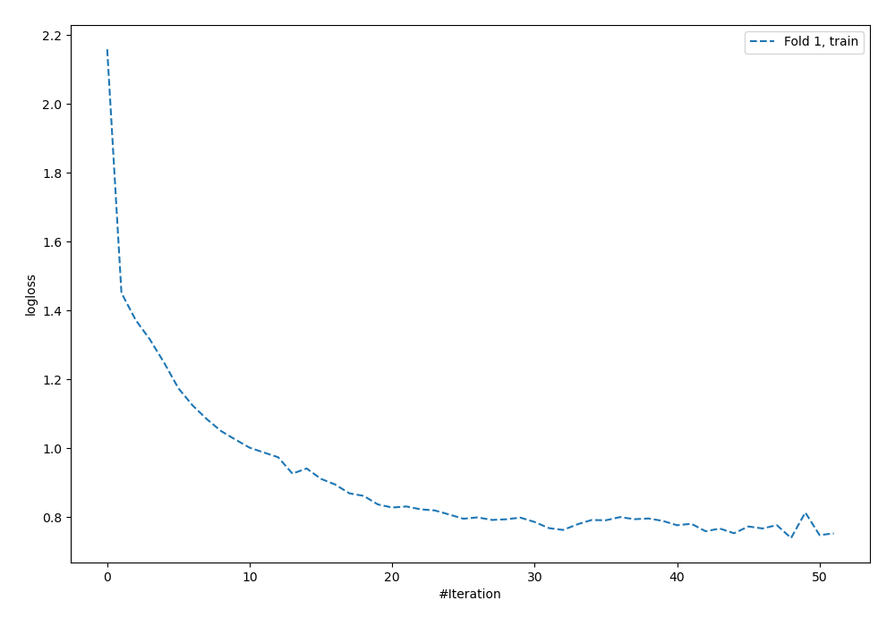
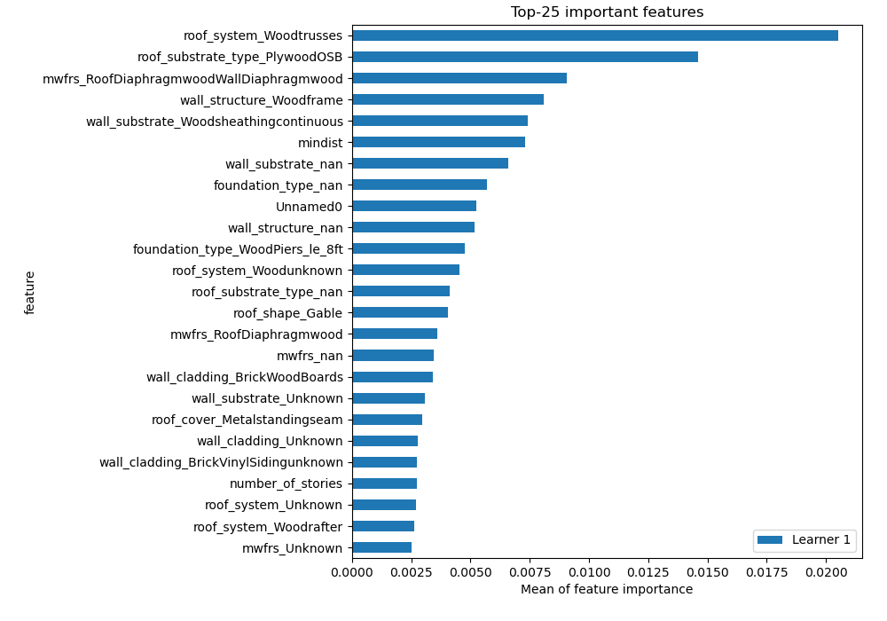
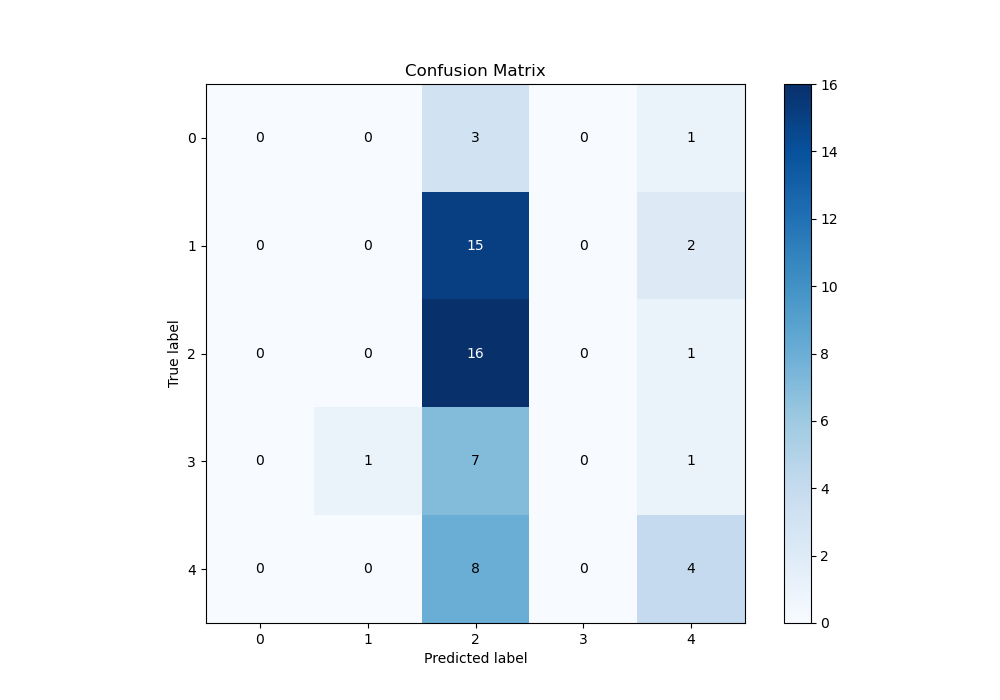
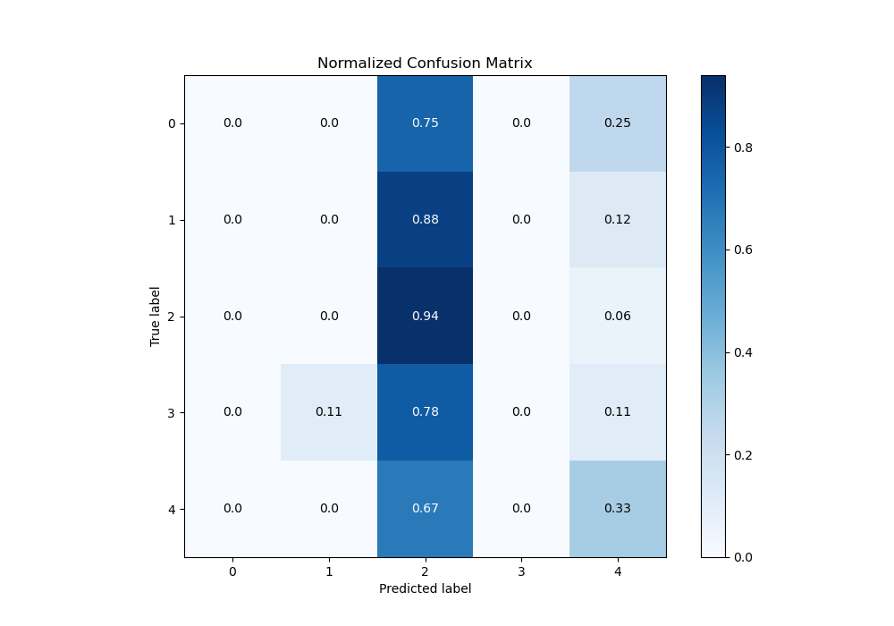
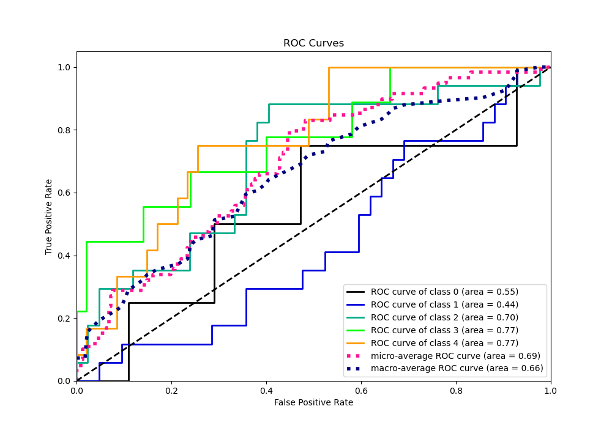
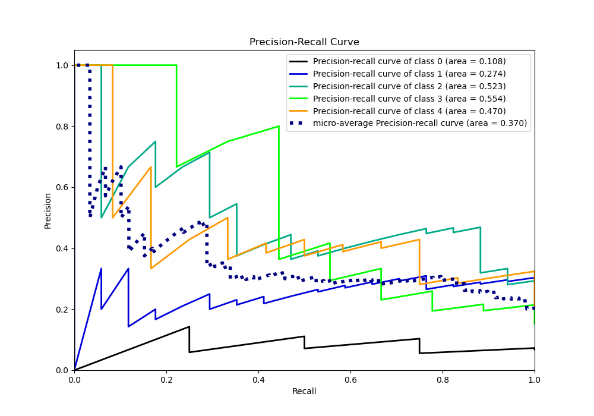

# Summary of 32_NeuralNetwork

[<< Go back](../README.md)

## Neural Network
- **n_jobs**: -1
- **dense_1_size**: 64
- **dense_2_size**: 16
- **learning_rate**: 0.08
- **num_class**: 5
- **explain_level**: 1

## Validation
 - **validation_type**: split
 - **train_ratio**: 0.9
 - **shuffle**: True
 - **stratify**: True

## Optimized metric
logloss

## Training time

2.0 seconds

### Metric details
|           |   0 |   1 |         2 |   3 |         4 |   accuracy |   macro avg |   weighted avg |   logloss |
|:----------|----:|----:|----------:|----:|----------:|-----------:|------------:|---------------:|----------:|
| precision |   0 |   0 |  0.326531 |   0 |  0.444444 |   0.338983 |    0.154195 |       0.184481 |   1.47947 |
| recall    |   0 |   0 |  0.941176 |   0 |  0.333333 |   0.338983 |    0.254902 |       0.338983 |   1.47947 |
| f1-score  |   0 |   0 |  0.484848 |   0 |  0.380952 |   0.338983 |    0.17316  |       0.217184 |   1.47947 |
| support   |   4 |  17 | 17        |   9 | 12        |   0.338983 |   59        |      59        |   1.47947 |

## Confusion matrix
|              |   Predicted as 0 |   Predicted as 1 |   Predicted as 2 |   Predicted as 3 |   Predicted as 4 |
|:-------------|-----------------:|-----------------:|-----------------:|-----------------:|-----------------:|
| Labeled as 0 |                0 |                0 |                3 |                0 |                1 |
| Labeled as 1 |                0 |                0 |               15 |                0 |                2 |
| Labeled as 2 |                0 |                0 |               16 |                0 |                1 |
| Labeled as 3 |                0 |                1 |                7 |                0 |                1 |
| Labeled as 4 |                0 |                0 |                8 |                0 |                4 |

## Learning curves

## Permutation-based Importance

## Confusion Matrix

## Normalized Confusion Matrix

## ROC Curve

## Precision Recall Curve

[<< Go back](../README.md)
