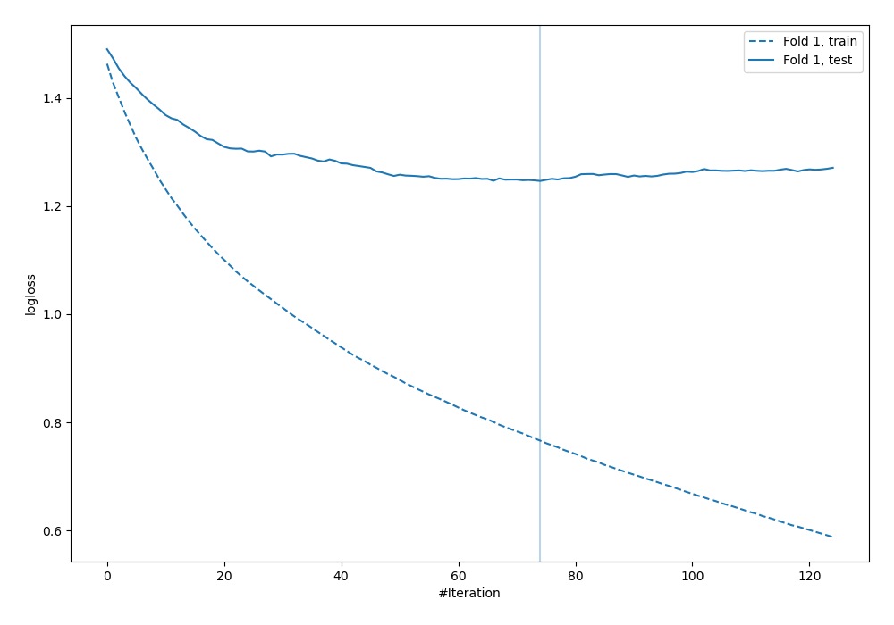
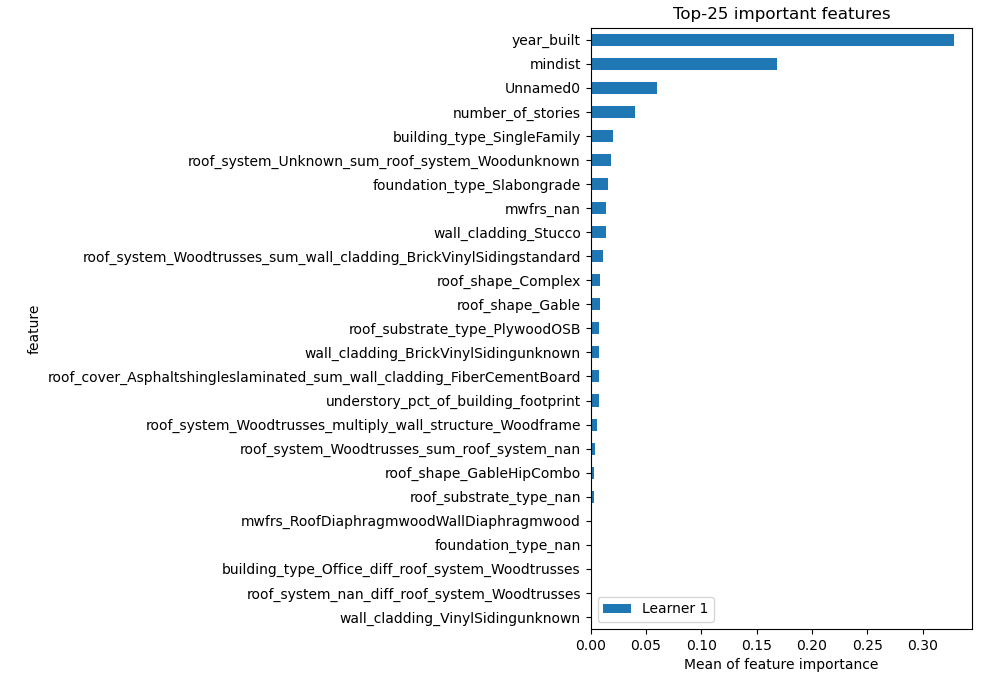
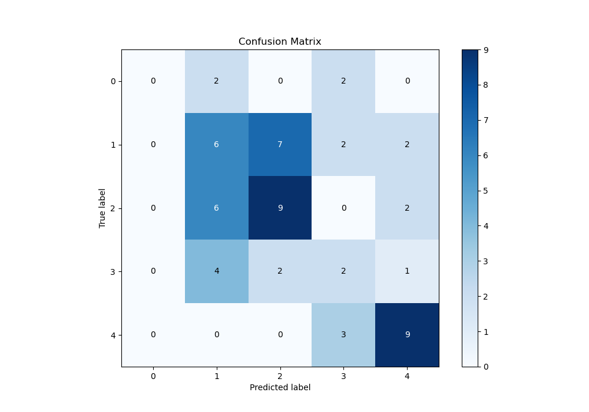
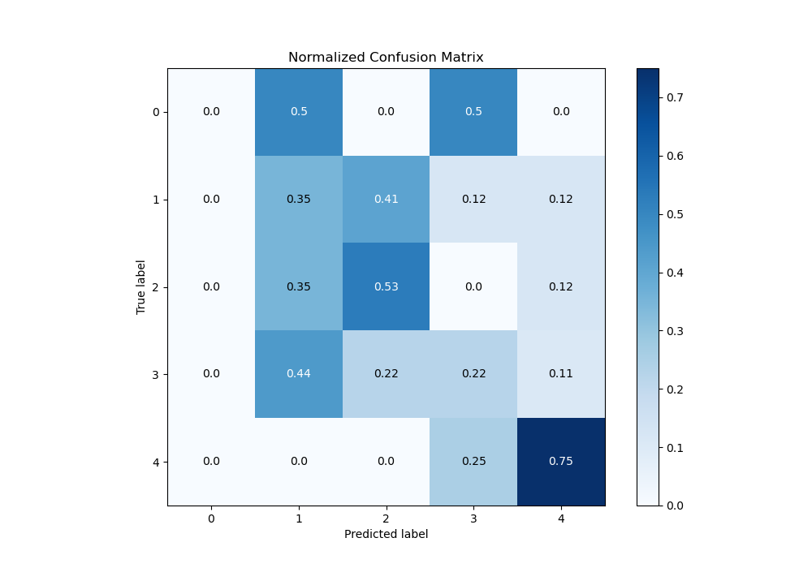
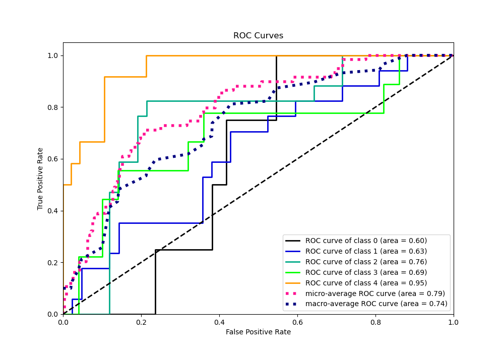
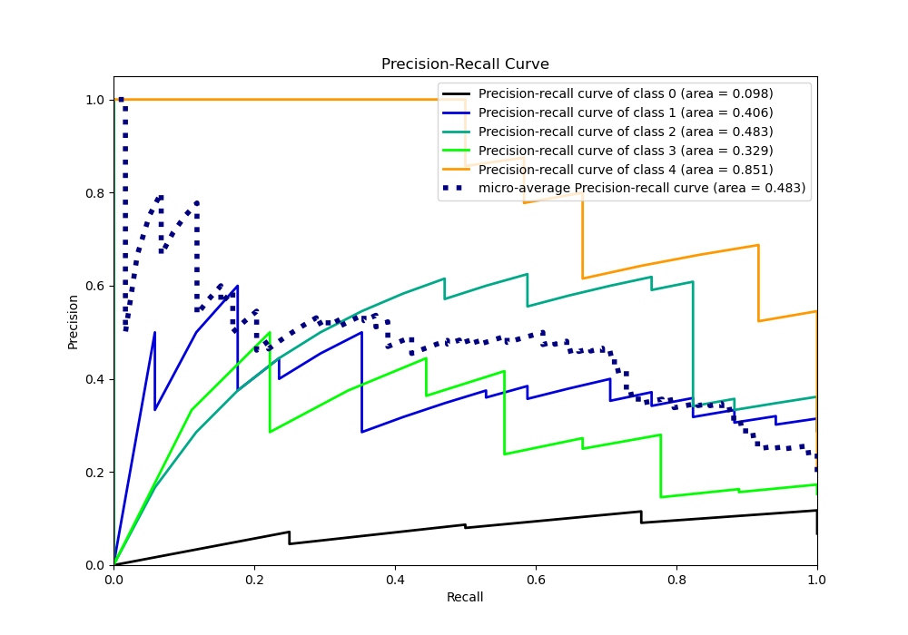

# Summary of 5_LightGBM_GoldenFeatures_RandomFeature

[<< Go back](../README.md)

## LightGBM
- **n_jobs**: -1
- **objective**: multiclass
- **num_leaves**: 15
- **learning_rate**: 0.05
- **feature_fraction**: 0.8
- **bagging_fraction**: 0.5
- **min_data_in_leaf**: 50
- **metric**: multi_logloss
- **custom_eval_metric_name**: None
- **num_class**: 5
- **explain_level**: 1

## Validation
 - **validation_type**: split
 - **train_ratio**: 0.9
 - **shuffle**: True
 - **stratify**: True

## Optimized metric
logloss

## Training time

2.6 seconds

### Metric details
|           |   0 |         1 |         2 |        3 |         4 |   accuracy |   macro avg |   weighted avg |   logloss |
|:----------|----:|----------:|----------:|---------:|----------:|-----------:|------------:|---------------:|----------:|
| precision |   0 |  0.333333 |  0.5      | 0.222222 |  0.642857 |   0.440678 |    0.339683 |       0.404762 |   1.24666 |
| recall    |   0 |  0.352941 |  0.529412 | 0.222222 |  0.75     |   0.440678 |    0.370915 |       0.440678 |   1.24666 |
| f1-score  |   0 |  0.342857 |  0.514286 | 0.222222 |  0.692308 |   0.440678 |    0.354335 |       0.42168  |   1.24666 |
| support   |   4 | 17        | 17        | 9        | 12        |   0.440678 |   59        |      59        |   1.24666 |

## Confusion matrix
|              |   Predicted as 0 |   Predicted as 1 |   Predicted as 2 |   Predicted as 3 |   Predicted as 4 |
|:-------------|-----------------:|-----------------:|-----------------:|-----------------:|-----------------:|
| Labeled as 0 |                0 |                2 |                0 |                2 |                0 |
| Labeled as 1 |                0 |                6 |                7 |                2 |                2 |
| Labeled as 2 |                0 |                6 |                9 |                0 |                2 |
| Labeled as 3 |                0 |                4 |                2 |                2 |                1 |
| Labeled as 4 |                0 |                0 |                0 |                3 |                9 |

## Learning curves

## Permutation-based Importance

## Confusion Matrix

## Normalized Confusion Matrix

## ROC Curve

## Precision Recall Curve

[<< Go back](../README.md)
