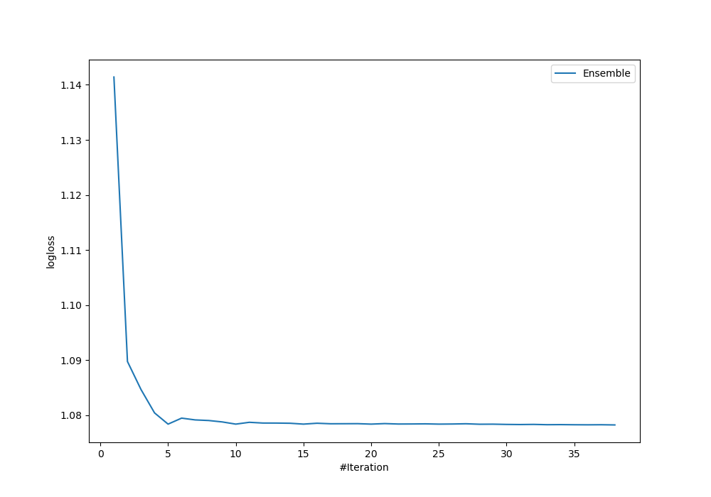

# Summary of Ensemble

[<< Go back](../README.md)

## Ensemble structure
| Model                                           |   Weight |
|:------------------------------------------------|---------:|
| 10_RandomForest_GoldenFeatures_SelectedFeatures |        8 |
| 14_NeuralNetwork_SelectedFeatures               |        1 |
| 19_RandomForest_GoldenFeatures_SelectedFeatures |        7 |
| 24_LightGBM_GoldenFeatures_SelectedFeatures     |       22 |

### Metric details
|           |   0 |         1 |         2 |        3 |         4 |   accuracy |   macro avg |   weighted avg |   logloss |
|:----------|----:|----------:|----------:|---------:|----------:|-----------:|------------:|---------------:|----------:|
| precision |   0 |  0.47619  |  0.6875   | 0.428571 |  0.642857 |   0.559322 |    0.447024 |       0.531427 |   1.07825 |
| recall    |   0 |  0.588235 |  0.647059 | 0.333333 |  0.75     |   0.559322 |    0.463725 |       0.559322 |   1.07825 |
| f1-score  |   0 |  0.526316 |  0.666667 | 0.375    |  0.692308 |   0.559322 |    0.452058 |       0.541752 |   1.07825 |
| support   |   4 | 17        | 17        | 9        | 12        |   0.559322 |   59        |      59        |   1.07825 |

## Confusion matrix
|              |   Predicted as 0 |   Predicted as 1 |   Predicted as 2 |   Predicted as 3 |   Predicted as 4 |
|:-------------|-----------------:|-----------------:|-----------------:|-----------------:|-----------------:|
| Labeled as 0 |                0 |                3 |                1 |                0 |                0 |
| Labeled as 1 |                1 |               10 |                3 |                1 |                2 |
| Labeled as 2 |                0 |                5 |               11 |                0 |                1 |
| Labeled as 3 |                0 |                3 |                1 |                3 |                2 |
| Labeled as 4 |                0 |                0 |                0 |                3 |                9 |

## Learning curves

## Confusion Matrix

## Normalized Confusion Matrix

## ROC Curve

## Precision Recall Curve

[<< Go back](../README.md)
