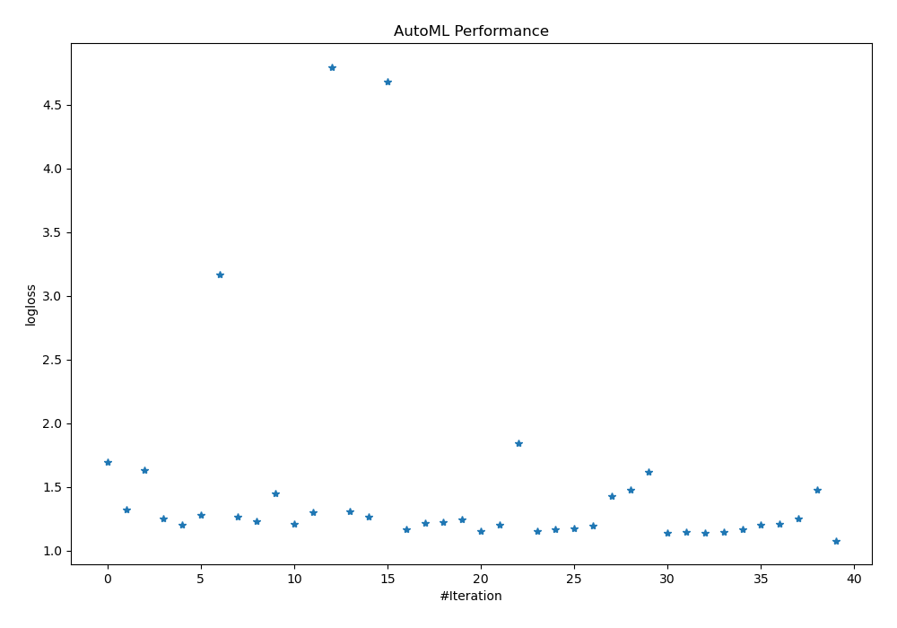
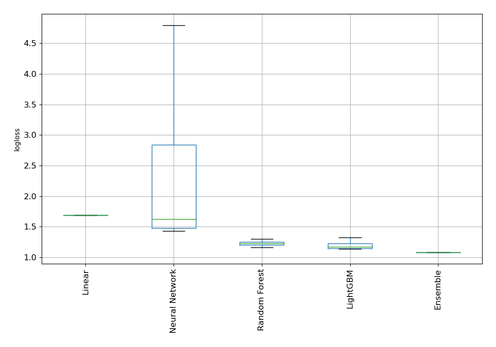
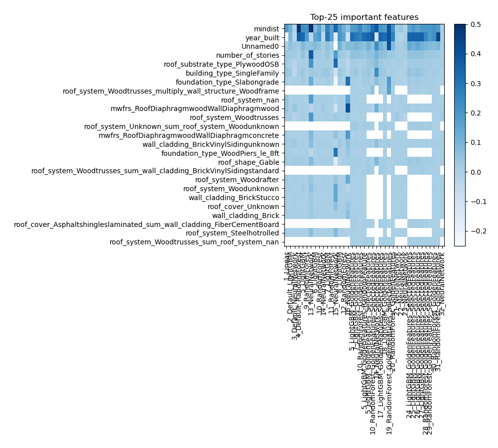
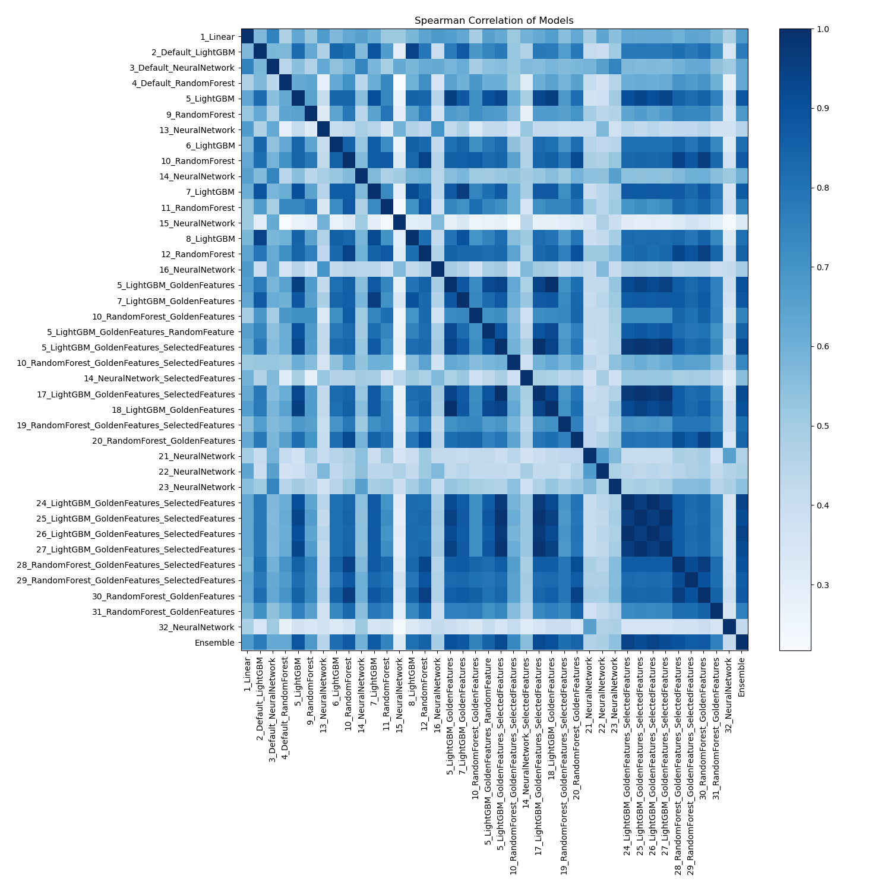

# AutoML Leaderboard

| Best model   | name                                                                                                         | model_type     | metric_type   |   metric_value |   train_time |   single_prediction_time |
|:-------------|:-------------------------------------------------------------------------------------------------------------|:---------------|:--------------|---------------:|-------------:|-------------------------:|
|              | [1_Linear](1_Linear/README.md)                                                                               | Linear         | logloss       |        1.69297 |         8.64 |                   0.0236 |
|              | [2_Default_LightGBM](2_Default_LightGBM/README.md)                                                           | LightGBM       | logloss       |        1.32129 |         2.3  |                   0.0199 |
|              | [3_Default_NeuralNetwork](3_Default_NeuralNetwork/README.md)                                                 | Neural Network | logloss       |        1.63409 |         2.24 |                   0.0246 |
|              | [4_Default_RandomForest](4_Default_RandomForest/README.md)                                                   | Random Forest  | logloss       |        1.25054 |         2.76 |                   0.0231 |
|              | [5_LightGBM](5_LightGBM/README.md)                                                                           | LightGBM       | logloss       |        1.20088 |         4.24 |                   0.0298 |
|              | [9_RandomForest](9_RandomForest/README.md)                                                                   | Random Forest  | logloss       |        1.2795  |         2.73 |                   0.0246 |
|              | [13_NeuralNetwork](13_NeuralNetwork/README.md)                                                               | Neural Network | logloss       |        3.16825 |         1.87 |                   0.0251 |
|              | [6_LightGBM](6_LightGBM/README.md)                                                                           | LightGBM       | logloss       |        1.26415 |         2.73 |                   0.0185 |
|              | [10_RandomForest](10_RandomForest/README.md)                                                                 | Random Forest  | logloss       |        1.23024 |         6.7  |                   0.0304 |
|              | [14_NeuralNetwork](14_NeuralNetwork/README.md)                                                               | Neural Network | logloss       |        1.45058 |         1.77 |                   0.0246 |
|              | [7_LightGBM](7_LightGBM/README.md)                                                                           | LightGBM       | logloss       |        1.21232 |         3.4  |                   0.0183 |
|              | [11_RandomForest](11_RandomForest/README.md)                                                                 | Random Forest  | logloss       |        1.3     |         4.31 |                   0.0272 |
|              | [15_NeuralNetwork](15_NeuralNetwork/README.md)                                                               | Neural Network | logloss       |        4.79667 |         2.03 |                   0.0316 |
|              | [8_LightGBM](8_LightGBM/README.md)                                                                           | LightGBM       | logloss       |        1.30672 |         6.16 |                   0.0185 |
|              | [12_RandomForest](12_RandomForest/README.md)                                                                 | Random Forest  | logloss       |        1.26381 |         6.24 |                   0.0294 |
|              | [16_NeuralNetwork](16_NeuralNetwork/README.md)                                                               | Neural Network | logloss       |        4.68189 |         1.94 |                   0.0238 |
|              | [5_LightGBM_GoldenFeatures](5_LightGBM_GoldenFeatures/README.md)                                             | LightGBM       | logloss       |        1.16778 |        27.84 |                   0.0247 |
|              | [7_LightGBM_GoldenFeatures](7_LightGBM_GoldenFeatures/README.md)                                             | LightGBM       | logloss       |        1.2152  |         3.33 |                   0.0245 |
|              | [10_RandomForest_GoldenFeatures](10_RandomForest_GoldenFeatures/README.md)                                   | Random Forest  | logloss       |        1.22514 |         4.52 |                   0.0312 |
|              | [5_LightGBM_GoldenFeatures_RandomFeature](5_LightGBM_GoldenFeatures_RandomFeature/README.md)                 | LightGBM       | logloss       |        1.24666 |         3.1  |                   0.0313 |
|              | [5_LightGBM_GoldenFeatures_SelectedFeatures](5_LightGBM_GoldenFeatures_SelectedFeatures/README.md)           | LightGBM       | logloss       |        1.15392 |         2.48 |                   0.0109 |
|              | [10_RandomForest_GoldenFeatures_SelectedFeatures](10_RandomForest_GoldenFeatures_SelectedFeatures/README.md) | Random Forest  | logloss       |        1.20007 |         1.53 |                   0.0167 |
|              | [14_NeuralNetwork_SelectedFeatures](14_NeuralNetwork_SelectedFeatures/README.md)                             | Neural Network | logloss       |        1.84584 |         1.04 |                   0.0092 |
|              | [17_LightGBM_GoldenFeatures_SelectedFeatures](17_LightGBM_GoldenFeatures_SelectedFeatures/README.md)         | LightGBM       | logloss       |        1.15392 |         2.61 |                   0.0117 |
|              | [18_LightGBM_GoldenFeatures](18_LightGBM_GoldenFeatures/README.md)                                           | LightGBM       | logloss       |        1.16778 |         4.03 |                   0.0251 |
|              | [19_RandomForest_GoldenFeatures_SelectedFeatures](19_RandomForest_GoldenFeatures_SelectedFeatures/README.md) | Random Forest  | logloss       |        1.1731  |         1.57 |                   0.0167 |
|              | [20_RandomForest_GoldenFeatures](20_RandomForest_GoldenFeatures/README.md)                                   | Random Forest  | logloss       |        1.19554 |         4.86 |                   0.0311 |
|              | [21_NeuralNetwork](21_NeuralNetwork/README.md)                                                               | Neural Network | logloss       |        1.42816 |         2.03 |                   0.026  |
|              | [22_NeuralNetwork](22_NeuralNetwork/README.md)                                                               | Neural Network | logloss       |        1.47707 |         2.16 |                   0.025  |
|              | [23_NeuralNetwork](23_NeuralNetwork/README.md)                                                               | Neural Network | logloss       |        1.61772 |         2.34 |                   0.0293 |
|              | [24_LightGBM_GoldenFeatures_SelectedFeatures](24_LightGBM_GoldenFeatures_SelectedFeatures/README.md)         | LightGBM       | logloss       |        1.14142 |         3.37 |                   0.0117 |
|              | [25_LightGBM_GoldenFeatures_SelectedFeatures](25_LightGBM_GoldenFeatures_SelectedFeatures/README.md)         | LightGBM       | logloss       |        1.14302 |         2.46 |                   0.0163 |
|              | [26_LightGBM_GoldenFeatures_SelectedFeatures](26_LightGBM_GoldenFeatures_SelectedFeatures/README.md)         | LightGBM       | logloss       |        1.14142 |         3.34 |                   0.0107 |
|              | [27_LightGBM_GoldenFeatures_SelectedFeatures](27_LightGBM_GoldenFeatures_SelectedFeatures/README.md)         | LightGBM       | logloss       |        1.14302 |         2.21 |                   0.0109 |
|              | [28_RandomForest_GoldenFeatures_SelectedFeatures](28_RandomForest_GoldenFeatures_SelectedFeatures/README.md) | Random Forest  | logloss       |        1.16639 |         2.08 |                   0.0188 |
|              | [29_RandomForest_GoldenFeatures_SelectedFeatures](29_RandomForest_GoldenFeatures_SelectedFeatures/README.md) | Random Forest  | logloss       |        1.20157 |         1.46 |                   0.0143 |
|              | [30_RandomForest_GoldenFeatures](30_RandomForest_GoldenFeatures/README.md)                                   | Random Forest  | logloss       |        1.20575 |         9.9  |                   0.0447 |
|              | [31_RandomForest_GoldenFeatures](31_RandomForest_GoldenFeatures/README.md)                                   | Random Forest  | logloss       |        1.24831 |         3.9  |                   0.0339 |
|              | [32_NeuralNetwork](32_NeuralNetwork/README.md)                                                               | Neural Network | logloss       |        1.47947 |         2.57 |                   0.0413 |
| **the best** | [Ensemble](Ensemble/README.md)                                                                               | Ensemble       | logloss       |        1.07825 |         1.93 |                   0.0474 |

### AutoML Performance

### AutoML Performance Boxplot

### Features Importance

### Spearman Correlation of Models

