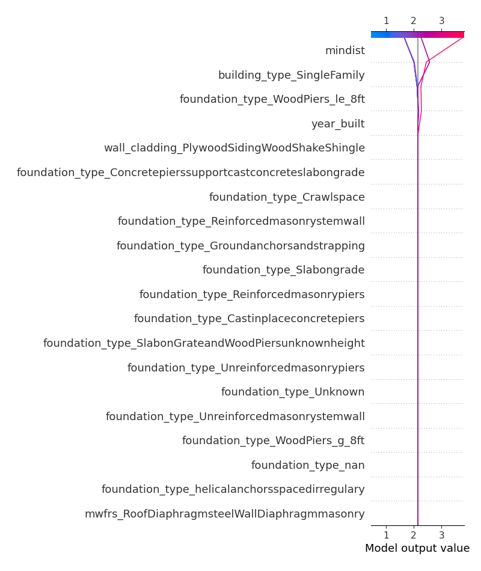
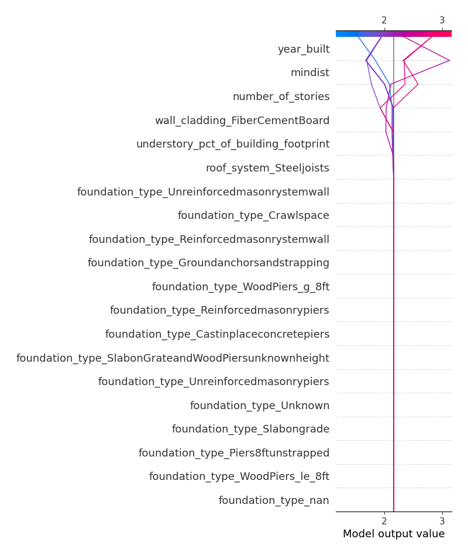

# Summary of 1_DecisionTree

[<< Go back](../README.md)

## Decision Tree
- **n_jobs**: -1
- **criterion**: mse
- **max_depth**: 3
- **explain_level**: 2

## Validation
 - **validation_type**: kfold
 - **k_folds**: 5
 - **shuffle**: False

## Optimized metric
rmse

## Training time

33.3 seconds

### Metric details:
| Metric   |       Score |
|:---------|------------:|
| MAE      | 0.795708    |
| MSE      | 1.00353     |
| RMSE     | 1.00176     |
| R2       | 0.324953    |
| MAPE     | 4.97345e+14 |

## Learning curves

## Decision Tree 

### Tree #1

### Rules

if (mindist > 10.287) and (foundation_type_WoodPiers_le_8ft <= 0.5) and (building_type_SingleFamily > 0.5) then response: 1.659 | based on 296 samples

if (mindist > 10.287) and (foundation_type_WoodPiers_le_8ft <= 0.5) and (building_type_SingleFamily <= 0.5) then response: 2.266 | based on 79 samples

if (mindist <= 10.287) and (year_built <= 2003.5) and (year_built > 970.0) then response: 3.753 | based on 73 samples

if (mindist <= 10.287) and (year_built > 2003.5) and (wall_cladding_PlywoodSidingWoodShakeShingle <= 0.5) then response: 2.375 | based on 8 samples

if (mindist > 10.287) and (foundation_type_WoodPiers_le_8ft > 0.5) and (mindist <= 16.385) then response: 4.0 | based on 7 samples

if (mindist <= 10.287) and (year_built <= 2003.5) and (year_built <= 970.0) then response: 2.5 | based on 4 samples

if (mindist > 10.287) and (foundation_type_WoodPiers_le_8ft > 0.5) and (mindist > 16.385) then response: 2.5 | based on 2 samples

if (mindist <= 10.287) and (year_built > 2003.5) and (wall_cladding_PlywoodSidingWoodShakeShingle > 0.5) then response: 0.0 | based on 1 samples

### Tree #2

### Rules

if (mindist > 10.468) and (building_type_SingleFamily > 0.5) and (understory_pct_of_building_footprint <= 17.5) then response: 1.628 | based on 288 samples

if (mindist > 10.468) and (building_type_SingleFamily <= 0.5) and (roof_substrate_type_Unknown <= 0.5) then response: 2.577 | based on 71 samples

if (mindist <= 10.468) and (year_built <= 1996.5) and (wall_cladding_FiberCementBoard <= 0.5) then response: 3.842 | based on 57 samples

if (mindist > 10.468) and (building_type_SingleFamily > 0.5) and (understory_pct_of_building_footprint > 17.5) then response: 2.542 | based on 24 samples

if (mindist <= 10.468) and (year_built > 1996.5) and (wall_cladding_PlywoodSidingWoodShakeShingle <= 0.5) then response: 2.684 | based on 19 samples

if (mindist > 10.468) and (building_type_SingleFamily <= 0.5) and (roof_substrate_type_Unknown > 0.5) then response: 1.111 | based on 9 samples

if (mindist <= 10.468) and (year_built > 1996.5) and (wall_cladding_PlywoodSidingWoodShakeShingle > 0.5) then response: 0.0 | based on 1 samples

if (mindist <= 10.468) and (year_built <= 1996.5) and (wall_cladding_FiberCementBoard > 0.5) then response: 1.0 | based on 1 samples

### Tree #3

### Rules

if (mindist > 10.271) and (year_built > 1995.5) and (roof_system_Steeljoists <= 0.5) then response: 1.54 | based on 215 samples

if (mindist > 10.271) and (year_built <= 1995.5) and (number_of_stories <= 1.5) then response: 1.983 | based on 119 samples

if (mindist <= 10.271) and (year_built <= 1996.5) and (year_built > 977.5) then response: 3.889 | based on 63 samples

if (mindist > 10.271) and (year_built <= 1995.5) and (number_of_stories > 1.5) then response: 2.745 | based on 47 samples

if (mindist <= 10.271) and (year_built > 1996.5) and (wall_cladding_PlywoodSidingWoodShakeShingle <= 0.5) then response: 2.706 | based on 17 samples

if (mindist <= 10.271) and (year_built <= 1996.5) and (year_built <= 977.5) then response: 2.8 | based on 5 samples

if (mindist > 10.271) and (year_built > 1995.5) and (roof_system_Steeljoists > 0.5) then response: 3.667 | based on 3 samples

if (mindist <= 10.271) and (year_built > 1996.5) and (wall_cladding_PlywoodSidingWoodShakeShingle > 0.5) then response: 0.0 | based on 1 samples

### Tree #4

### Rules

if (mindist > 10.446) and (year_built > 1995.5) and (roof_system_Steeljoists <= 0.5) then response: 1.55 | based on 209 samples

if (mindist > 10.446) and (year_built <= 1995.5) and (number_of_stories <= 1.5) then response: 1.953 | based on 128 samples

if (mindist <= 10.446) and (year_built <= 1995.0) and (wall_cladding_FiberCementBoard <= 0.5) then response: 3.812 | based on 69 samples

if (mindist > 10.446) and (year_built <= 1995.5) and (number_of_stories > 1.5) then response: 2.822 | based on 45 samples

if (mindist <= 10.446) and (year_built > 1995.0) and (understory_pct_of_building_footprint <= 62.5) then response: 2.333 | based on 12 samples

if (mindist <= 10.446) and (year_built > 1995.0) and (understory_pct_of_building_footprint > 62.5) then response: 3.4 | based on 5 samples

if (mindist > 10.446) and (year_built > 1995.5) and (roof_system_Steeljoists > 0.5) then response: 4.0 | based on 2 samples

if (mindist <= 10.446) and (year_built <= 1995.0) and (wall_cladding_FiberCementBoard > 0.5) then response: 1.0 | based on 1 samples

### Tree #5

### Rules

if (mindist > 10.468) and (building_type_SingleFamily > 0.5) and (foundation_type_WoodPiers_le_8ft <= 0.5) then response: 1.627 | based on 300 samples

if (mindist <= 10.468) and (year_built <= 2003.5) and (wall_cladding_FiberCementBoard <= 0.5) then response: 3.784 | based on 74 samples

if (mindist > 10.468) and (building_type_SingleFamily <= 0.5) and (roof_substrate_type_Unknown <= 0.5) then response: 2.742 | based on 66 samples

if (mindist <= 10.468) and (year_built > 2003.5) and (wall_cladding_PlywoodSidingWoodShakeShingle <= 0.5) then response: 2.385 | based on 13 samples

if (mindist > 10.468) and (building_type_SingleFamily <= 0.5) and (roof_substrate_type_Unknown > 0.5) then response: 1.7 | based on 10 samples

if (mindist > 10.468) and (building_type_SingleFamily > 0.5) and (foundation_type_WoodPiers_le_8ft > 0.5) then response: 4.0 | based on 6 samples

if (mindist <= 10.468) and (year_built > 2003.5) and (wall_cladding_PlywoodSidingWoodShakeShingle > 0.5) then response: 0.0 | based on 1 samples

if (mindist <= 10.468) and (year_built <= 2003.5) and (wall_cladding_FiberCementBoard > 0.5) then response: 1.0 | based on 1 samples

## Permutation-based Importance

## True vs Predicted

## Predicted vs Residuals

## SHAP Importance

## SHAP Dependence plots

### Dependence (Fold 1)

### Dependence (Fold 2)

### Dependence (Fold 3)

### Dependence (Fold 4)

### Dependence (Fold 5)

## SHAP Decision plots

### Top-10 Worst decisions (Fold 1)

### Top-10 Worst decisions (Fold 2)

### Top-10 Worst decisions (Fold 3)

### Top-10 Worst decisions (Fold 4)

### Top-10 Worst decisions (Fold 5)

### Top-10 Best decisions (Fold 1)

### Top-10 Best decisions (Fold 2)

### Top-10 Best decisions (Fold 3)

### Top-10 Best decisions (Fold 4)

### Top-10 Best decisions (Fold 5)

[<< Go back](../README.md)
