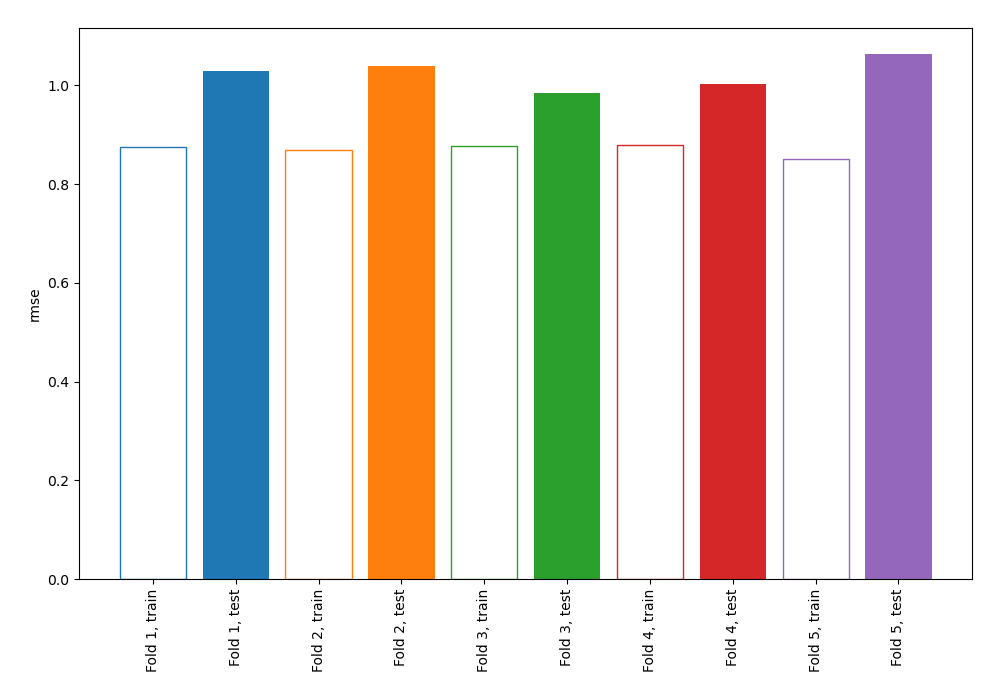
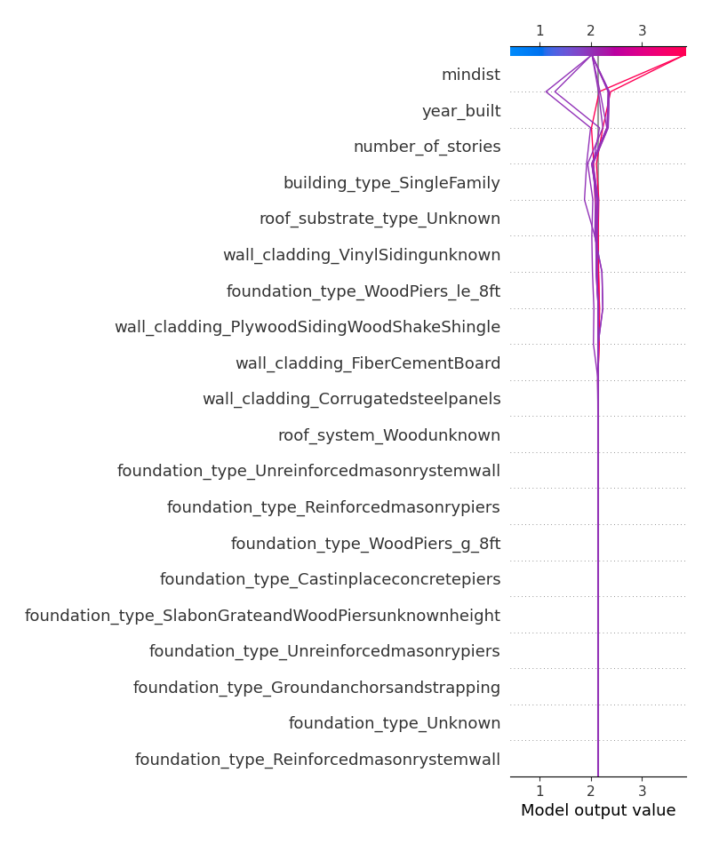
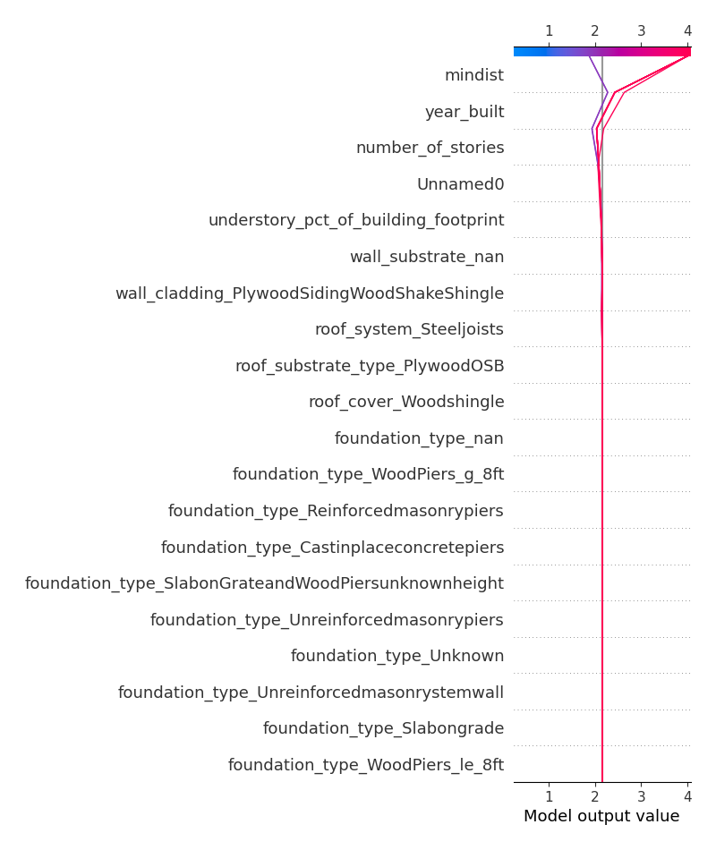

# Summary of 21_DecisionTree

[<< Go back](../README.md)

## Decision Tree
- **n_jobs**: -1
- **criterion**: mse
- **max_depth**: 4
- **explain_level**: 2

## Validation
 - **validation_type**: kfold
 - **k_folds**: 5
 - **shuffle**: False

## Optimized metric
rmse

## Training time

67.5 seconds

### Metric details:
| Metric   |       Score |
|:---------|------------:|
| MAE      | 0.79159     |
| MSE      | 1.04734     |
| RMSE     | 1.0234      |
| R2       | 0.295483    |
| MAPE     | 4.73567e+14 |

## Learning curves

## Decision Tree 

### Tree #1

### Rules

if (mindist > 10.287) and (foundation_type_WoodPiers_le_8ft <= 0.5) and (building_type_SingleFamily > 0.5) and (number_of_stories <= 1.75) then response: 1.532 | based on 220 samples

if (mindist > 10.287) and (foundation_type_WoodPiers_le_8ft <= 0.5) and (building_type_SingleFamily > 0.5) and (number_of_stories > 1.75) then response: 2.026 | based on 76 samples

if (mindist <= 10.287) and (year_built <= 2003.5) and (year_built > 970.0) and (wall_cladding_FiberCementBoard <= 0.5) then response: 3.803 | based on 71 samples

if (mindist > 10.287) and (foundation_type_WoodPiers_le_8ft <= 0.5) and (building_type_SingleFamily <= 0.5) and (roof_substrate_type_Unknown <= 0.5) then response: 2.492 | based on 65 samples

if (mindist > 10.287) and (foundation_type_WoodPiers_le_8ft <= 0.5) and (building_type_SingleFamily <= 0.5) and (roof_substrate_type_Unknown > 0.5) then response: 1.214 | based on 14 samples

if (mindist > 10.287) and (foundation_type_WoodPiers_le_8ft > 0.5) and (mindist <= 16.385) then response: 4.0 | based on 7 samples

if (mindist <= 10.287) and (year_built > 2003.5) and (wall_cladding_PlywoodSidingWoodShakeShingle <= 0.5) and (wall_cladding_VinylSidingunknown > 0.5) then response: 2.75 | based on 4 samples

if (mindist <= 10.287) and (year_built > 2003.5) and (wall_cladding_PlywoodSidingWoodShakeShingle <= 0.5) and (wall_cladding_VinylSidingunknown <= 0.5) then response: 2.0 | based on 4 samples

if (mindist <= 10.287) and (year_built <= 2003.5) and (year_built > 970.0) and (wall_cladding_FiberCementBoard > 0.5) then response: 2.0 | based on 2 samples

if (mindist <= 10.287) and (year_built <= 2003.5) and (year_built <= 970.0) and (wall_cladding_Corrugatedsteelpanels > 0.5) then response: 3.0 | based on 2 samples

if (mindist <= 10.287) and (year_built <= 2003.5) and (year_built <= 970.0) and (wall_cladding_Corrugatedsteelpanels <= 0.5) then response: 2.0 | based on 2 samples

if (mindist > 10.287) and (foundation_type_WoodPiers_le_8ft > 0.5) and (mindist > 16.385) and (roof_system_Woodunknown > 0.5) then response: 2.0 | based on 1 samples

if (mindist > 10.287) and (foundation_type_WoodPiers_le_8ft > 0.5) and (mindist > 16.385) and (roof_system_Woodunknown <= 0.5) then response: 3.0 | based on 1 samples

if (mindist <= 10.287) and (year_built > 2003.5) and (wall_cladding_PlywoodSidingWoodShakeShingle > 0.5) then response: 0.0 | based on 1 samples

### Tree #2

### Rules

if (mindist > 10.468) and (building_type_SingleFamily > 0.5) and (understory_pct_of_building_footprint <= 17.5) and (Unnamed0 <= 720.0) then response: 1.652 | based on 282 samples

if (mindist <= 10.468) and (year_built <= 1996.5) and (wall_cladding_FiberCementBoard <= 0.5) and (year_built > 970.0) then response: 3.889 | based on 54 samples

if (mindist > 10.468) and (building_type_SingleFamily <= 0.5) and (roof_substrate_type_Unknown <= 0.5) and (year_built <= 1984.5) then response: 2.897 | based on 39 samples

if (mindist > 10.468) and (building_type_SingleFamily <= 0.5) and (roof_substrate_type_Unknown <= 0.5) and (year_built > 1984.5) then response: 2.188 | based on 32 samples

if (mindist <= 10.468) and (year_built > 1996.5) and (wall_substrate_Unknown <= 0.5) and (wall_structure_ConcretemomentresistingframeSteelcoldform <= 0.5) then response: 2.778 | based on 18 samples

if (mindist > 10.468) and (building_type_SingleFamily > 0.5) and (understory_pct_of_building_footprint > 17.5) and (mindist <= 14.511) then response: 2.125 | based on 16 samples

if (mindist > 10.468) and (building_type_SingleFamily > 0.5) and (understory_pct_of_building_footprint > 17.5) and (mindist > 14.511) then response: 3.375 | based on 8 samples

if (mindist > 10.468) and (building_type_SingleFamily <= 0.5) and (roof_substrate_type_Unknown > 0.5) and (mindist <= 26.758) then response: 0.75 | based on 8 samples

if (mindist > 10.468) and (building_type_SingleFamily > 0.5) and (understory_pct_of_building_footprint <= 17.5) and (Unnamed0 > 720.0) then response: 0.5 | based on 6 samples

if (mindist <= 10.468) and (year_built <= 1996.5) and (wall_cladding_FiberCementBoard <= 0.5) and (year_built <= 970.0) then response: 3.0 | based on 3 samples

if (mindist > 10.468) and (building_type_SingleFamily <= 0.5) and (roof_substrate_type_Unknown > 0.5) and (mindist > 26.758) then response: 4.0 | based on 1 samples

if (mindist <= 10.468) and (year_built > 1996.5) and (wall_substrate_Unknown > 0.5) then response: 0.0 | based on 1 samples

if (mindist <= 10.468) and (year_built > 1996.5) and (wall_substrate_Unknown <= 0.5) and (wall_structure_ConcretemomentresistingframeSteelcoldform > 0.5) then response: 1.0 | based on 1 samples

if (mindist <= 10.468) and (year_built <= 1996.5) and (wall_cladding_FiberCementBoard > 0.5) then response: 1.0 | based on 1 samples

### Tree #3

### Rules

if (mindist > 10.271) and (year_built > 1995.5) and (roof_system_Steeljoists <= 0.5) and (Unnamed0 <= 509.5) then response: 1.287 | based on 108 samples

if (mindist > 10.271) and (year_built > 1995.5) and (roof_system_Steeljoists <= 0.5) and (Unnamed0 > 509.5) then response: 1.794 | based on 107 samples

if (mindist > 10.271) and (year_built <= 1995.5) and (number_of_stories <= 1.5) and (mindist > 14.967) then response: 1.875 | based on 104 samples

if (mindist <= 10.271) and (year_built <= 1996.5) and (year_built > 977.5) and (mindist <= 9.171) then response: 4.0 | based on 41 samples

if (mindist > 10.271) and (year_built <= 1995.5) and (number_of_stories > 1.5) and (understory_pct_of_building_footprint <= 45.0) then response: 2.538 | based on 39 samples

if (mindist <= 10.271) and (year_built <= 1996.5) and (year_built > 977.5) and (mindist > 9.171) then response: 3.682 | based on 22 samples

if (mindist > 10.271) and (year_built <= 1995.5) and (number_of_stories <= 1.5) and (mindist <= 14.967) then response: 2.733 | based on 15 samples

if (mindist <= 10.271) and (year_built > 1996.5) and (wall_cladding_PlywoodSidingWoodShakeShingle <= 0.5) and (understory_pct_of_building_footprint <= 62.5) then response: 2.4 | based on 10 samples

if (mindist > 10.271) and (year_built <= 1995.5) and (number_of_stories > 1.5) and (understory_pct_of_building_footprint > 45.0) then response: 3.75 | based on 8 samples

if (mindist <= 10.271) and (year_built > 1996.5) and (wall_cladding_PlywoodSidingWoodShakeShingle <= 0.5) and (understory_pct_of_building_footprint > 62.5) then response: 3.143 | based on 7 samples

if (mindist <= 10.271) and (year_built <= 1996.5) and (year_built <= 977.5) and (wall_substrate_nan > 0.5) then response: 3.333 | based on 3 samples

if (mindist > 10.271) and (year_built > 1995.5) and (roof_system_Steeljoists > 0.5) and (roof_substrate_type_PlywoodOSB <= 0.5) then response: 4.0 | based on 2 samples

if (mindist <= 10.271) and (year_built <= 1996.5) and (year_built <= 977.5) and (wall_substrate_nan <= 0.5) then response: 2.0 | based on 2 samples

if (mindist > 10.271) and (year_built > 1995.5) and (roof_system_Steeljoists > 0.5) and (roof_substrate_type_PlywoodOSB > 0.5) then response: 3.0 | based on 1 samples

if (mindist <= 10.271) and (year_built > 1996.5) and (wall_cladding_PlywoodSidingWoodShakeShingle > 0.5) then response: 0.0 | based on 1 samples

### Tree #4

### Rules

if (mindist > 10.446) and (year_built > 1995.5) and (roof_system_Steeljoists <= 0.5) and (Unnamed0 > 126.5) then response: 1.661 | based on 174 samples

if (mindist > 10.446) and (year_built <= 1995.5) and (number_of_stories <= 1.5) and (foundation_type_WoodPiers_le_8ft <= 0.5) then response: 1.904 | based on 125 samples

if (mindist <= 10.446) and (year_built <= 1995.0) and (wall_cladding_FiberCementBoard <= 0.5) and (year_built > 970.0) then response: 3.877 | based on 65 samples

if (mindist > 10.446) and (year_built <= 1995.5) and (number_of_stories > 1.5) and (mindist > 14.955) then response: 2.641 | based on 39 samples

if (mindist > 10.446) and (year_built > 1995.5) and (roof_system_Steeljoists <= 0.5) and (Unnamed0 <= 126.5) then response: 1.0 | based on 35 samples

if (mindist <= 10.446) and (year_built > 1995.0) and (understory_pct_of_building_footprint <= 62.5) and (mwfrs_nan <= 0.5) then response: 2.111 | based on 9 samples

if (mindist > 10.446) and (year_built <= 1995.5) and (number_of_stories > 1.5) and (mindist <= 14.955) then response: 4.0 | based on 6 samples

if (mindist <= 10.446) and (year_built <= 1995.0) and (wall_cladding_FiberCementBoard <= 0.5) and (year_built <= 970.0) then response: 2.75 | based on 4 samples

if (mindist > 10.446) and (year_built <= 1995.5) and (number_of_stories <= 1.5) and (foundation_type_WoodPiers_le_8ft > 0.5) then response: 4.0 | based on 3 samples

if (mindist <= 10.446) and (year_built > 1995.0) and (understory_pct_of_building_footprint > 62.5) and (wall_cladding_VinylSidingunknown > 0.5) then response: 3.0 | based on 3 samples

if (mindist <= 10.446) and (year_built > 1995.0) and (understory_pct_of_building_footprint <= 62.5) and (mwfrs_nan > 0.5) then response: 3.0 | based on 3 samples

if (mindist > 10.446) and (year_built > 1995.5) and (roof_system_Steeljoists > 0.5) then response: 4.0 | based on 2 samples

if (mindist <= 10.446) and (year_built > 1995.0) and (understory_pct_of_building_footprint > 62.5) and (wall_cladding_VinylSidingunknown <= 0.5) then response: 4.0 | based on 2 samples

if (mindist <= 10.446) and (year_built <= 1995.0) and (wall_cladding_FiberCementBoard > 0.5) then response: 1.0 | based on 1 samples

### Tree #5

### Rules

if (mindist > 10.468) and (building_type_SingleFamily > 0.5) and (foundation_type_WoodPiers_le_8ft <= 0.5) and (number_of_stories <= 1.75) then response: 1.502 | based on 223 samples

if (mindist > 10.468) and (building_type_SingleFamily > 0.5) and (foundation_type_WoodPiers_le_8ft <= 0.5) and (number_of_stories > 1.75) then response: 1.987 | based on 77 samples

if (mindist > 10.468) and (building_type_SingleFamily <= 0.5) and (roof_substrate_type_Unknown <= 0.5) and (roof_shape_Gable <= 0.5) then response: 2.5 | based on 42 samples

if (mindist <= 10.468) and (year_built <= 2003.5) and (wall_cladding_FiberCementBoard <= 0.5) and (mindist <= 9.171) then response: 4.0 | based on 41 samples

if (mindist <= 10.468) and (year_built <= 2003.5) and (wall_cladding_FiberCementBoard <= 0.5) and (mindist > 9.171) then response: 3.515 | based on 33 samples

if (mindist > 10.468) and (building_type_SingleFamily <= 0.5) and (roof_substrate_type_Unknown <= 0.5) and (roof_shape_Gable > 0.5) then response: 3.167 | based on 24 samples

if (mindist <= 10.468) and (year_built > 2003.5) and (wall_cladding_PlywoodSidingWoodShakeShingle <= 0.5) and (understory_pct_of_building_footprint <= 95.0) then response: 2.1 | based on 10 samples

if (mindist > 10.468) and (building_type_SingleFamily <= 0.5) and (roof_substrate_type_Unknown > 0.5) and (building_type_Unknown <= 0.5) then response: 1.444 | based on 9 samples

if (mindist > 10.468) and (building_type_SingleFamily > 0.5) and (foundation_type_WoodPiers_le_8ft > 0.5) then response: 4.0 | based on 6 samples

if (mindist <= 10.468) and (year_built > 2003.5) and (wall_cladding_PlywoodSidingWoodShakeShingle <= 0.5) and (understory_pct_of_building_footprint > 95.0) then response: 3.333 | based on 3 samples

if (mindist > 10.468) and (building_type_SingleFamily <= 0.5) and (roof_substrate_type_Unknown > 0.5) and (building_type_Unknown > 0.5) then response: 4.0 | based on 1 samples

if (mindist <= 10.468) and (year_built > 2003.5) and (wall_cladding_PlywoodSidingWoodShakeShingle > 0.5) then response: 0.0 | based on 1 samples

if (mindist <= 10.468) and (year_built <= 2003.5) and (wall_cladding_FiberCementBoard > 0.5) then response: 1.0 | based on 1 samples

## Permutation-based Importance

## True vs Predicted

## Predicted vs Residuals

## SHAP Importance

## SHAP Dependence plots

### Dependence (Fold 1)

### Dependence (Fold 2)

### Dependence (Fold 3)

### Dependence (Fold 4)

### Dependence (Fold 5)

## SHAP Decision plots

### Top-10 Worst decisions (Fold 1)

### Top-10 Worst decisions (Fold 2)

### Top-10 Worst decisions (Fold 3)

### Top-10 Worst decisions (Fold 4)

### Top-10 Worst decisions (Fold 5)

### Top-10 Best decisions (Fold 1)

### Top-10 Best decisions (Fold 2)

### Top-10 Best decisions (Fold 3)

### Top-10 Best decisions (Fold 4)

### Top-10 Best decisions (Fold 5)

[<< Go back](../README.md)
