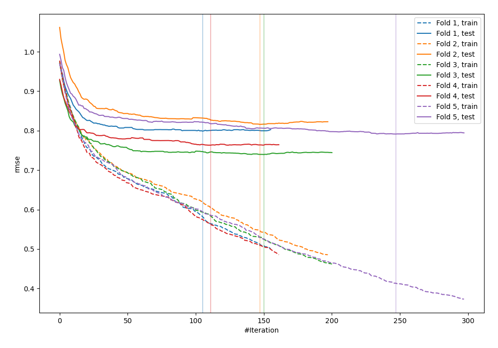
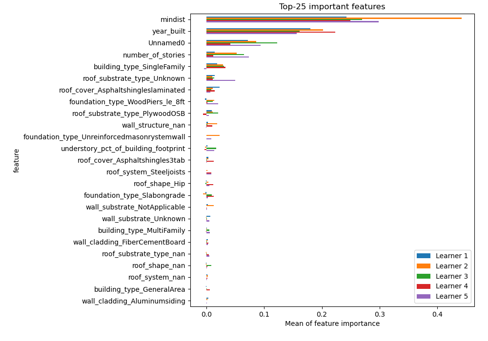
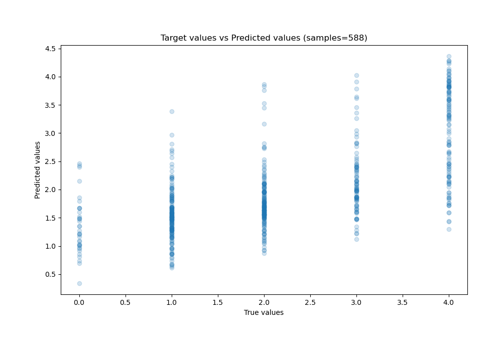
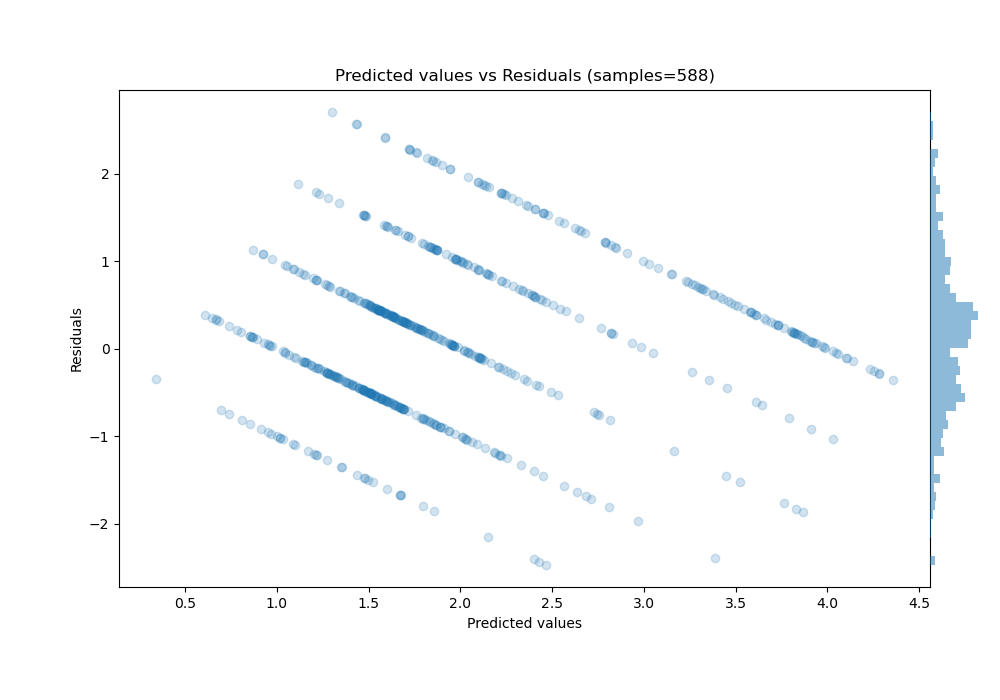

# Summary of 4_Default_CatBoost

[<< Go back](../README.md)

## CatBoost
- **n_jobs**: -1
- **learning_rate**: 0.1
- **depth**: 6
- **rsm**: 1
- **loss_function**: RMSE
- **eval_metric**: RMSE
- **explain_level**: 2

## Validation
 - **validation_type**: kfold
 - **k_folds**: 5
 - **shuffle**: False

## Optimized metric
rmse

## Training time

25.5 seconds

### Metric details:
| Metric   |      Score |
|:---------|-----------:|
| MAE      | 0.721413   |
| MSE      | 0.84439    |
| RMSE     | 0.918907   |
| R2       | 0.432004   |
| MAPE     | 3.7091e+14 |

## Learning curves

## Permutation-based Importance

## True vs Predicted

## Predicted vs Residuals

[<< Go back](../README.md)
