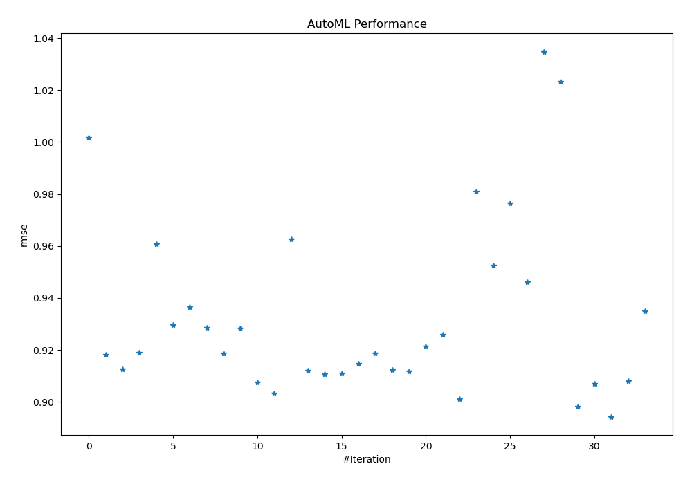
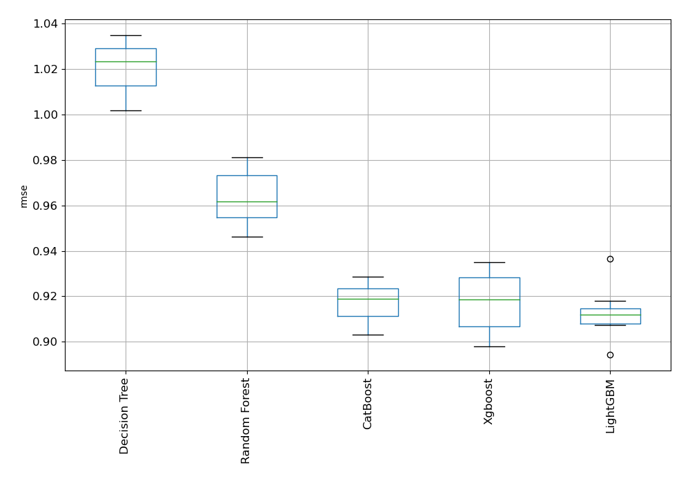

# AutoML Leaderboard

| Best model   | name                                                                                         | model_type    | metric_type   |   metric_value |   train_time |
|:-------------|:---------------------------------------------------------------------------------------------|:--------------|:--------------|---------------:|-------------:|
|              | [1_DecisionTree](1_DecisionTree/README.md)                                                   | Decision Tree | rmse          |       1.00176  |        33.95 |
|              | [2_Default_LightGBM](2_Default_LightGBM/README.md)                                           | LightGBM      | rmse          |       0.918103 |        22.17 |
|              | [3_Default_Xgboost](3_Default_Xgboost/README.md)                                             | Xgboost       | rmse          |       0.912481 |        30.27 |
|              | [4_Default_CatBoost](4_Default_CatBoost/README.md)                                           | CatBoost      | rmse          |       0.918907 |        25.97 |
|              | [5_Default_RandomForest](5_Default_RandomForest/README.md)                                   | Random Forest | rmse          |       0.960859 |        30.81 |
|              | [3_Default_Xgboost_GoldenFeatures](3_Default_Xgboost_GoldenFeatures/README.md)               | Xgboost       | rmse          |       0.929706 |        47.32 |
|              | [2_Default_LightGBM_GoldenFeatures](2_Default_LightGBM_GoldenFeatures/README.md)             | LightGBM      | rmse          |       0.936586 |        28.68 |
|              | [4_Default_CatBoost_GoldenFeatures](4_Default_CatBoost_GoldenFeatures/README.md)             | CatBoost      | rmse          |       0.928609 |        31.76 |
|              | [3_Default_Xgboost_RandomFeature](3_Default_Xgboost_RandomFeature/README.md)                 | Xgboost       | rmse          |       0.91876  |        23.86 |
|              | [3_Default_Xgboost_SelectedFeatures](3_Default_Xgboost_SelectedFeatures/README.md)           | Xgboost       | rmse          |       0.92828  |        17.06 |
|              | [2_Default_LightGBM_SelectedFeatures](2_Default_LightGBM_SelectedFeatures/README.md)         | LightGBM      | rmse          |       0.907479 |        21.73 |
|              | [4_Default_CatBoost_SelectedFeatures](4_Default_CatBoost_SelectedFeatures/README.md)         | CatBoost      | rmse          |       0.903286 |        11.87 |
|              | [5_Default_RandomForest_SelectedFeatures](5_Default_RandomForest_SelectedFeatures/README.md) | Random Forest | rmse          |       0.96266  |        20.93 |
|              | [6_CatBoost_SelectedFeatures](6_CatBoost_SelectedFeatures/README.md)                         | CatBoost      | rmse          |       0.912135 |        13.88 |
|              | [7_CatBoost_SelectedFeatures](7_CatBoost_SelectedFeatures/README.md)                         | CatBoost      | rmse          |       0.910824 |        12.03 |
|              | [8_LightGBM_SelectedFeatures](8_LightGBM_SelectedFeatures/README.md)                         | LightGBM      | rmse          |       0.91085  |        22.61 |
|              | [9_LightGBM_SelectedFeatures](9_LightGBM_SelectedFeatures/README.md)                         | LightGBM      | rmse          |       0.914728 |        25.76 |
|              | [10_Xgboost](10_Xgboost/README.md)                                                           | Xgboost       | rmse          |       0.918622 |        38.4  |
|              | [11_LightGBM](11_LightGBM/README.md)                                                         | LightGBM      | rmse          |       0.912281 |        36.95 |
|              | [12_LightGBM](12_LightGBM/README.md)                                                         | LightGBM      | rmse          |       0.911826 |        37.22 |
|              | [13_CatBoost](13_CatBoost/README.md)                                                         | CatBoost      | rmse          |       0.921337 |        33.52 |
|              | [14_CatBoost](14_CatBoost/README.md)                                                         | CatBoost      | rmse          |       0.925787 |        32.89 |
|              | [15_Xgboost_SelectedFeatures](15_Xgboost_SelectedFeatures/README.md)                         | Xgboost       | rmse          |       0.901045 |       284.5  |
|              | [16_RandomForest](16_RandomForest/README.md)                                                 | Random Forest | rmse          |       0.981028 |       831.29 |
|              | [17_RandomForest](17_RandomForest/README.md)                                                 | Random Forest | rmse          |       0.952586 |        51.85 |
|              | [18_RandomForest_SelectedFeatures](18_RandomForest_SelectedFeatures/README.md)               | Random Forest | rmse          |       0.976573 |        25.03 |
|              | [19_RandomForest_SelectedFeatures](19_RandomForest_SelectedFeatures/README.md)               | Random Forest | rmse          |       0.946224 |        33.01 |
|              | [20_DecisionTree](20_DecisionTree/README.md)                                                 | Decision Tree | rmse          |       1.03485  |        54.27 |
|              | [21_DecisionTree](21_DecisionTree/README.md)                                                 | Decision Tree | rmse          |       1.0234   |        68.21 |
|              | [22_Xgboost_SelectedFeatures](22_Xgboost_SelectedFeatures/README.md)                         | Xgboost       | rmse          |       0.89814  |        49.15 |
|              | [23_Xgboost_SelectedFeatures](23_Xgboost_SelectedFeatures/README.md)                         | Xgboost       | rmse          |       0.906925 |        59.08 |
| **the best** | [24_LightGBM_SelectedFeatures](24_LightGBM_SelectedFeatures/README.md)                       | LightGBM      | rmse          |       0.894332 |        56.18 |
|              | [25_LightGBM_SelectedFeatures](25_LightGBM_SelectedFeatures/README.md)                       | LightGBM      | rmse          |       0.908042 |        61.81 |
|              | [26_Xgboost](26_Xgboost/README.md)                                                           | Xgboost       | rmse          |       0.934885 |        71.62 |

### AutoML Performance

### AutoML Performance Boxplot
