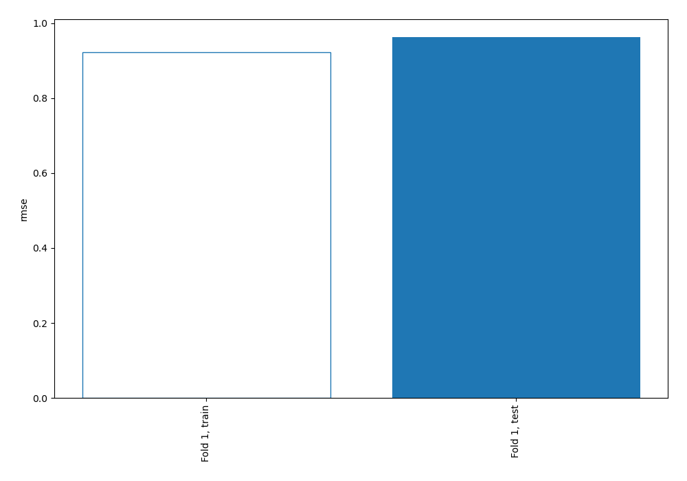
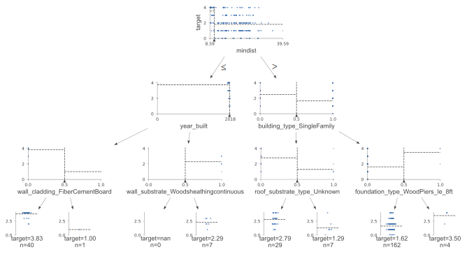
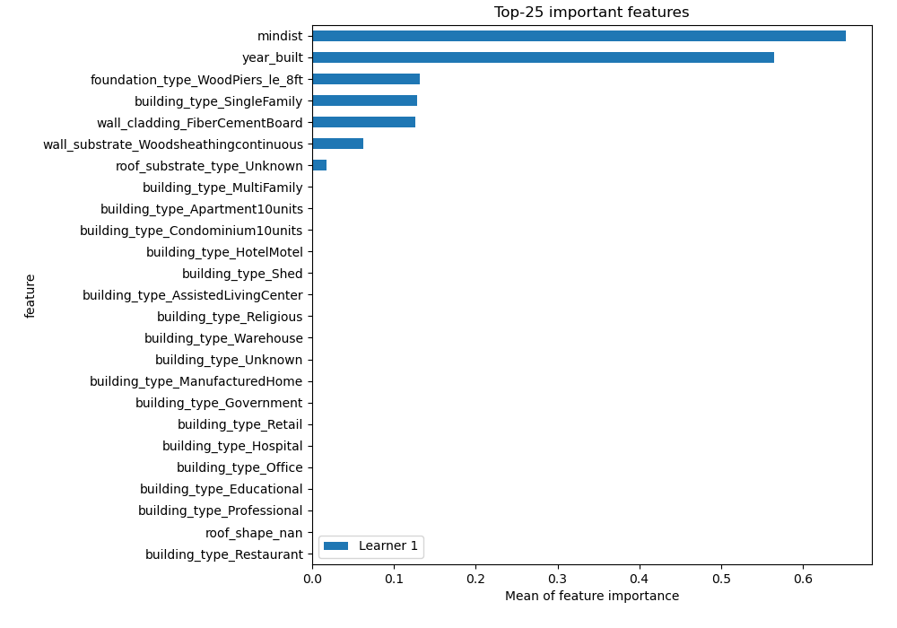
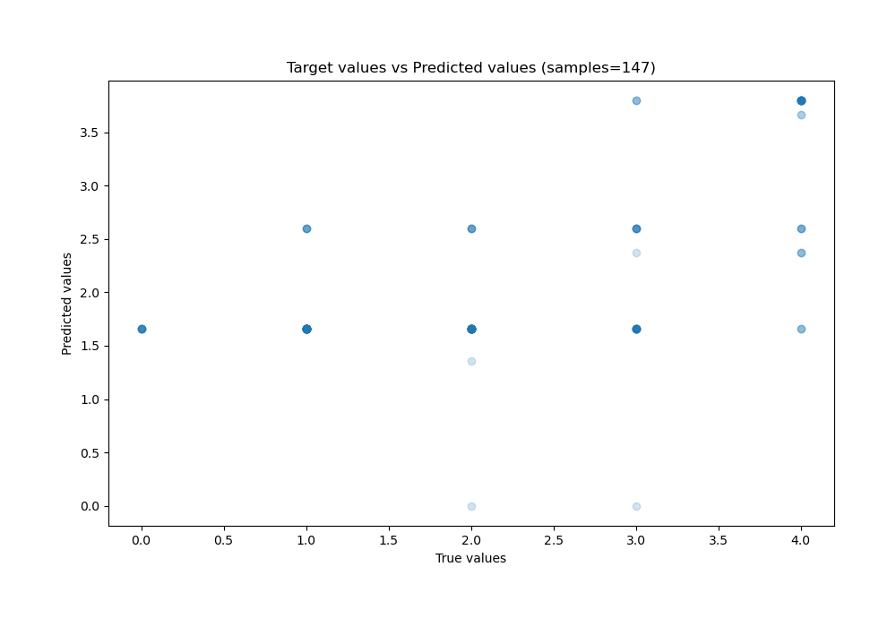
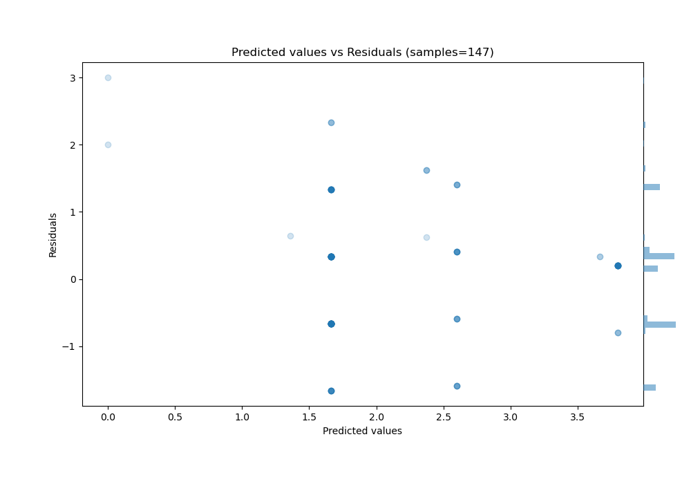
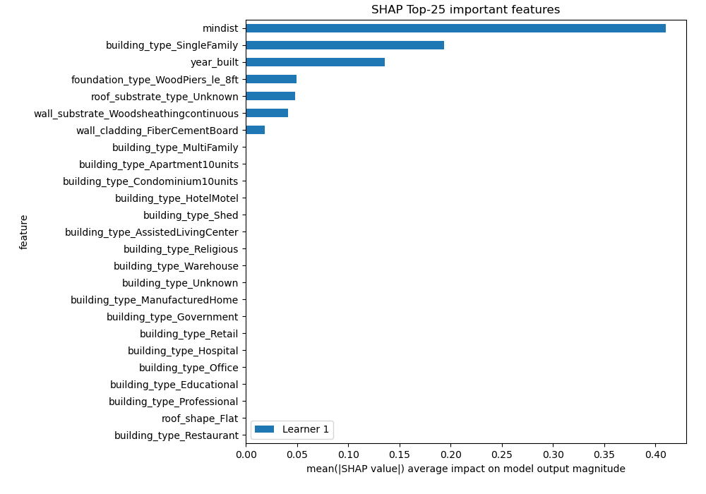
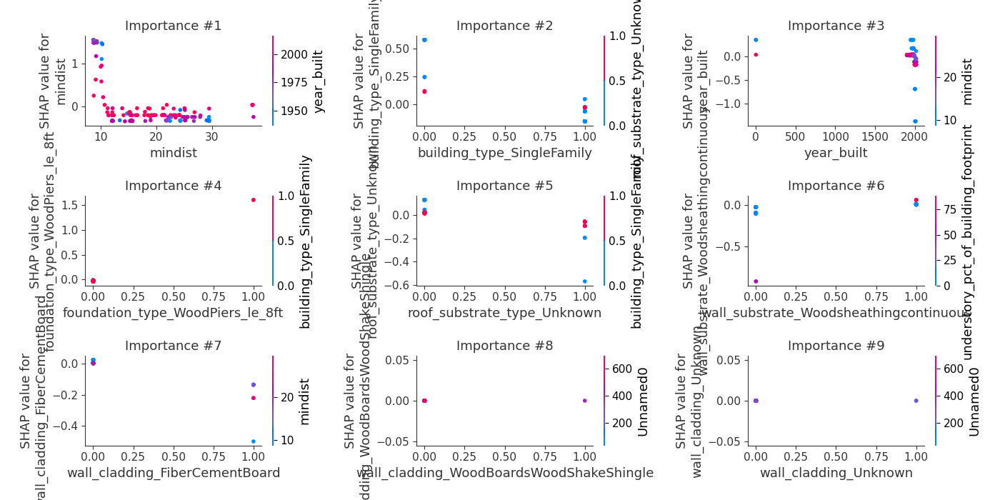
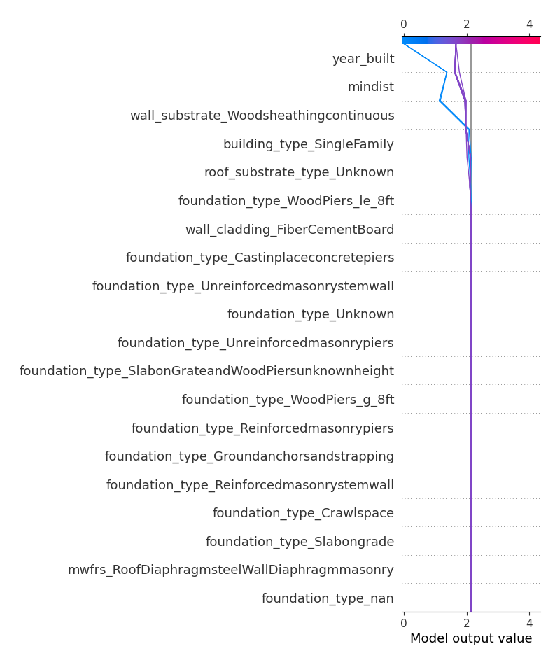
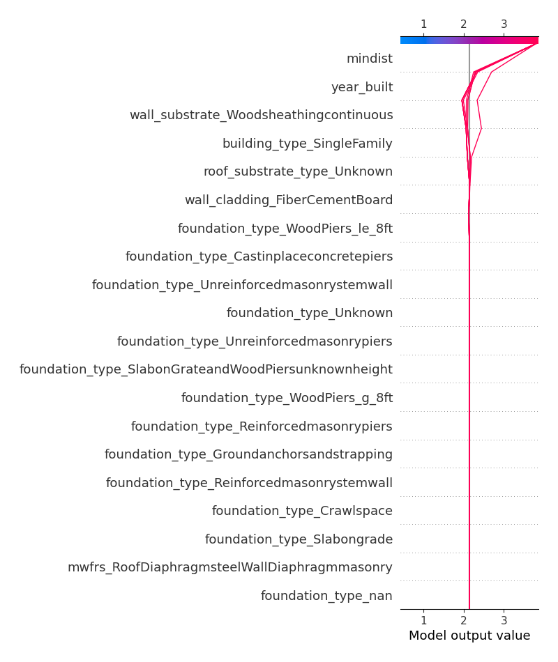

# Summary of 2_DecisionTree

[<< Go back](../README.md)

## Decision Tree
- **n_jobs**: -1
- **criterion**: mse
- **max_depth**: 3
- **explain_level**: 2

## Validation
 - **validation_type**: split
 - **train_ratio**: 0.75
 - **shuffle**: True

## Optimized metric
rmse

## Training time

10.1 seconds

### Metric details:
| Metric   |       Score |
|:---------|------------:|
| MAE      | 0.780634    |
| MSE      | 0.926479    |
| RMSE     | 0.962538    |
| R2       | 0.371656    |
| MAPE     | 4.57892e+14 |

## Learning curves

## Decision Tree 

### Tree #1

### Rules

if (mindist > 10.468) and (building_type_SingleFamily > 0.5) and (foundation_type_WoodPiers_le_8ft <= 0.5) then response: 1.661 | based on 277 samples

if (mindist <= 10.468) and (year_built <= 1996.5) and (wall_cladding_FiberCementBoard <= 0.5) then response: 3.797 | based on 64 samples

if (mindist > 10.468) and (building_type_SingleFamily <= 0.5) and (roof_substrate_type_Unknown <= 0.5) then response: 2.597 | based on 62 samples

if (mindist <= 10.468) and (year_built > 1996.5) and (wall_substrate_Woodsheathingcontinuous > 0.5) then response: 2.375 | based on 16 samples

if (mindist > 10.468) and (building_type_SingleFamily <= 0.5) and (roof_substrate_type_Unknown > 0.5) then response: 1.357 | based on 14 samples

if (mindist > 10.468) and (building_type_SingleFamily > 0.5) and (foundation_type_WoodPiers_le_8ft > 0.5) then response: 3.667 | based on 6 samples

if (mindist <= 10.468) and (year_built > 1996.5) and (wall_substrate_Woodsheathingcontinuous <= 0.5) then response: 0.0 | based on 1 samples

if (mindist <= 10.468) and (year_built <= 1996.5) and (wall_cladding_FiberCementBoard > 0.5) then response: 1.0 | based on 1 samples

## Permutation-based Importance

## True vs Predicted

## Predicted vs Residuals

## SHAP Importance

## SHAP Dependence plots

### Dependence (Fold 1)

## SHAP Decision plots

### Top-10 Worst decisions (Fold 1)

### Top-10 Best decisions (Fold 1)

[<< Go back](../README.md)
