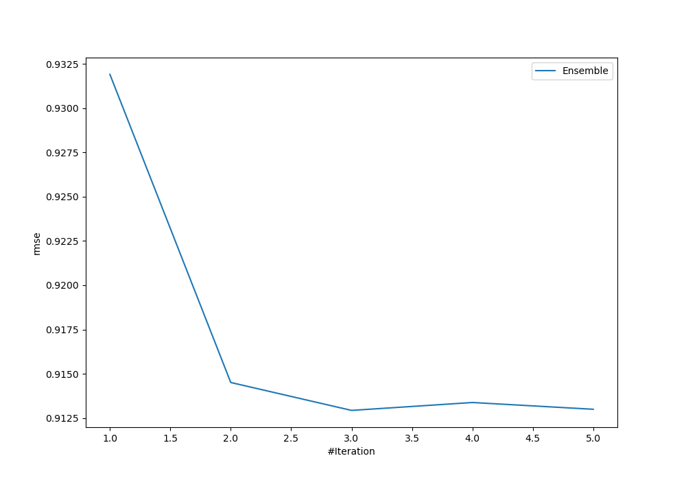
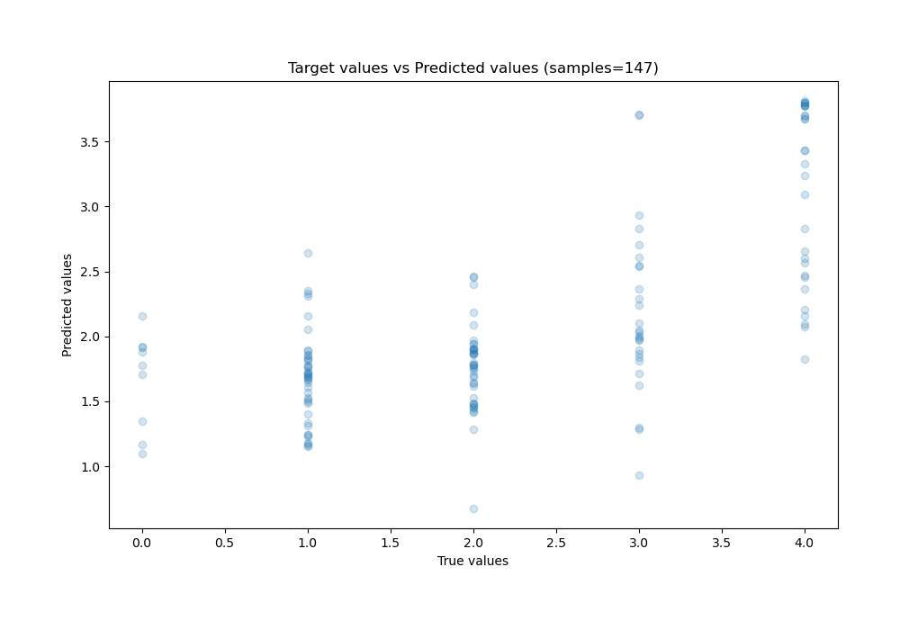
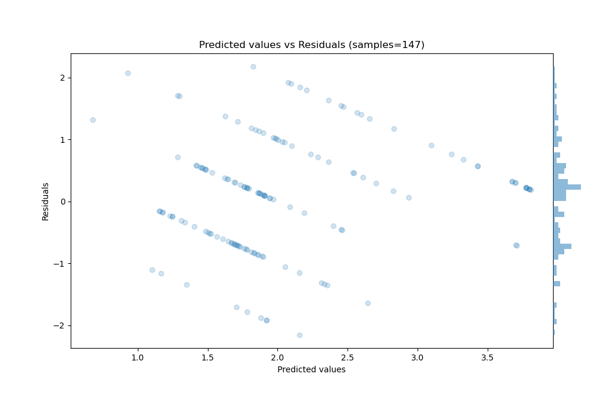

# Summary of Ensemble

[<< Go back](../README.md)

## Ensemble structure
| Model             |   Weight |
|:------------------|---------:|
| 2_DecisionTree    |        1 |
| 3_Default_Xgboost |        2 |

### Metric details:
| Metric   |       Score |
|:---------|------------:|
| MAE      | 0.732786    |
| MSE      | 0.833448    |
| RMSE     | 0.912934    |
| R2       | 0.434751    |
| MAPE     | 4.58706e+14 |

## Learning curves

## True vs Predicted

## Predicted vs Residuals

[<< Go back](../README.md)
