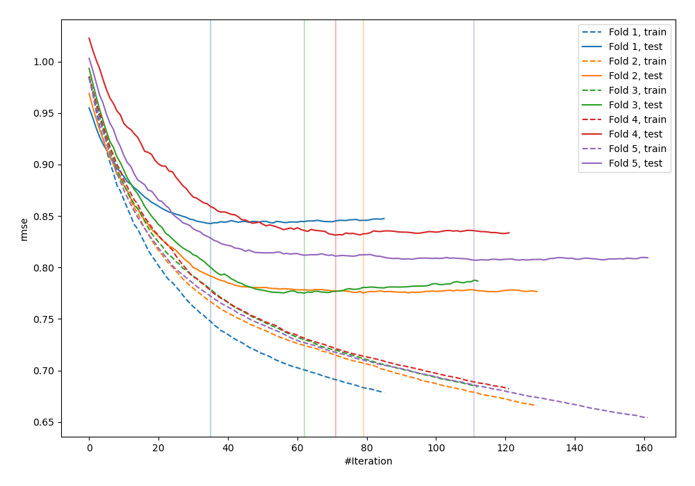
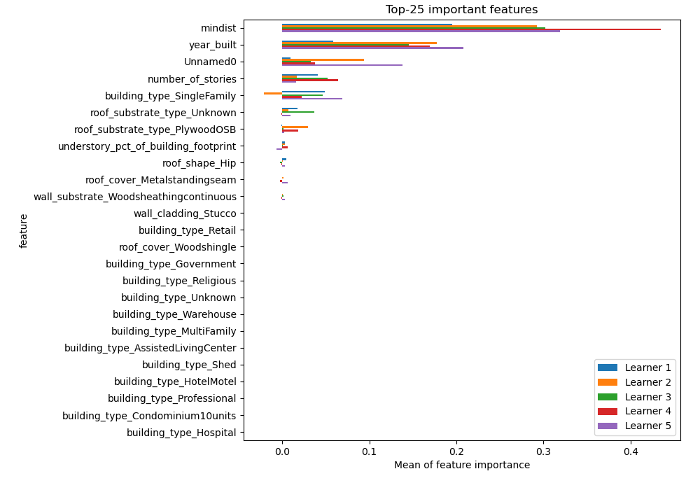
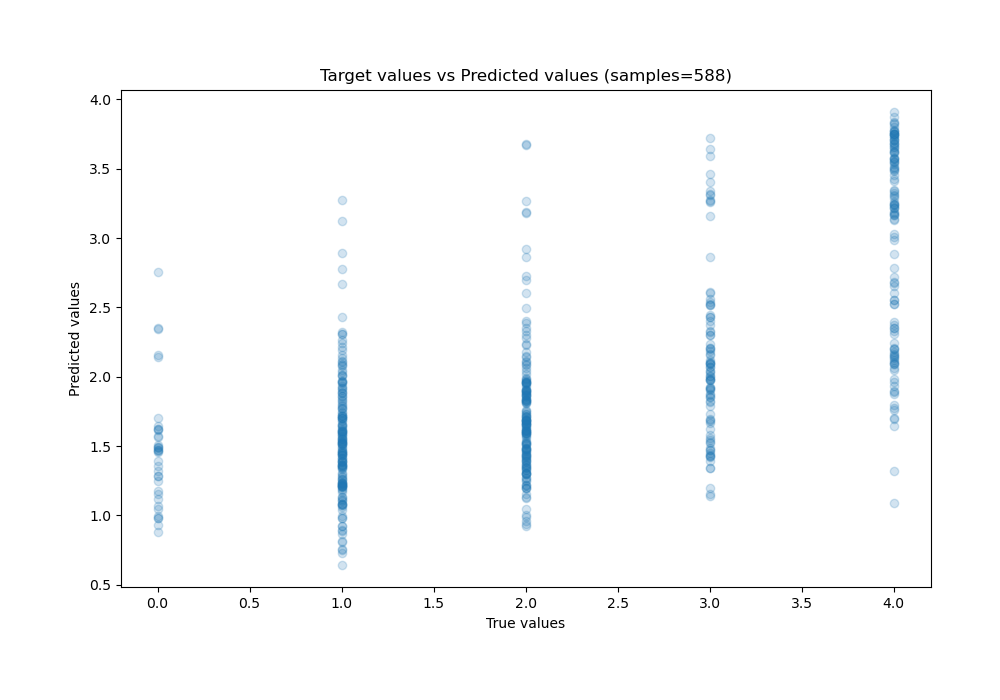
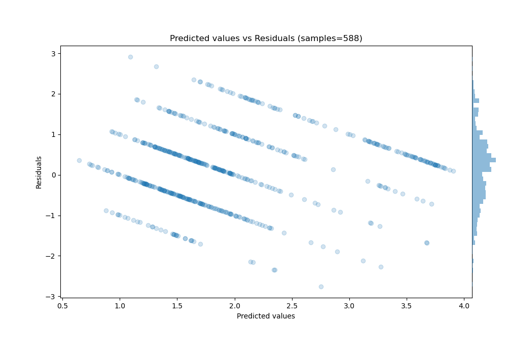

# Summary of 10_LightGBM

[<< Go back](../README.md)

## LightGBM
- **n_jobs**: -1
- **objective**: regression
- **num_leaves**: 15
- **learning_rate**: 0.05
- **feature_fraction**: 0.8
- **bagging_fraction**: 0.5
- **min_data_in_leaf**: 50
- **metric**: rmse
- **custom_eval_metric_name**: None
- **explain_level**: 1

## Validation
 - **validation_type**: kfold
 - **k_folds**: 5
 - **shuffle**: True

## Optimized metric
rmse

## Training time

8.4 seconds

### Metric details:
| Metric   |       Score |
|:---------|------------:|
| MAE      | 0.748115    |
| MSE      | 0.872516    |
| RMSE     | 0.934086    |
| R2       | 0.413084    |
| MAPE     | 4.07103e+14 |

## Learning curves

## Permutation-based Importance

## True vs Predicted

## Predicted vs Residuals

[<< Go back](../README.md)
