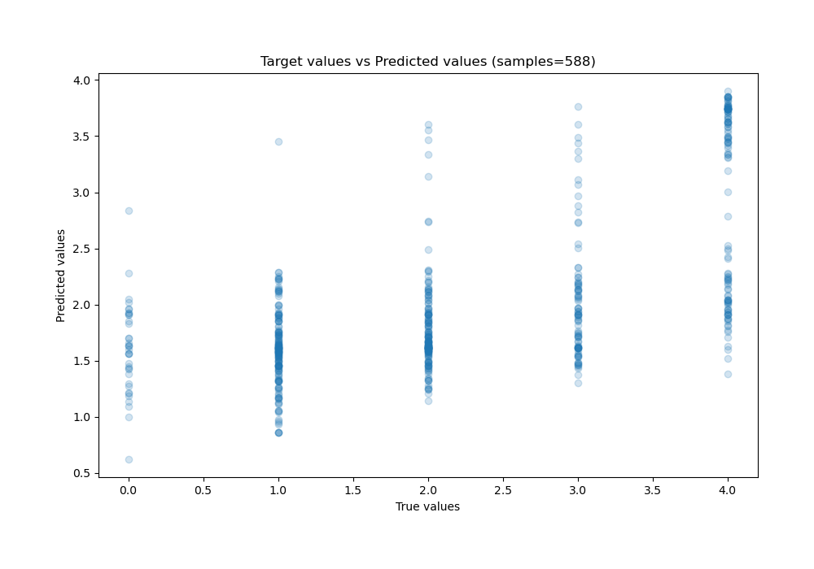
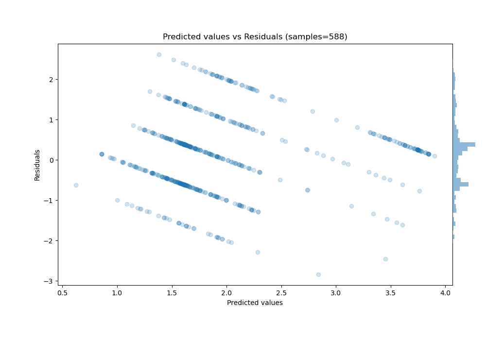

# Summary of 18_RandomForest

[<< Go back](../README.md)

## Random Forest
- **n_jobs**: -1
- **criterion**: mse
- **max_features**: 0.5
- **min_samples_split**: 20
- **max_depth**: 4
- **eval_metric_name**: rmse
- **explain_level**: 1

## Validation
 - **validation_type**: kfold
 - **k_folds**: 5
 - **shuffle**: True

## Optimized metric
rmse

## Training time

16.5 seconds

### Metric details:
| Metric   |       Score |
|:---------|------------:|
| MAE      | 0.757932    |
| MSE      | 0.919743    |
| RMSE     | 0.959032    |
| R2       | 0.381316    |
| MAPE     | 4.43165e+14 |

## Learning curves

## Permutation-based Importance

## True vs Predicted

## Predicted vs Residuals

[<< Go back](../README.md)
