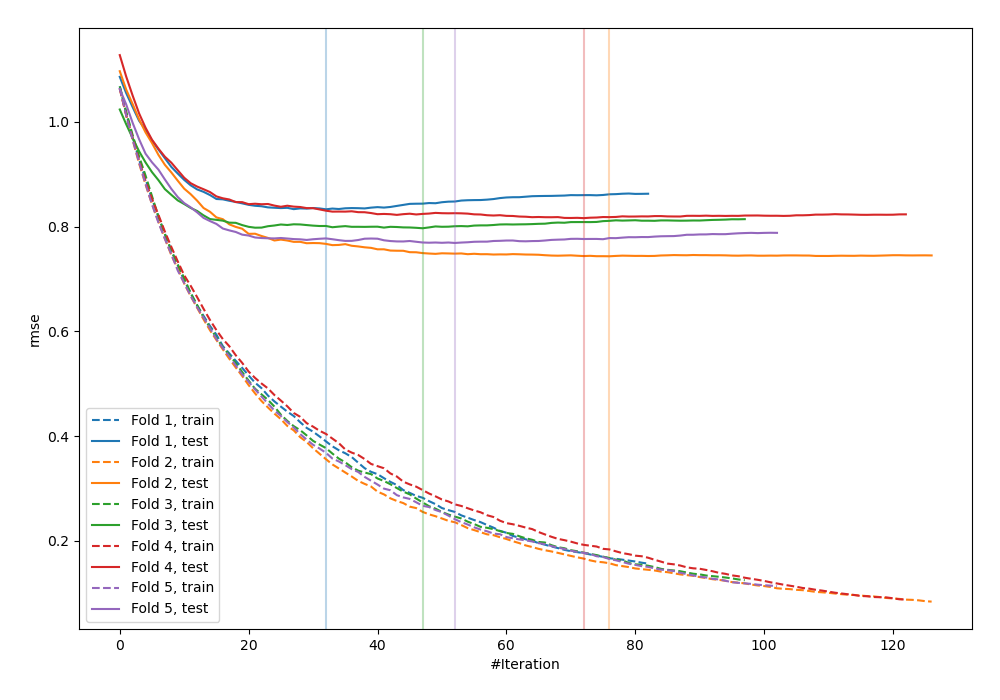
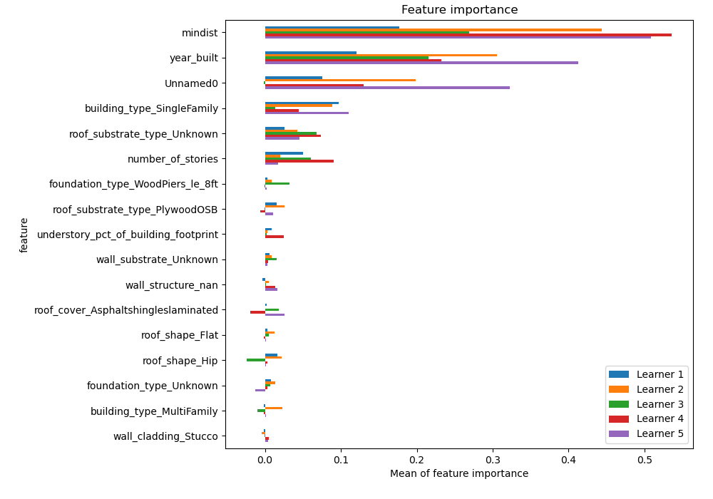
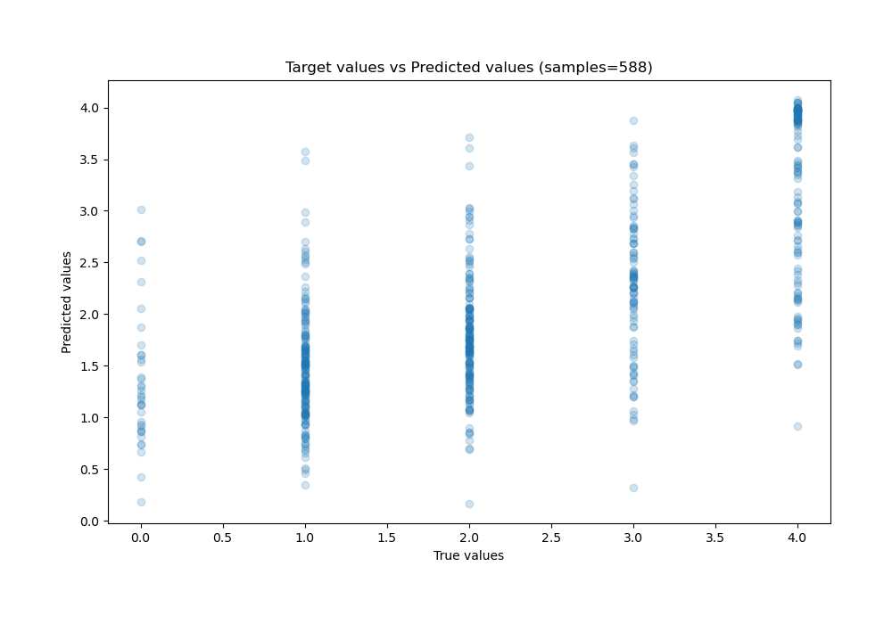
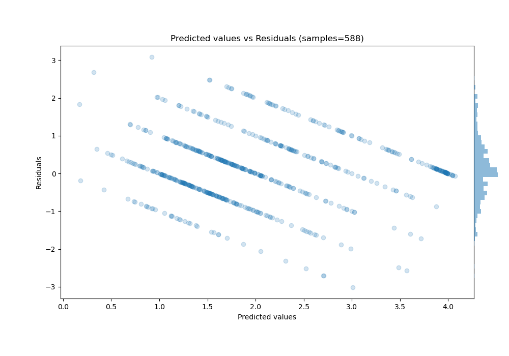

# Summary of 42_Xgboost_SelectedFeatures

[<< Go back](../README.md)

## Extreme Gradient Boosting (Xgboost)
- **n_jobs**: -1
- **objective**: reg:squarederror
- **eta**: 0.075
- **max_depth**: 8
- **min_child_weight**: 1
- **subsample**: 0.9
- **colsample_bytree**: 1.0
- **eval_metric**: rmse
- **explain_level**: 1

## Validation
 - **validation_type**: kfold
 - **k_folds**: 5
 - **shuffle**: True

## Optimized metric
rmse

## Training time

10.7 seconds

### Metric details:
| Metric   |      Score |
|:---------|-----------:|
| MAE      | 0.67587    |
| MSE      | 0.817963   |
| RMSE     | 0.904413   |
| R2       | 0.44978    |
| MAPE     | 3.7452e+14 |

## Learning curves

## Permutation-based Importance

## True vs Predicted

## Predicted vs Residuals

[<< Go back](../README.md)
