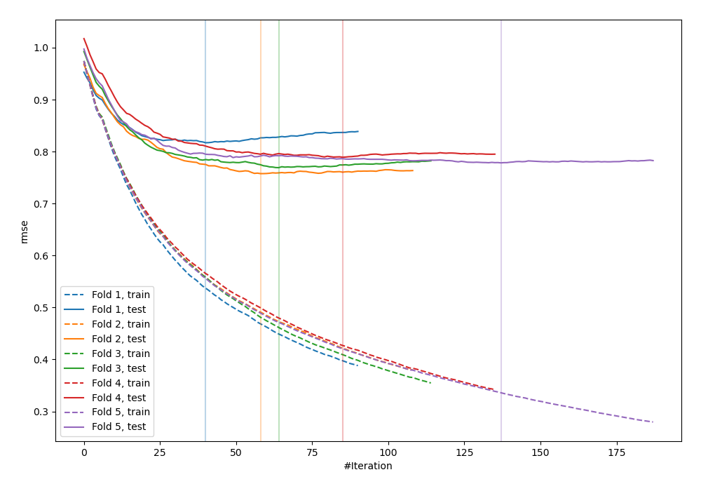
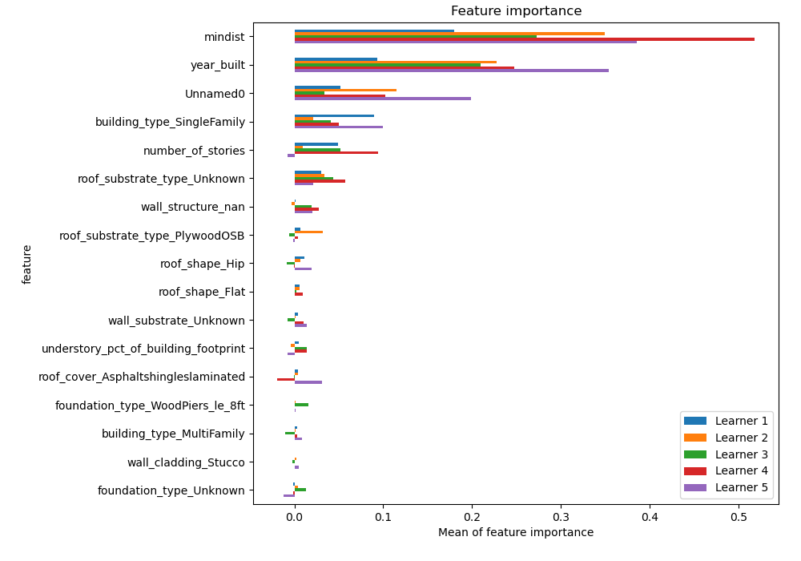
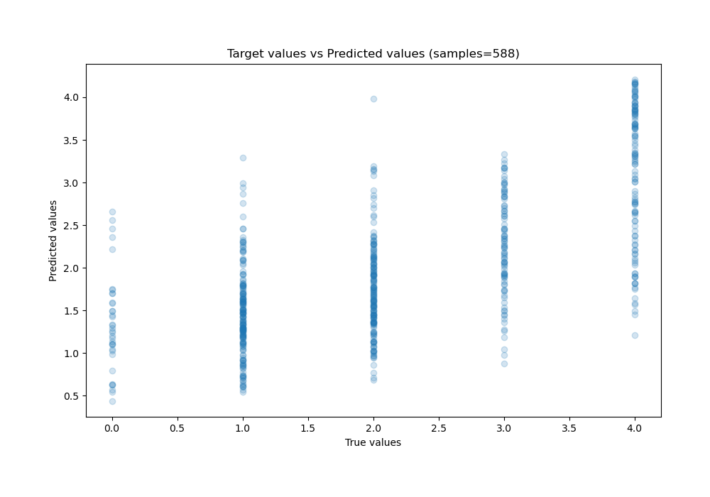
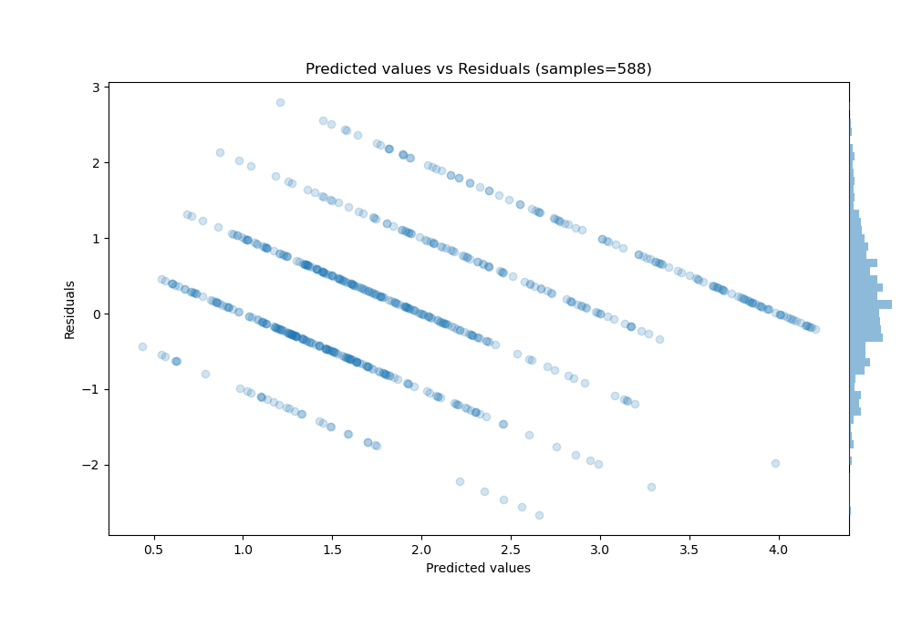

# Summary of 46_LightGBM_SelectedFeatures

[<< Go back](../README.md)

## LightGBM
- **n_jobs**: -1
- **objective**: regression
- **num_leaves**: 63
- **learning_rate**: 0.05
- **feature_fraction**: 0.8
- **bagging_fraction**: 0.8
- **min_data_in_leaf**: 10
- **metric**: rmse
- **custom_eval_metric_name**: None
- **explain_level**: 1

## Validation
 - **validation_type**: kfold
 - **k_folds**: 5
 - **shuffle**: True

## Optimized metric
rmse

## Training time

9.3 seconds

### Metric details:
| Metric   |       Score |
|:---------|------------:|
| MAE      | 0.689137    |
| MSE      | 0.809999    |
| RMSE     | 0.899999    |
| R2       | 0.455138    |
| MAPE     | 3.72976e+14 |

## Learning curves

## Permutation-based Importance

## True vs Predicted

## Predicted vs Residuals

[<< Go back](../README.md)
