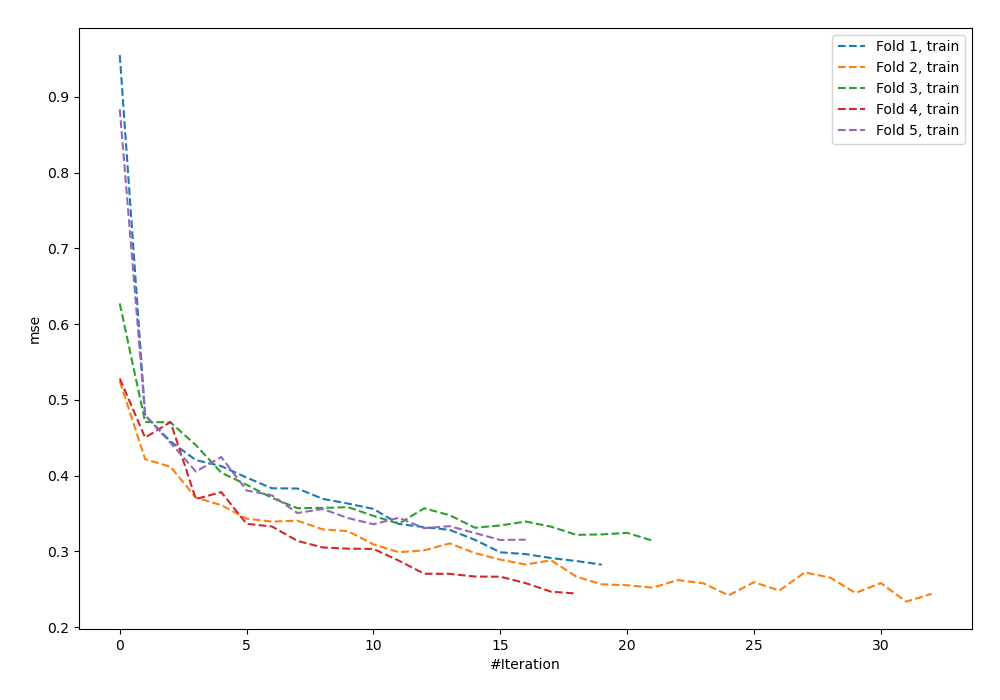
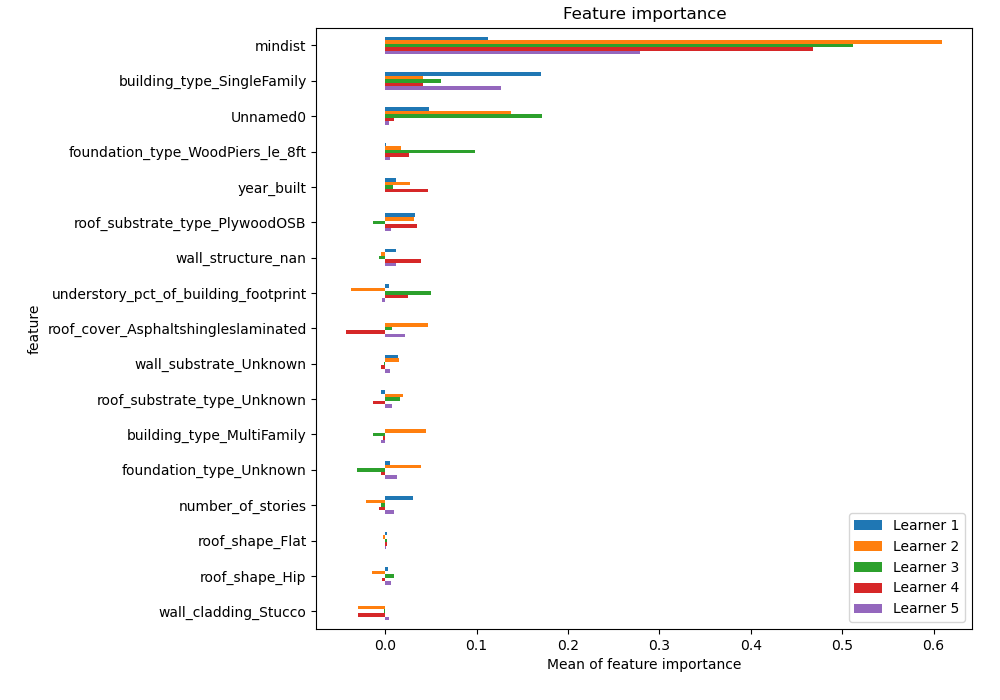
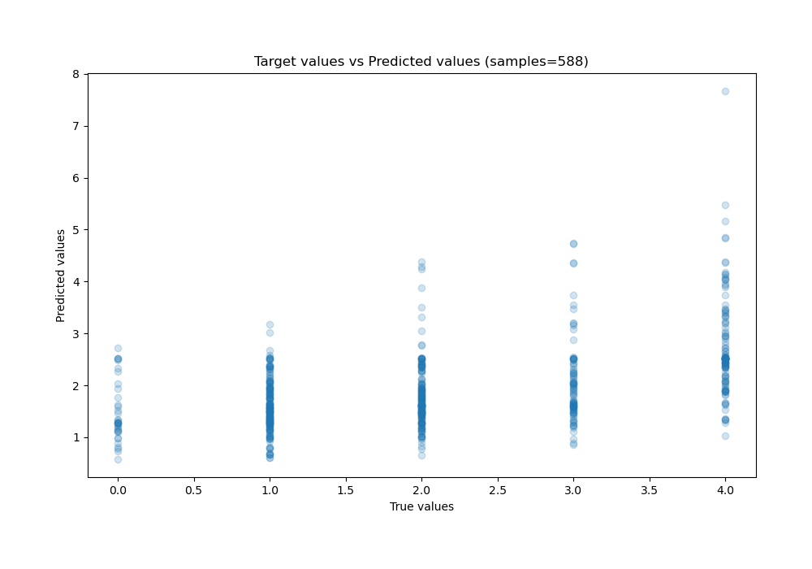
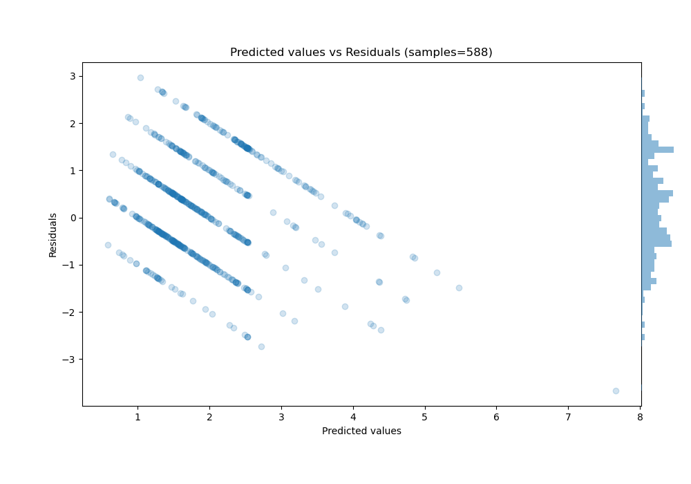

# Summary of 4_Default_NeuralNetwork_SelectedFeatures

[<< Go back](../README.md)

## Neural Network
- **n_jobs**: -1
- **dense_1_size**: 32
- **dense_2_size**: 16
- **learning_rate**: 0.05
- **explain_level**: 1

## Validation
 - **validation_type**: kfold
 - **k_folds**: 5
 - **shuffle**: True

## Optimized metric
rmse

## Training time

4.1 seconds

### Metric details:
| Metric   |       Score |
|:---------|------------:|
| MAE      | 0.895761    |
| MSE      | 1.2086      |
| RMSE     | 1.09936     |
| R2       | 0.187013    |
| MAPE     | 4.10087e+14 |

## Learning curves

## Permutation-based Importance

## True vs Predicted

## Predicted vs Residuals

[<< Go back](../README.md)
