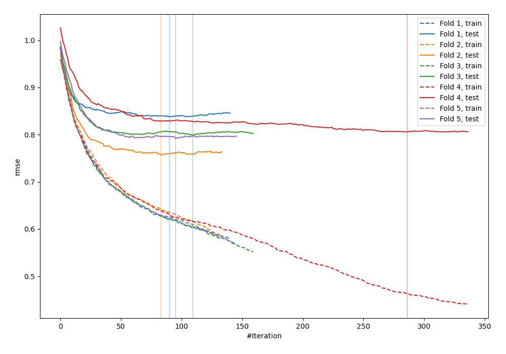
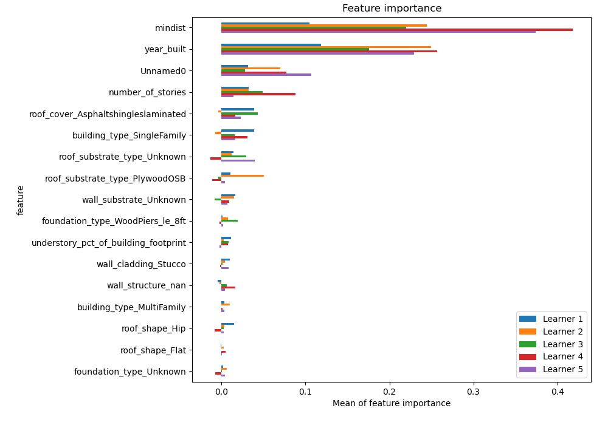
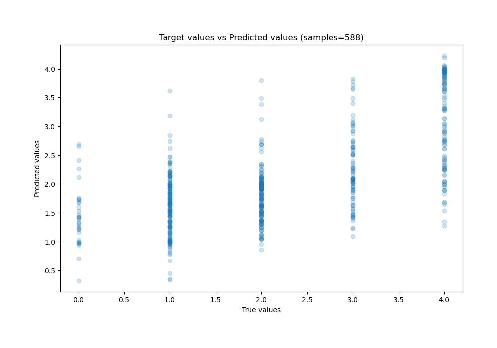
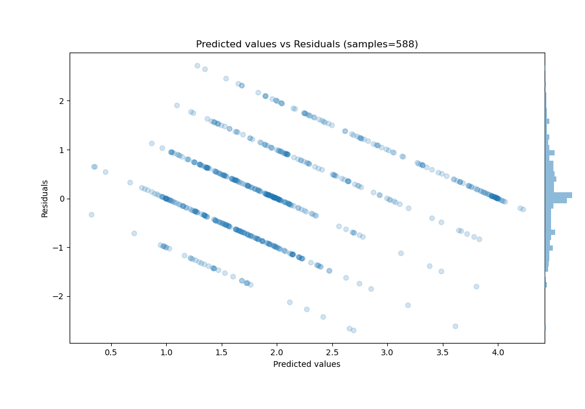

# Summary of 51_CatBoost_SelectedFeatures

[<< Go back](../README.md)

## CatBoost
- **n_jobs**: -1
- **learning_rate**: 0.05
- **depth**: 7
- **rsm**: 1.0
- **loss_function**: MAE
- **eval_metric**: RMSE
- **explain_level**: 1

## Validation
 - **validation_type**: kfold
 - **k_folds**: 5
 - **shuffle**: True

## Optimized metric
rmse

## Training time

7.6 seconds

### Metric details:
| Metric   |       Score |
|:---------|------------:|
| MAE      | 0.694427    |
| MSE      | 0.830937    |
| RMSE     | 0.911557    |
| R2       | 0.441053    |
| MAPE     | 3.99283e+14 |

## Learning curves

## Permutation-based Importance

## True vs Predicted

## Predicted vs Residuals

[<< Go back](../README.md)
