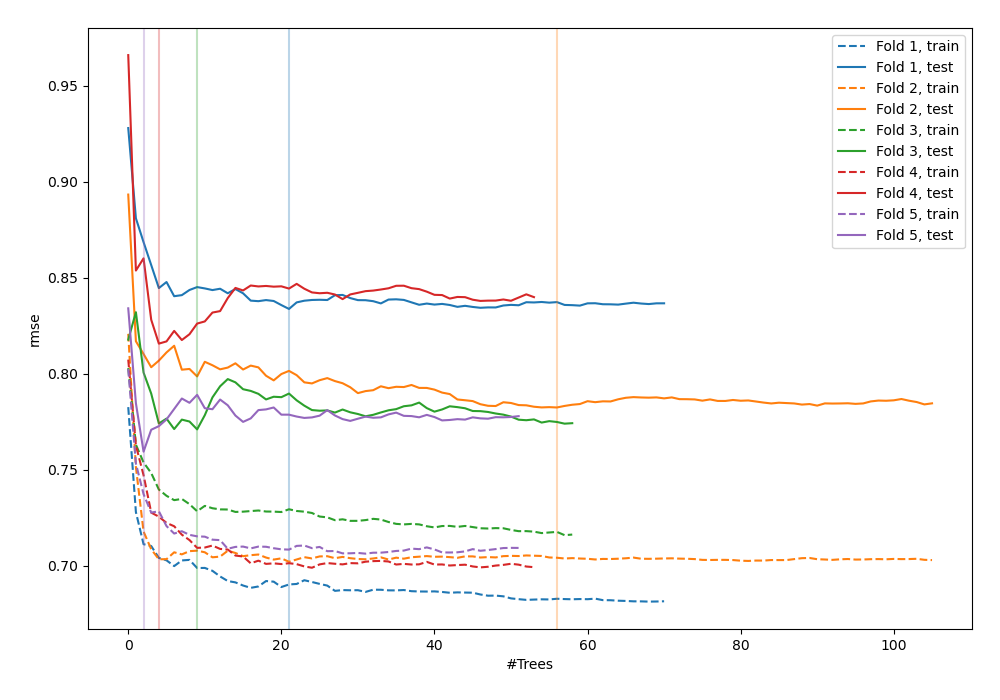
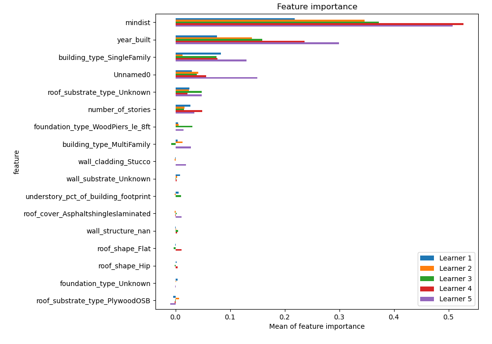
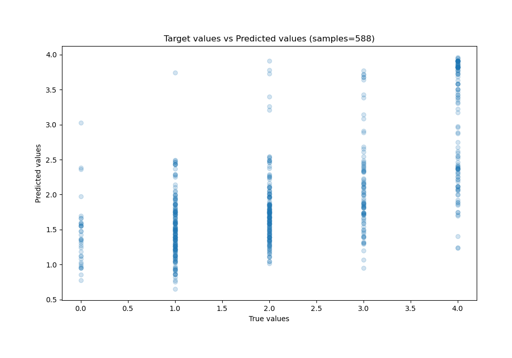
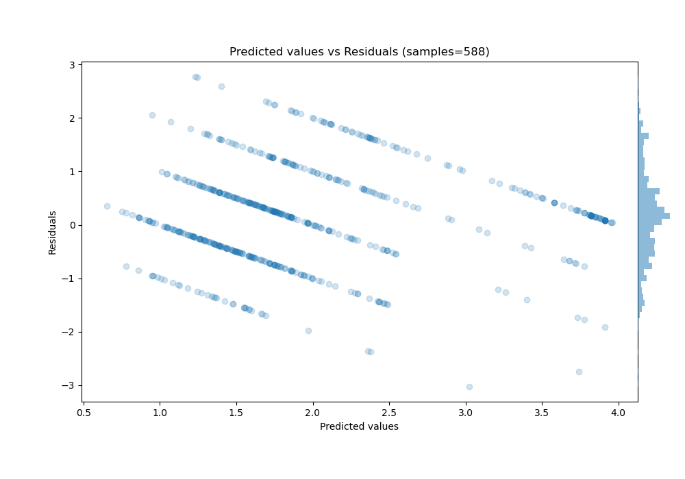

# Summary of 53_RandomForest_SelectedFeatures

[<< Go back](../README.md)

## Random Forest
- **n_jobs**: -1
- **criterion**: mse
- **max_features**: 0.9
- **min_samples_split**: 40
- **max_depth**: 7
- **eval_metric_name**: rmse
- **explain_level**: 1

## Validation
 - **validation_type**: kfold
 - **k_folds**: 5
 - **shuffle**: True

## Optimized metric
rmse

## Training time

6.3 seconds

### Metric details:
| Metric   |       Score |
|:---------|------------:|
| MAE      | 0.717658    |
| MSE      | 0.854185    |
| RMSE     | 0.924221    |
| R2       | 0.425415    |
| MAPE     | 3.93596e+14 |

## Learning curves

## Permutation-based Importance

## True vs Predicted

## Predicted vs Residuals

[<< Go back](../README.md)
