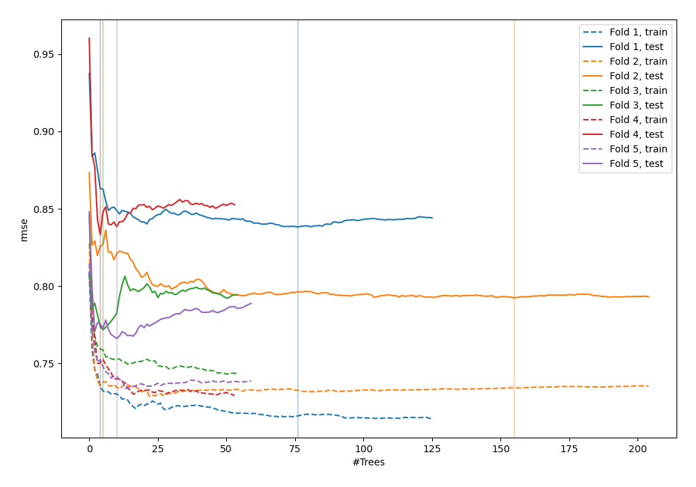
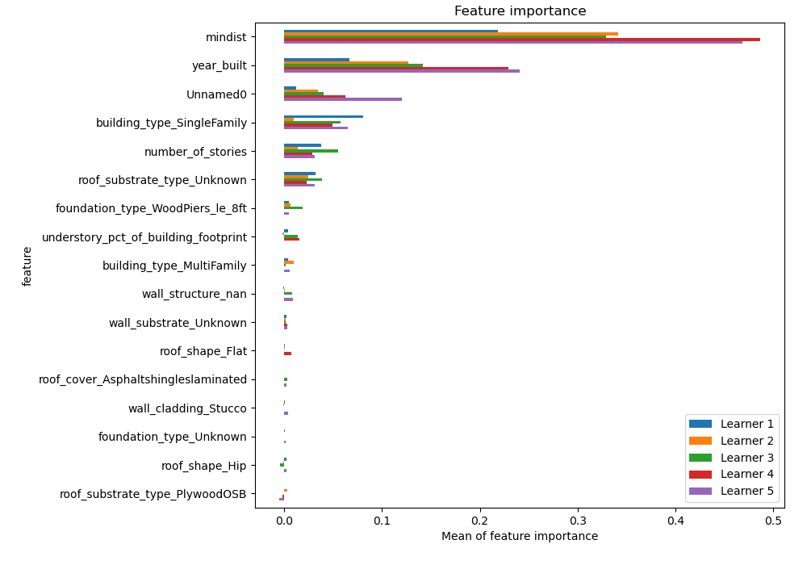
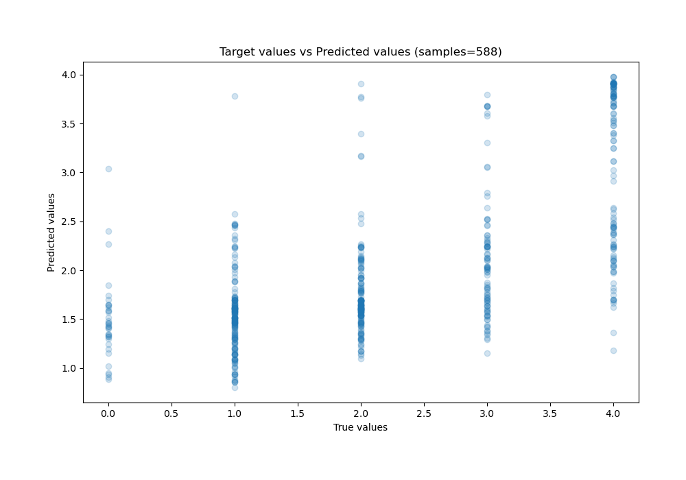
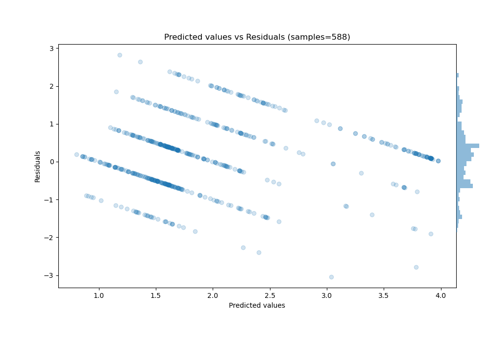

# Summary of 54_RandomForest_SelectedFeatures

[<< Go back](../README.md)

## Random Forest
- **n_jobs**: -1
- **criterion**: mse
- **max_features**: 1.0
- **min_samples_split**: 40
- **max_depth**: 5
- **eval_metric_name**: rmse
- **explain_level**: 1

## Validation
 - **validation_type**: kfold
 - **k_folds**: 5
 - **shuffle**: True

## Optimized metric
rmse

## Training time

7.4 seconds

### Metric details:
| Metric   |       Score |
|:---------|------------:|
| MAE      | 0.726523    |
| MSE      | 0.869014    |
| RMSE     | 0.932209    |
| R2       | 0.41544     |
| MAPE     | 4.10528e+14 |

## Learning curves

## Permutation-based Importance

## True vs Predicted

## Predicted vs Residuals

[<< Go back](../README.md)
