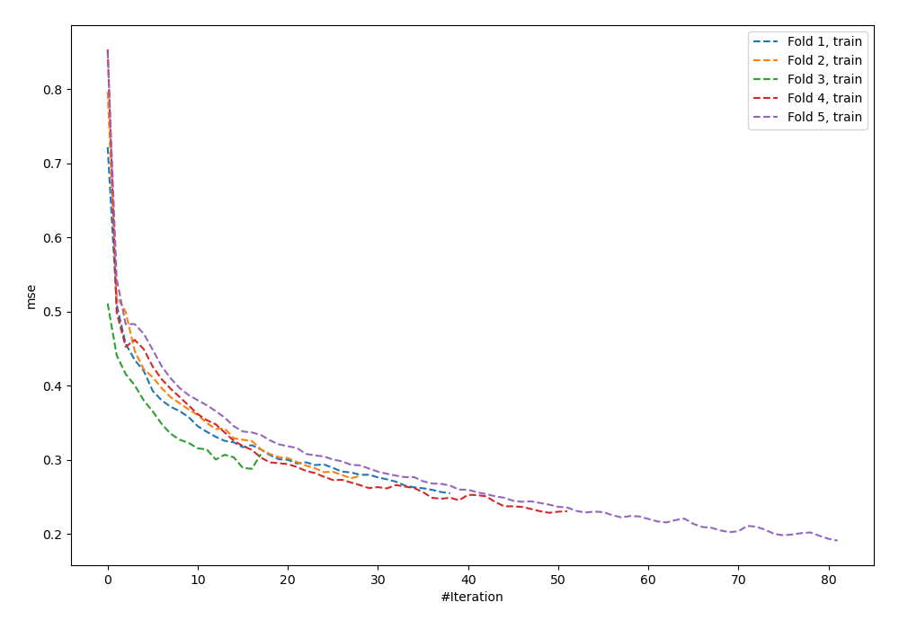
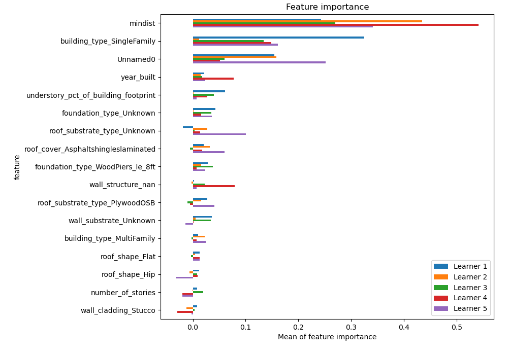
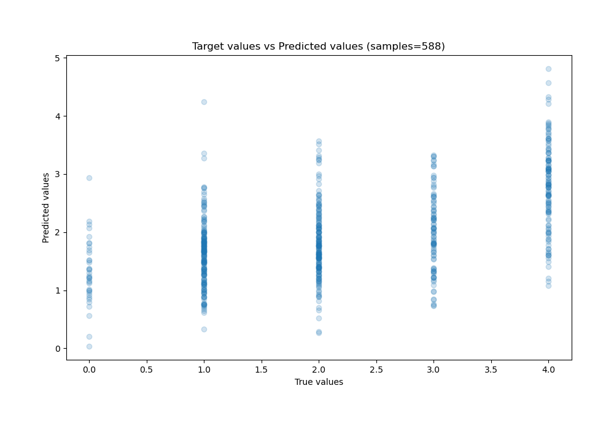
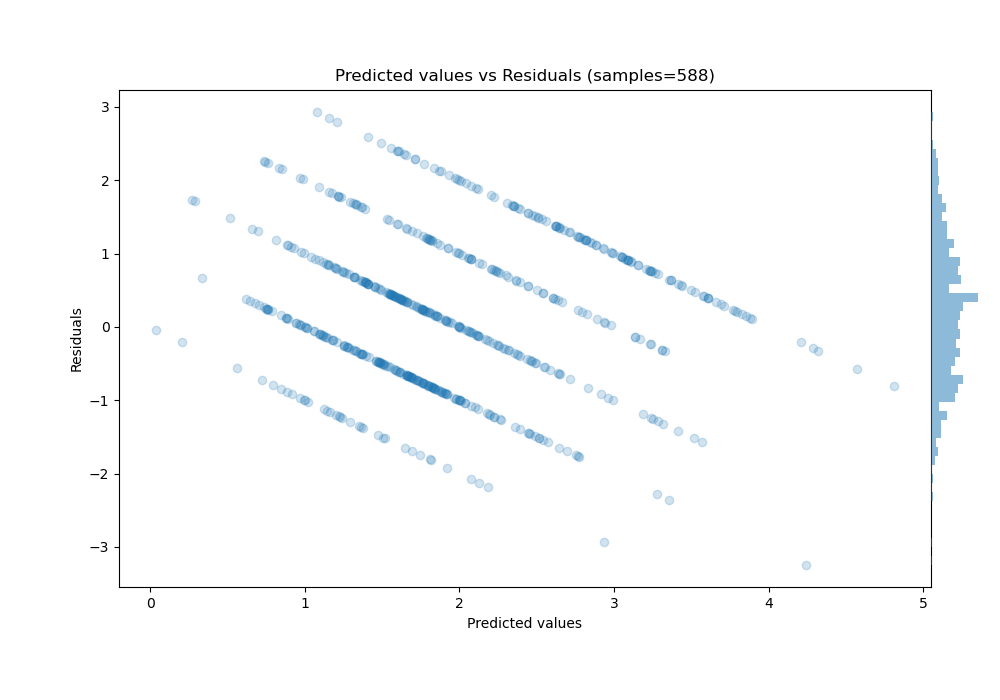

# Summary of 56_NeuralNetwork_SelectedFeatures

[<< Go back](../README.md)

## Neural Network
- **n_jobs**: -1
- **dense_1_size**: 16
- **dense_2_size**: 16
- **learning_rate**: 0.01
- **explain_level**: 1

## Validation
 - **validation_type**: kfold
 - **k_folds**: 5
 - **shuffle**: True

## Optimized metric
rmse

## Training time

6.3 seconds

### Metric details:
| Metric   |       Score |
|:---------|------------:|
| MAE      | 0.839826    |
| MSE      | 1.08182     |
| RMSE     | 1.04011     |
| R2       | 0.272289    |
| MAPE     | 3.60774e+14 |

## Learning curves

## Permutation-based Importance

## True vs Predicted

## Predicted vs Residuals

[<< Go back](../README.md)
