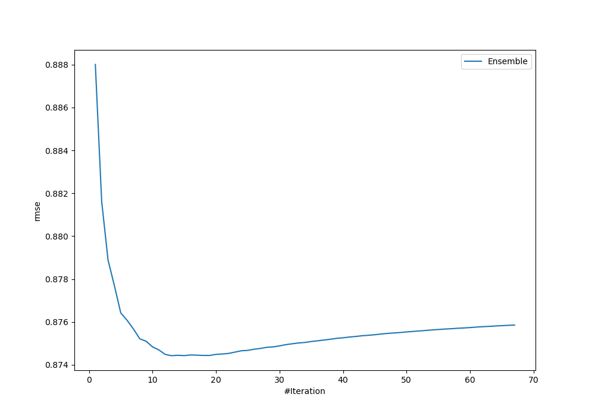
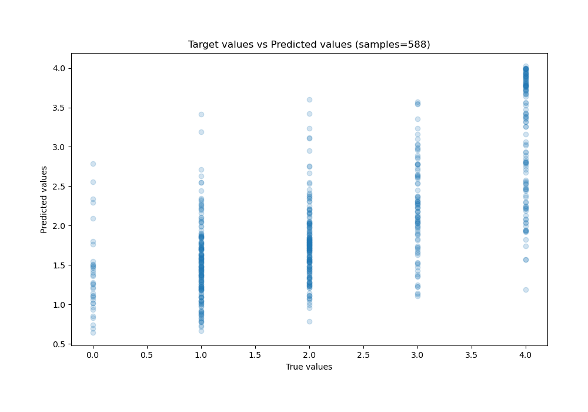
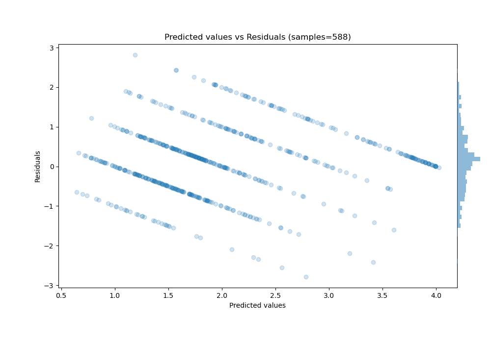

# Summary of Ensemble

[<< Go back](../README.md)

## Ensemble structure
| Model                             |   Weight |
|:----------------------------------|---------:|
| 17_CatBoost                       |        1 |
| 42_Xgboost_SelectedFeatures       |        2 |
| 43_Xgboost_SelectedFeatures       |        5 |
| 48_Xgboost_SelectedFeatures       |        1 |
| 51_CatBoost_SelectedFeatures      |        1 |
| 55_RandomForest_SelectedFeatures  |        1 |
| 56_NeuralNetwork_SelectedFeatures |        1 |
| 9_Xgboost                         |        1 |

### Metric details:
| Metric   |       Score |
|:---------|------------:|
| MAE      | 0.673086    |
| MSE      | 0.764626    |
| RMSE     | 0.874429    |
| R2       | 0.485659    |
| MAPE     | 3.79982e+14 |

## Learning curves

## True vs Predicted

## Predicted vs Residuals

[<< Go back](../README.md)
