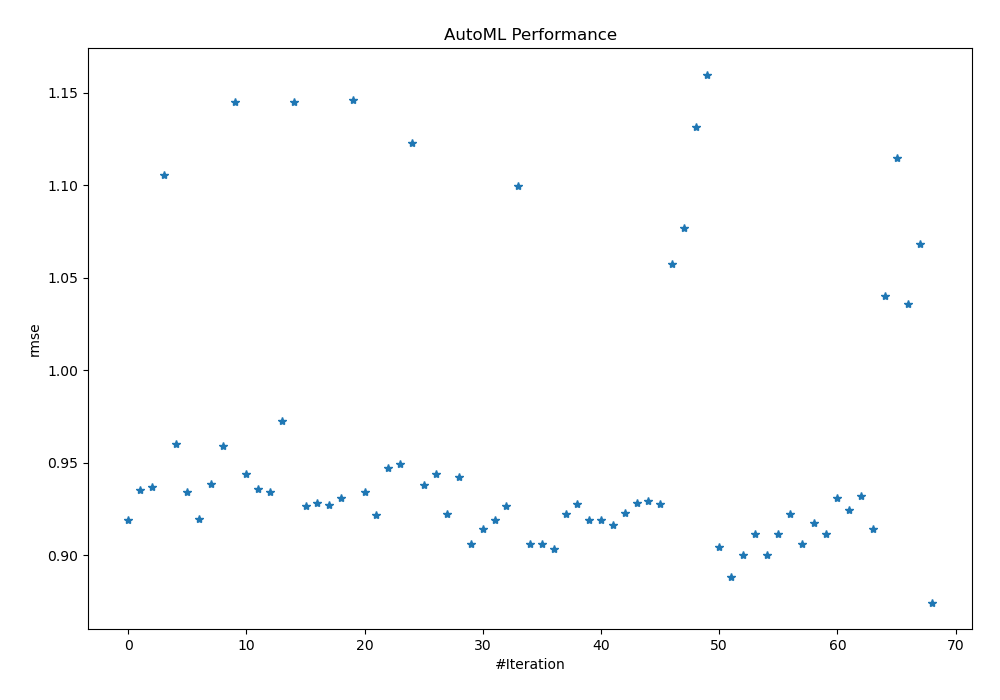
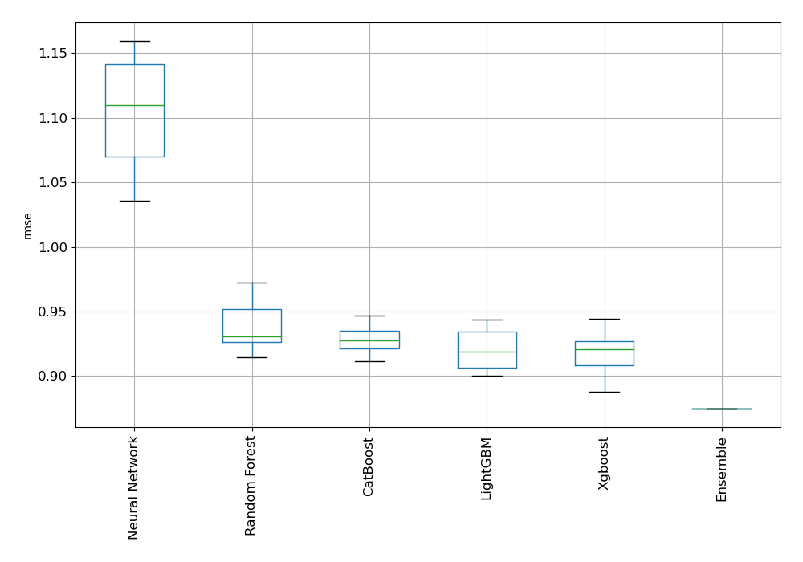
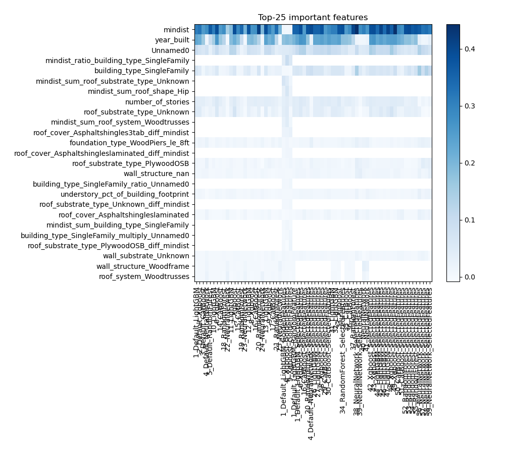
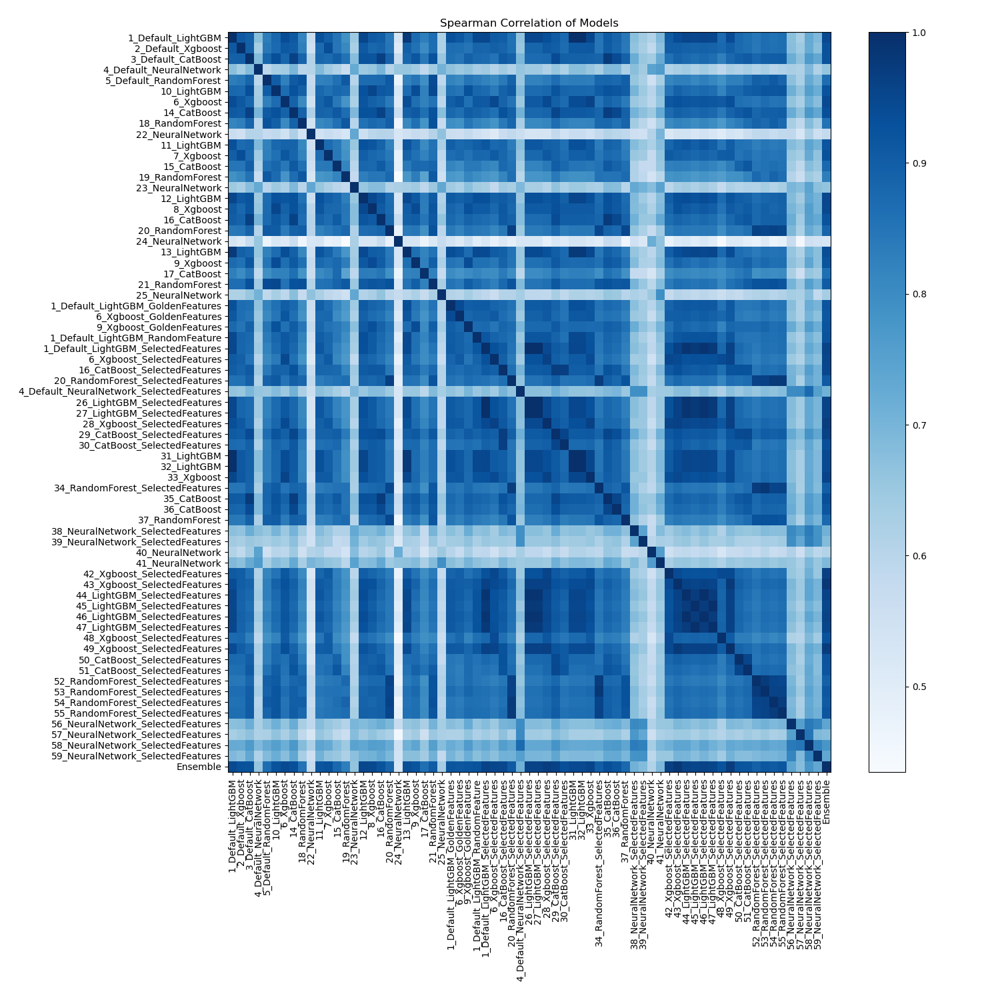

# AutoML Leaderboard

| Best model   | name                                                                                           | model_type     | metric_type   |   metric_value |   train_time |   single_prediction_time |
|:-------------|:-----------------------------------------------------------------------------------------------|:---------------|:--------------|---------------:|-------------:|-------------------------:|
|              | [1_Default_LightGBM](1_Default_LightGBM/README.md)                                             | LightGBM       | rmse          |       0.91917  |        12.56 |                   0.09   |
|              | [2_Default_Xgboost](2_Default_Xgboost/README.md)                                               | Xgboost        | rmse          |       0.935093 |        13.19 |                   0.1012 |
|              | [3_Default_CatBoost](3_Default_CatBoost/README.md)                                             | CatBoost       | rmse          |       0.9366   |        16.19 |                   0.1144 |
|              | [4_Default_NeuralNetwork](4_Default_NeuralNetwork/README.md)                                   | Neural Network | rmse          |       1.10525  |         6.69 |                   0.1242 |
|              | [5_Default_RandomForest](5_Default_RandomForest/README.md)                                     | Random Forest  | rmse          |       0.960308 |        17.4  |                   0.1302 |
|              | [10_LightGBM](10_LightGBM/README.md)                                                           | LightGBM       | rmse          |       0.934086 |         8.83 |                   0.09   |
|              | [6_Xgboost](6_Xgboost/README.md)                                                               | Xgboost        | rmse          |       0.919474 |        15.31 |                   0.0987 |
|              | [14_CatBoost](14_CatBoost/README.md)                                                           | CatBoost       | rmse          |       0.938555 |        17.73 |                   0.1134 |
|              | [18_RandomForest](18_RandomForest/README.md)                                                   | Random Forest  | rmse          |       0.959032 |        16.87 |                   0.1291 |
|              | [22_NeuralNetwork](22_NeuralNetwork/README.md)                                                 | Neural Network | rmse          |       1.14479  |         6.8  |                   0.1238 |
|              | [11_LightGBM](11_LightGBM/README.md)                                                           | LightGBM       | rmse          |       0.943907 |         8.91 |                   0.0892 |
|              | [7_Xgboost](7_Xgboost/README.md)                                                               | Xgboost        | rmse          |       0.93572  |        16.29 |                   0.0915 |
|              | [15_CatBoost](15_CatBoost/README.md)                                                           | CatBoost       | rmse          |       0.9342   |        16.2  |                   0.1121 |
|              | [19_RandomForest](19_RandomForest/README.md)                                                   | Random Forest  | rmse          |       0.972384 |        14.71 |                   0.1248 |
|              | [23_NeuralNetwork](23_NeuralNetwork/README.md)                                                 | Neural Network | rmse          |       1.14506  |         7.34 |                   0.1232 |
|              | [12_LightGBM](12_LightGBM/README.md)                                                           | LightGBM       | rmse          |       0.926794 |        11.22 |                   0.0897 |
|              | [8_Xgboost](8_Xgboost/README.md)                                                               | Xgboost        | rmse          |       0.928195 |        11.93 |                   0.0919 |
|              | [16_CatBoost](16_CatBoost/README.md)                                                           | CatBoost       | rmse          |       0.927059 |        16.65 |                   0.1139 |
|              | [20_RandomForest](20_RandomForest/README.md)                                                   | Random Forest  | rmse          |       0.930967 |        17.35 |                   0.1272 |
|              | [24_NeuralNetwork](24_NeuralNetwork/README.md)                                                 | Neural Network | rmse          |       1.14619  |         8.09 |                   0.1294 |
|              | [13_LightGBM](13_LightGBM/README.md)                                                           | LightGBM       | rmse          |       0.934356 |        13.96 |                   0.0986 |
|              | [9_Xgboost](9_Xgboost/README.md)                                                               | Xgboost        | rmse          |       0.921616 |        11.94 |                   0.0917 |
|              | [17_CatBoost](17_CatBoost/README.md)                                                           | CatBoost       | rmse          |       0.947103 |        17.83 |                   0.1207 |
|              | [21_RandomForest](21_RandomForest/README.md)                                                   | Random Forest  | rmse          |       0.949204 |        25.29 |                   0.1487 |
|              | [25_NeuralNetwork](25_NeuralNetwork/README.md)                                                 | Neural Network | rmse          |       1.12298  |         8.19 |                   0.1263 |
|              | [1_Default_LightGBM_GoldenFeatures](1_Default_LightGBM_GoldenFeatures/README.md)               | LightGBM       | rmse          |       0.937874 |        27.08 |                   0.122  |
|              | [6_Xgboost_GoldenFeatures](6_Xgboost_GoldenFeatures/README.md)                                 | Xgboost        | rmse          |       0.944086 |        19.61 |                   0.1229 |
|              | [9_Xgboost_GoldenFeatures](9_Xgboost_GoldenFeatures/README.md)                                 | Xgboost        | rmse          |       0.922072 |        15    |                   0.1231 |
|              | [1_Default_LightGBM_RandomFeature](1_Default_LightGBM_RandomFeature/README.md)                 | LightGBM       | rmse          |       0.942245 |        12.63 |                   0.0956 |
|              | [1_Default_LightGBM_SelectedFeatures](1_Default_LightGBM_SelectedFeatures/README.md)           | LightGBM       | rmse          |       0.90613  |         7.87 |                   0.0298 |
|              | [6_Xgboost_SelectedFeatures](6_Xgboost_SelectedFeatures/README.md)                             | Xgboost        | rmse          |       0.914155 |         6.93 |                   0.0325 |
|              | [16_CatBoost_SelectedFeatures](16_CatBoost_SelectedFeatures/README.md)                         | CatBoost       | rmse          |       0.919    |         5.8  |                   0.032  |
|              | [20_RandomForest_SelectedFeatures](20_RandomForest_SelectedFeatures/README.md)                 | Random Forest  | rmse          |       0.926669 |         6.42 |                   0.0542 |
|              | [4_Default_NeuralNetwork_SelectedFeatures](4_Default_NeuralNetwork_SelectedFeatures/README.md) | Neural Network | rmse          |       1.09936  |         4.44 |                   0.0481 |
|              | [26_LightGBM_SelectedFeatures](26_LightGBM_SelectedFeatures/README.md)                         | LightGBM       | rmse          |       0.90613  |         7.9  |                   0.0271 |
|              | [27_LightGBM_SelectedFeatures](27_LightGBM_SelectedFeatures/README.md)                         | LightGBM       | rmse          |       0.90613  |         8    |                   0.0341 |
|              | [28_Xgboost_SelectedFeatures](28_Xgboost_SelectedFeatures/README.md)                           | Xgboost        | rmse          |       0.903275 |         6.93 |                   0.0323 |
|              | [29_CatBoost_SelectedFeatures](29_CatBoost_SelectedFeatures/README.md)                         | CatBoost       | rmse          |       0.922317 |         6.23 |                   0.0303 |
|              | [30_CatBoost_SelectedFeatures](30_CatBoost_SelectedFeatures/README.md)                         | CatBoost       | rmse          |       0.9275   |         5.71 |                   0.0346 |
|              | [31_LightGBM](31_LightGBM/README.md)                                                           | LightGBM       | rmse          |       0.91917  |        15.28 |                   0.0914 |
|              | [32_LightGBM](32_LightGBM/README.md)                                                           | LightGBM       | rmse          |       0.91917  |        16.48 |                   0.0919 |
|              | [33_Xgboost](33_Xgboost/README.md)                                                             | Xgboost        | rmse          |       0.916581 |        20.01 |                   0.0963 |
|              | [34_RandomForest_SelectedFeatures](34_RandomForest_SelectedFeatures/README.md)                 | Random Forest  | rmse          |       0.922787 |         6.87 |                   0.0466 |
|              | [35_CatBoost](35_CatBoost/README.md)                                                           | CatBoost       | rmse          |       0.927954 |        20.03 |                   0.1158 |
|              | [36_CatBoost](36_CatBoost/README.md)                                                           | CatBoost       | rmse          |       0.929346 |        20.83 |                   0.1106 |
|              | [37_RandomForest](37_RandomForest/README.md)                                                   | Random Forest  | rmse          |       0.927892 |        16.83 |                   0.1269 |
|              | [38_NeuralNetwork_SelectedFeatures](38_NeuralNetwork_SelectedFeatures/README.md)               | Neural Network | rmse          |       1.05749  |         5.32 |                   0.0469 |
|              | [39_NeuralNetwork_SelectedFeatures](39_NeuralNetwork_SelectedFeatures/README.md)               | Neural Network | rmse          |       1.07675  |         5.01 |                   0.0474 |
|              | [40_NeuralNetwork](40_NeuralNetwork/README.md)                                                 | Neural Network | rmse          |       1.13166  |         8.05 |                   0.1229 |
|              | [41_NeuralNetwork](41_NeuralNetwork/README.md)                                                 | Neural Network | rmse          |       1.15977  |        11.09 |                   0.1414 |
|              | [42_Xgboost_SelectedFeatures](42_Xgboost_SelectedFeatures/README.md)                           | Xgboost        | rmse          |       0.904413 |        11.11 |                   0.033  |
|              | [43_Xgboost_SelectedFeatures](43_Xgboost_SelectedFeatures/README.md)                           | Xgboost        | rmse          |       0.888006 |         7.48 |                   0.0298 |
|              | [44_LightGBM_SelectedFeatures](44_LightGBM_SelectedFeatures/README.md)                         | LightGBM       | rmse          |       0.899999 |         8.76 |                   0.0299 |
|              | [45_LightGBM_SelectedFeatures](45_LightGBM_SelectedFeatures/README.md)                         | LightGBM       | rmse          |       0.911216 |         8.37 |                   0.0347 |
|              | [46_LightGBM_SelectedFeatures](46_LightGBM_SelectedFeatures/README.md)                         | LightGBM       | rmse          |       0.899999 |         9.67 |                   0.0327 |
|              | [47_LightGBM_SelectedFeatures](47_LightGBM_SelectedFeatures/README.md)                         | LightGBM       | rmse          |       0.911216 |         8.89 |                   0.0468 |
|              | [48_Xgboost_SelectedFeatures](48_Xgboost_SelectedFeatures/README.md)                           | Xgboost        | rmse          |       0.92213  |        11.39 |                   0.0304 |
|              | [49_Xgboost_SelectedFeatures](49_Xgboost_SelectedFeatures/README.md)                           | Xgboost        | rmse          |       0.906005 |         7.71 |                   0.0344 |
|              | [50_CatBoost_SelectedFeatures](50_CatBoost_SelectedFeatures/README.md)                         | CatBoost       | rmse          |       0.917416 |         7.13 |                   0.0307 |
|              | [51_CatBoost_SelectedFeatures](51_CatBoost_SelectedFeatures/README.md)                         | CatBoost       | rmse          |       0.911557 |         7.99 |                   0.032  |
|              | [52_RandomForest_SelectedFeatures](52_RandomForest_SelectedFeatures/README.md)                 | Random Forest  | rmse          |       0.930894 |         6.93 |                   0.0463 |
|              | [53_RandomForest_SelectedFeatures](53_RandomForest_SelectedFeatures/README.md)                 | Random Forest  | rmse          |       0.924221 |         6.7  |                   0.0506 |
|              | [54_RandomForest_SelectedFeatures](54_RandomForest_SelectedFeatures/README.md)                 | Random Forest  | rmse          |       0.932209 |         7.85 |                   0.0575 |
|              | [55_RandomForest_SelectedFeatures](55_RandomForest_SelectedFeatures/README.md)                 | Random Forest  | rmse          |       0.914358 |         8.49 |                   0.0512 |
|              | [56_NeuralNetwork_SelectedFeatures](56_NeuralNetwork_SelectedFeatures/README.md)               | Neural Network | rmse          |       1.04011  |         6.61 |                   0.0478 |
|              | [57_NeuralNetwork_SelectedFeatures](57_NeuralNetwork_SelectedFeatures/README.md)               | Neural Network | rmse          |       1.11467  |         5.26 |                   0.0475 |
|              | [58_NeuralNetwork_SelectedFeatures](58_NeuralNetwork_SelectedFeatures/README.md)               | Neural Network | rmse          |       1.03572  |         5.56 |                   0.0542 |
|              | [59_NeuralNetwork_SelectedFeatures](59_NeuralNetwork_SelectedFeatures/README.md)               | Neural Network | rmse          |       1.06796  |         5.88 |                   0.0465 |
| **the best** | [Ensemble](Ensemble/README.md)                                                                 | Ensemble       | rmse          |       0.874429 |         1.57 |                   0.4179 |

### AutoML Performance

### AutoML Performance Boxplot

### Features Importance

### Spearman Correlation of Models

